Iterable having one method iterator()

iterator() method returns Iterator

Iterator uses to traverse over the collection one-by-one.

using forEach() loop we can do but with this Iterator also we can do.

=> If any class implements Iterable then there foreach() functionality also will come

How Works
----------

        List<Integer> list = new ArrayList<>();

        -> ArrayList Implements List

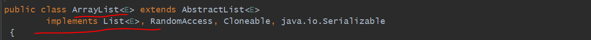

        -> List extends Collection Interface

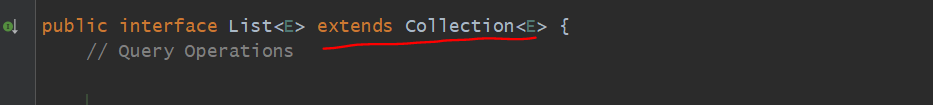

        -> Collection Interface extends Iterable Interface

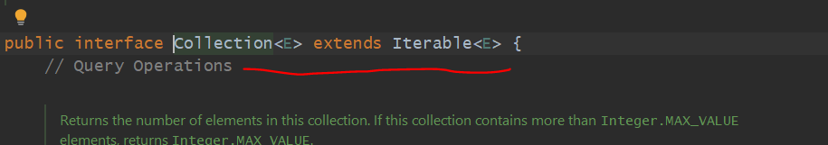

        -> Iterable Interface is having a method called iterator()

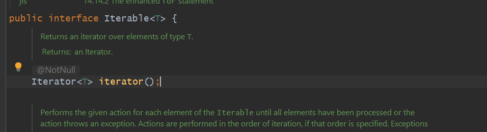

        -> If you see in ArrayList class having one overriden method iterator() bcz ArrayList Implements List

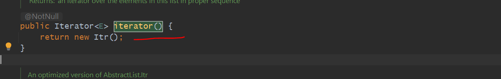

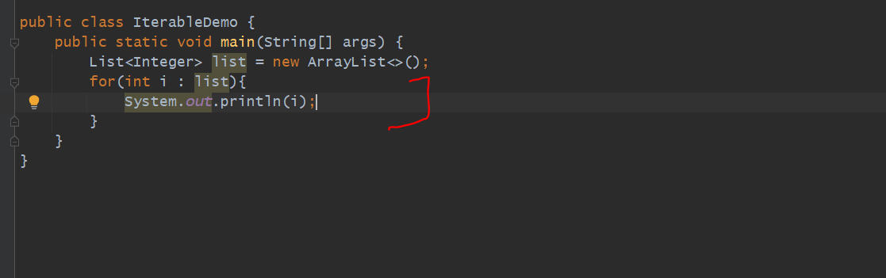

Now Java Compiler convert this above code into a below code format

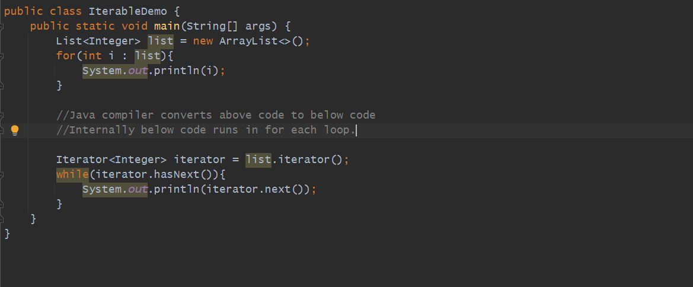

=> In our Hierarchy at top Iterable is there that's the reason in all implemented class we can use iterator method.

Iterator remove() method
========================

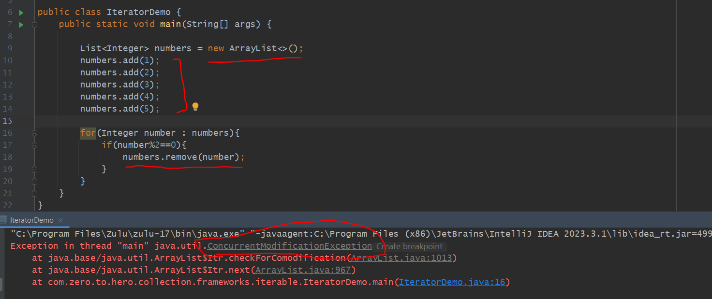

=> If you say we can use CopyOnWriteArrayList here

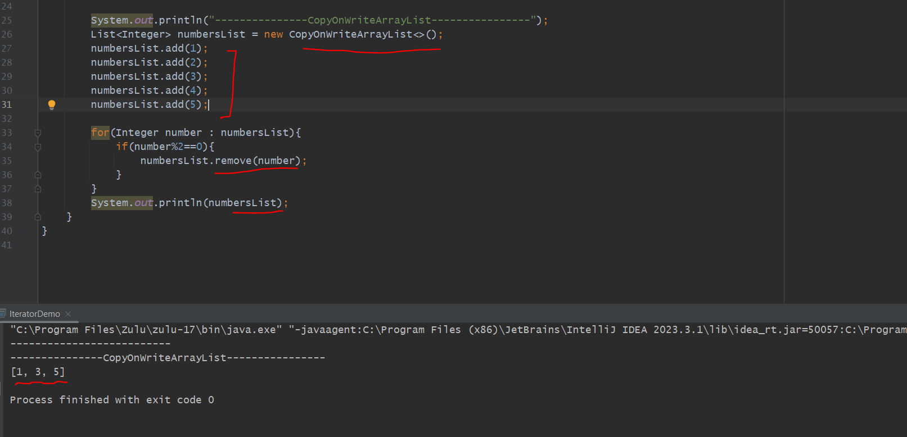

=> *** It will get removed but after this for loop. bcz what copyOnWriteArrayList will do it will iterate foreach on stable copy of list and once the
   modification done on list it will create a new copy of modified list. then after completing for each loop it will replace old list with copied new list.
   => purani list = new list

=> Iterator provide the remove functionality while Iterating
   ----------------------------------------------------------
 
 let's run in a DEBUG mode:-             ->first iterator points to -1 index

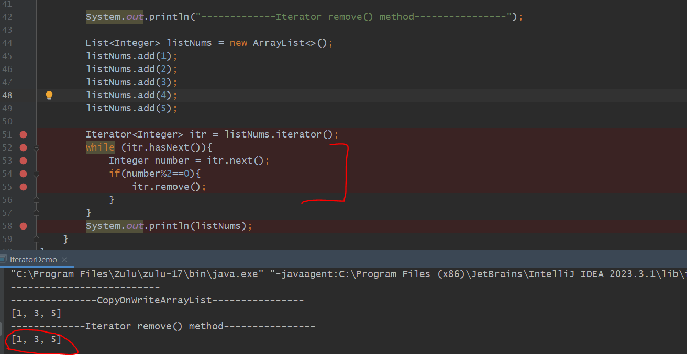

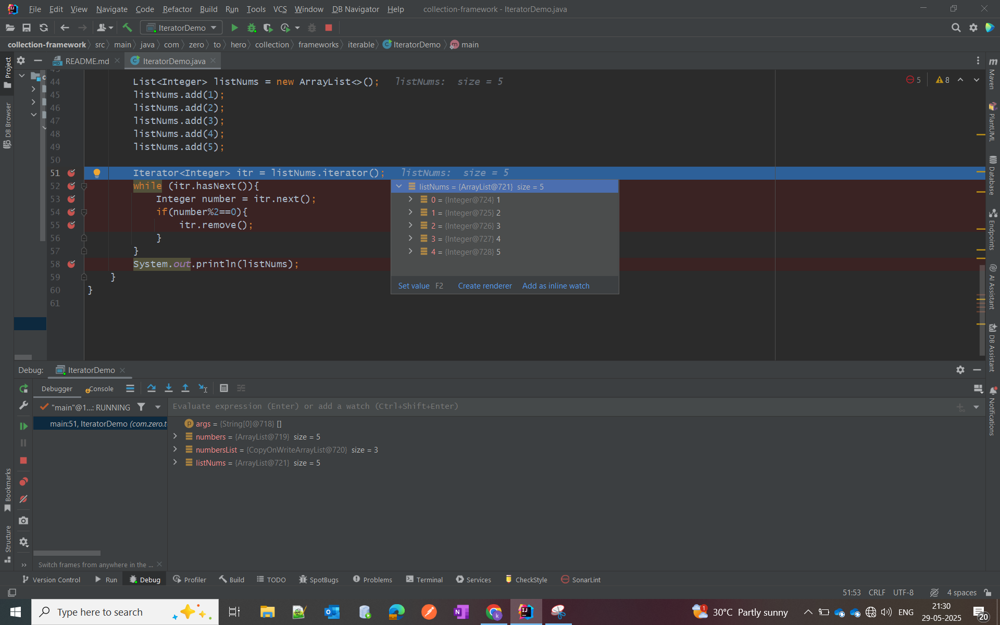

we are having 5 numbers in list before remove

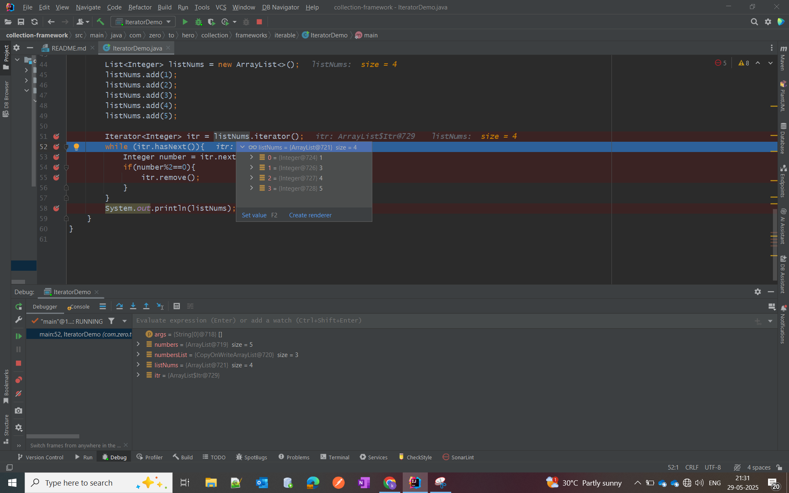

while first remove method called it removed from list. 

=> while Iterating it is removing and modifying the list also

=> Here In a collection loop is also running and on same collection removal also running...

=> 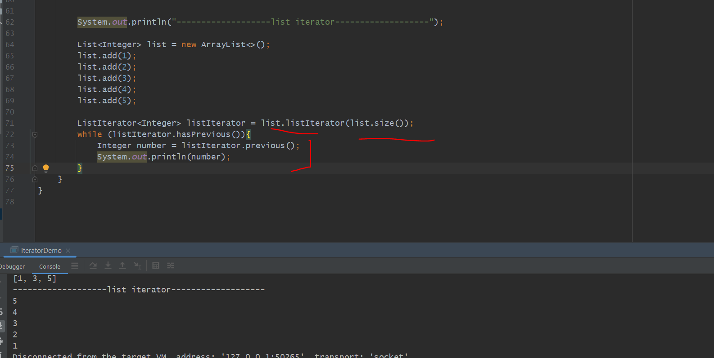

using list iterator() we can iterate in both direction

some other methods in list iterator()--------

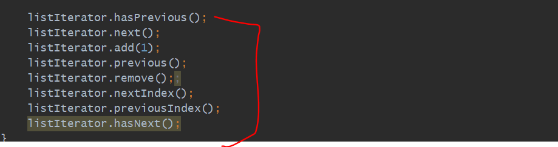

   