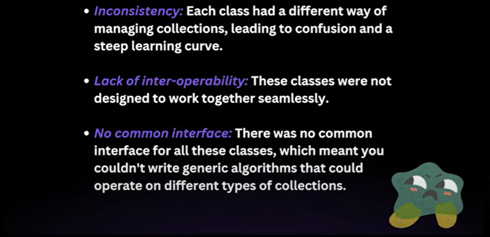

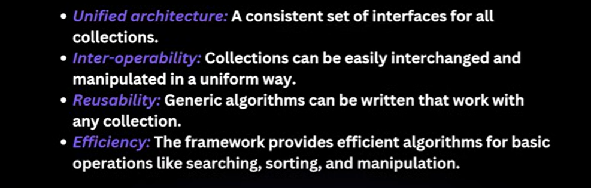

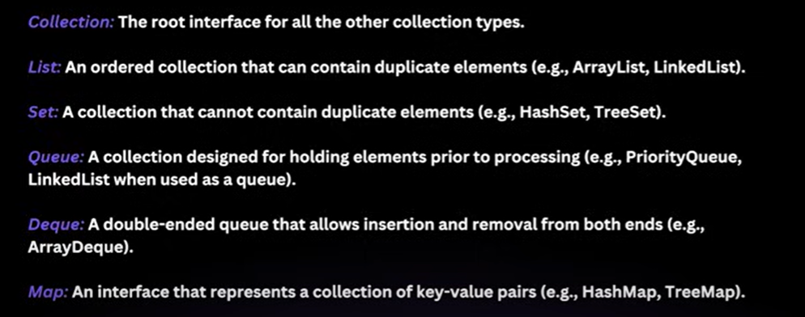

Iterable
--------

        Iterable is a Root Interface

        It only use is If Any Class which Implement's Iterable Interface then we can use forEach on that object's that's It.

        Collection Extends Iterable.

        Iterable comes under package "java.lang"

        So, All List, Set ... going to use Iterable so, that's the reason we can use forEach() method on collection objects.

Iterable Interface
------------------

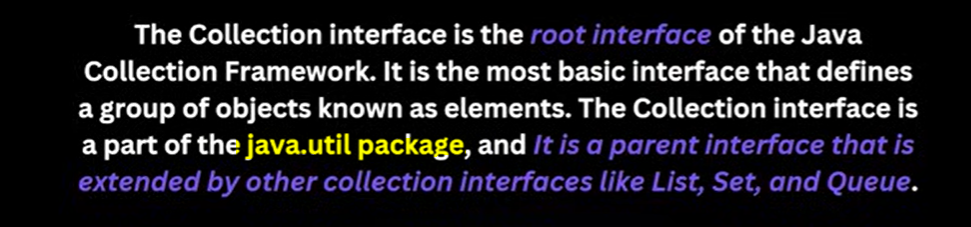

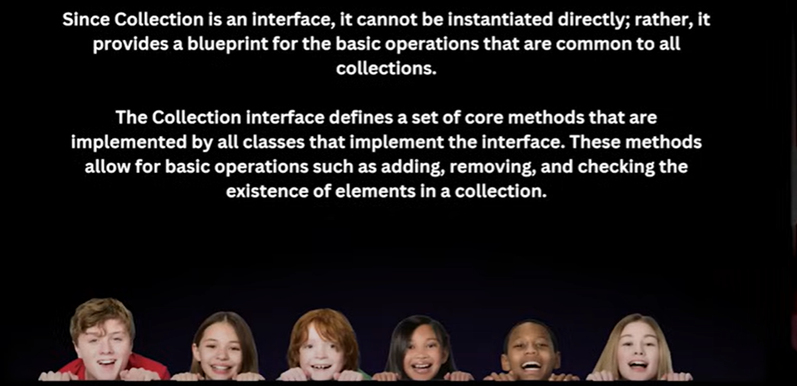

List Interface
==============

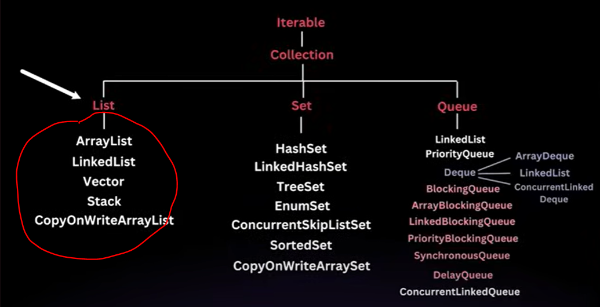

        List Extends Collection

        List comes under package "java.util"

        So, All methods which comes under Collection will be applicable for List as well.

        ArrayList, LinkedList, Vector and Stack extends List so keep duplicates and mentain insertion order.

        To use-
            when we want to keep in a same order which elements is coming.
            we are ready to mentain duplicates elements.
            
            
        Key Features of List Interface-
               Order Preservation
               Index-Based Access
               Allow Duplicates

Array List
==========

        When to Use-
            We need a Data Structure which can dynamically increase/decrease based on the size either insert/remove.
            
            We can use when the no. of element's is not known.

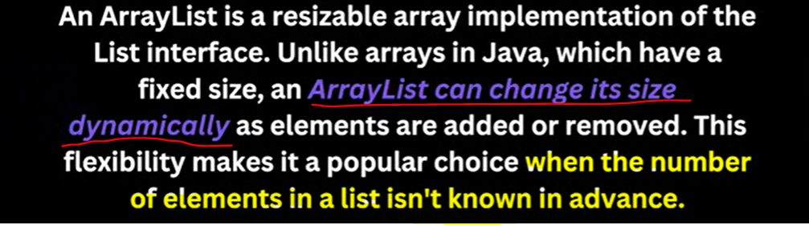

Internal Working - Array List
-----------------------------

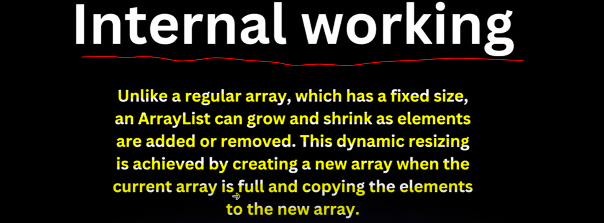

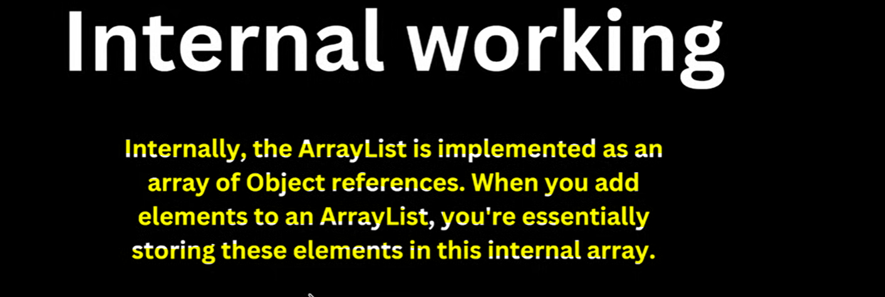

            Which Mean If you define-

            ArrayList list = new ArrayList();

                * size -> 0
                * Capacity -> 10
                * once Internal Array size is full new array will create with capacity 1.5 times current capacity
                * you can define your capacity as well if you don't want to creating a new array and copying into new array
                     
                    ArrayList list = new ArrayList(100)                -> 100: initial capacity
            
                Note: After creating a new array internally while elements increases if you remove the elements from 
                      list then ArrayList will not automatically srink or decrease the size of array but you can
                      do it to save memory by using trimToSize() method

                        * list.trimToSize();      -> trimToSize() method

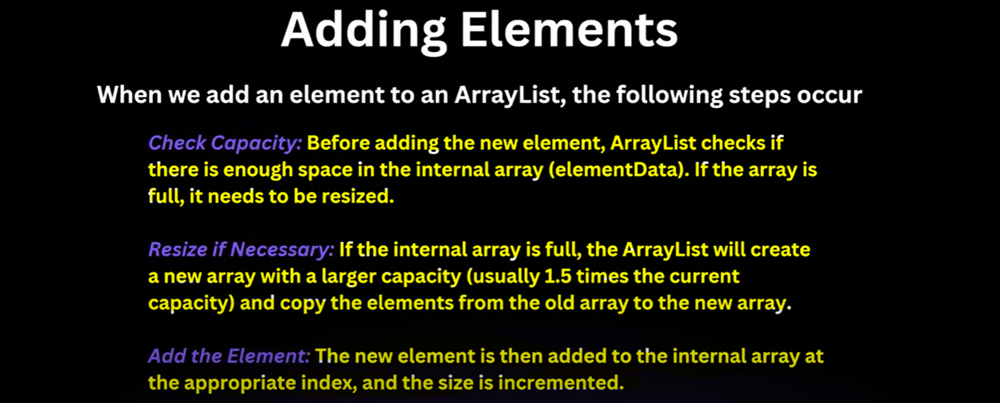

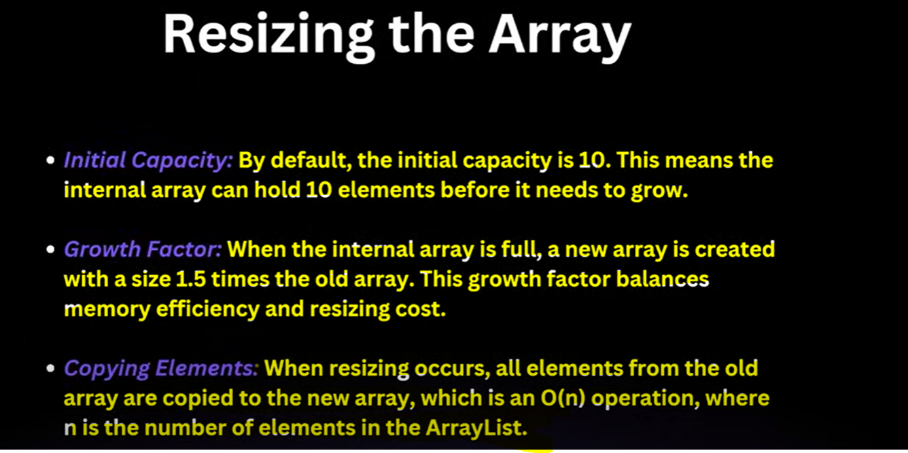

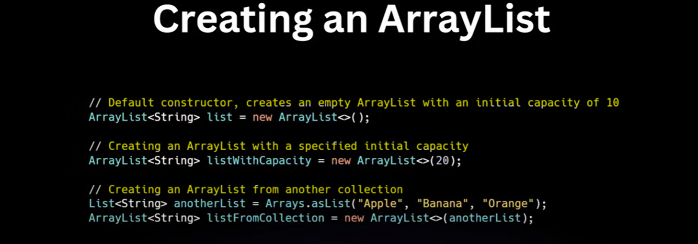

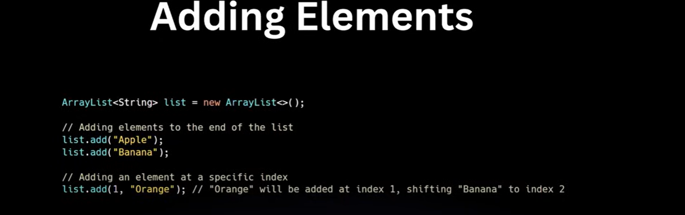

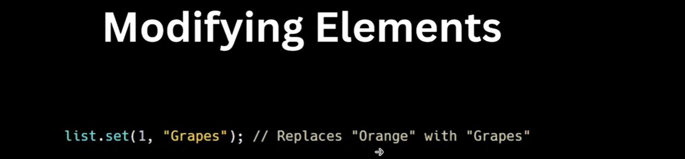

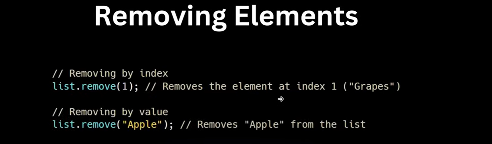

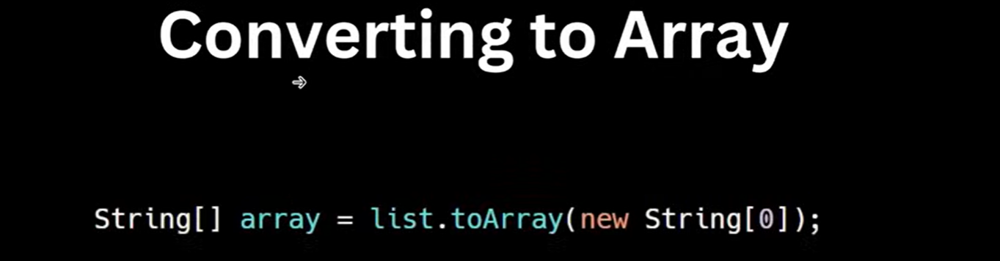

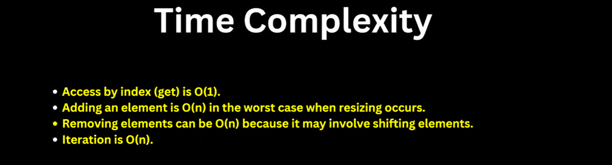

        
        Comparator is an Interface with the help of Comparator we can do custom Ordering...

        it is functional interface with method compare. it compare 2 data of same type.
            
                int compare(int a, int b);

        Ex-
            o1     o2
           "ok"   "bye"

        * we just have to calculate on 2 no. rest all comparator can handle
        * sort on length ascending order -> so, o1-o2 -> 2-3 -> -1 so, o1 come first o2 come after
        * sort on length descending order -> so, 02-o1 -> 3-2 -> +1 so, o2 come first then o1 come after.

        * if int value result come -Ve then a come first then b come after
        * if int value result come 0 then a and b comes equals
        * if int value result come +ve then a go after and b come before.

        

