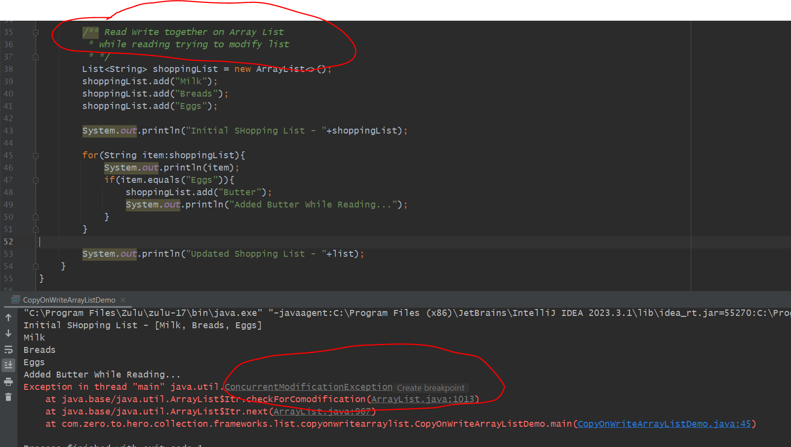

CopyOnWriteArrayList

        "Copy on Write" means that whenever a write operation 
        like adding or removing an element 
        Instead of directly modifying the existing list
        a new copy of the list is created, and the modification is applied to that copy
        this ensures that other threads reading the list while it's being modified are un-effected.

        Read Operations: Fast and Direct, since they happen on a stable list without interferance from modifications.

        Write Operations: A new Copy of the list is created for every modifications. 
                          The reference to the list is then updated so that subsequent reads 
                          use this new list.

        
        Example- while we have a notebook multiple students reading through note book but if
                 anyone want to change the content so instead of changing in original notepad
                 we will create a copy of notepad and ask them to modify on copies notepad 
                 and once he done i can use teh reference of list instaed of our list ref.

usecase ( when less Write and more Read)
---------

When Read Operation is more compare to Write Operation then we should use CopyOnWriteArrayList
------------------------------------------------------------------------------------------------

because on every write a new copy of list is creating so more memory consumed.
------------------------------------------------------------------------------

Advantage-  Reading and Modifying on same time

Because Read operation is happening on Snapshot and write operation happened on a other copy list.

SO, we are running our loop on snapshot of our original list
when loop got ended then only shoppinglist reference we make equal to our newly modified list.

In Loop we need stable snapshot 

Let's Try CopyOnWrite on Multiple Thread
----------------------------------------

     package com.zero.to.hero.collection.frameworks.list.copyonwritearraylist;

    import java.util.ArrayList;
    import java.util.List;
    
    public class CopyOnWriteArrayList_MultipleThreadDemo {
    public static void main(String[] args) {

        List<String> sharedList = new ArrayList<>();
        sharedList.add("item1");
        sharedList.add("item2");
        sharedList.add("item3");

        Thread readerThread = new Thread(()-> {

            try{
                while(true){
                    //Iterate through the list
                    for(String item:sharedList){
                        System.out.println("Reading Item: "+item);
                        Thread.sleep(100);
                    }
                }
            }catch (Exception exception){
                System.out.println("Exception in reader Thread : "+exception);
            }
        });

        Thread writerThread = new Thread(()-> {

           try{
               Thread.sleep(500);  // delay to start reading thread first
               sharedList.add("item4");
               System.out.println("Added Item4 to List ");

               Thread.sleep(500);  // delay to start reading thread first
               sharedList.remove("item1");
               System.out.println("Removed Item1 from List ");

           }catch (InterruptedException e){
                e.printStackTrace();
           }
        });

        readerThread.start();
        writerThread.start();

    }
    }
