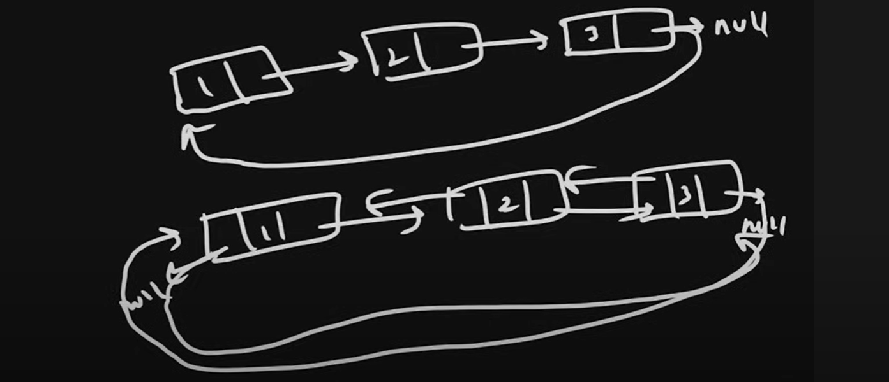
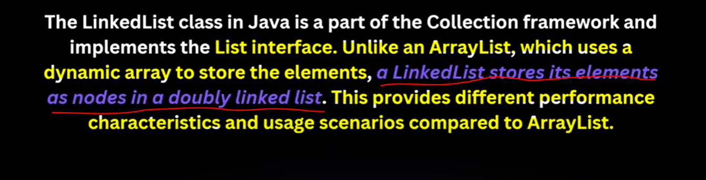
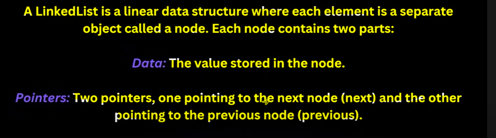
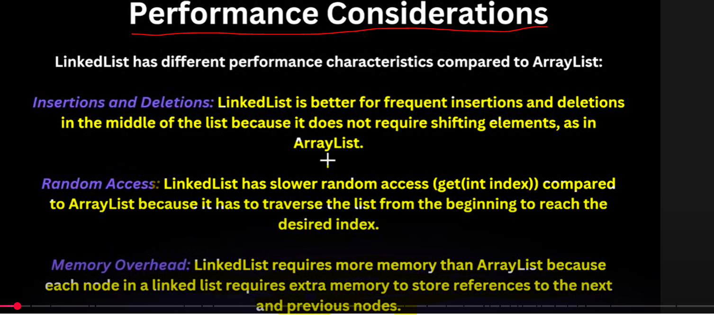

        -> Linked List won't store data in a contiguous Memory like ArrayLike (index+1)...

How Linked List we are using as a Stack because It's a Double ended Linked List because we have a
-----------------------------------------------------------------------------------------------
Pointer on Last element so that only we can do getLast(), removeLast(), addLast().... 
-------------------------------------------------------------------------------------

If Java Linked list would be a single linked list we can't perform this operation simple
------------------------------------------------------------------------------------------

