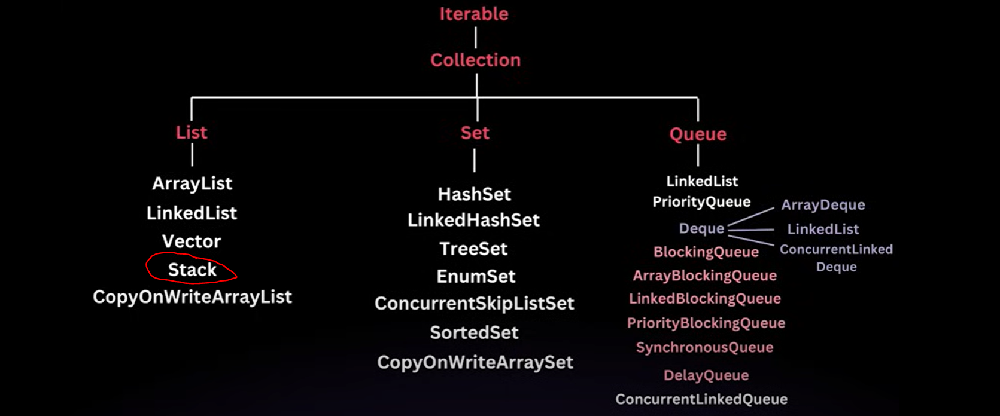
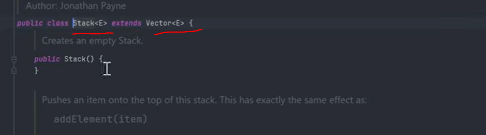
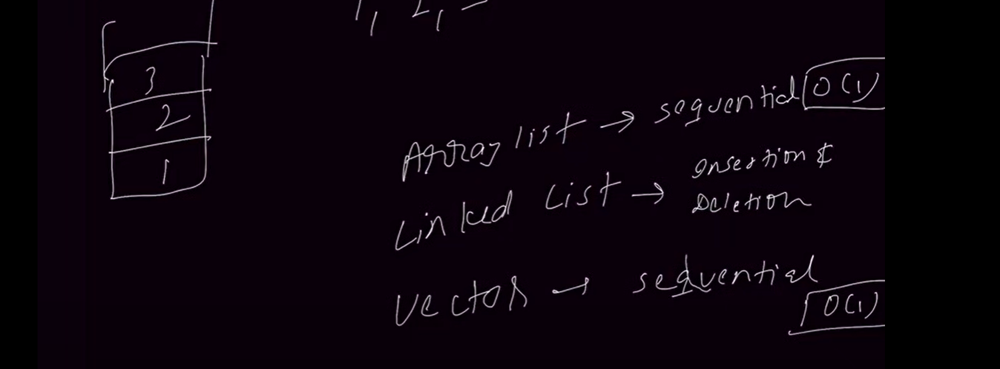
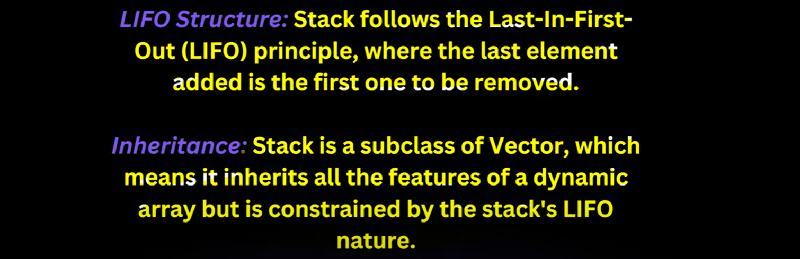
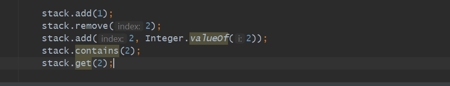
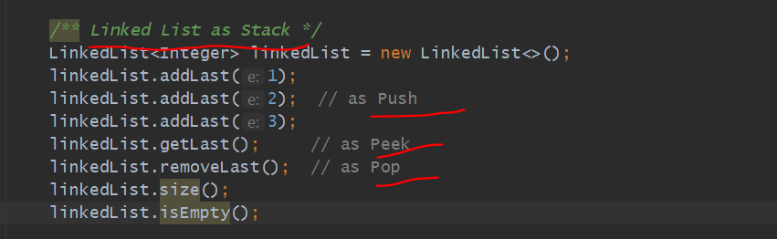
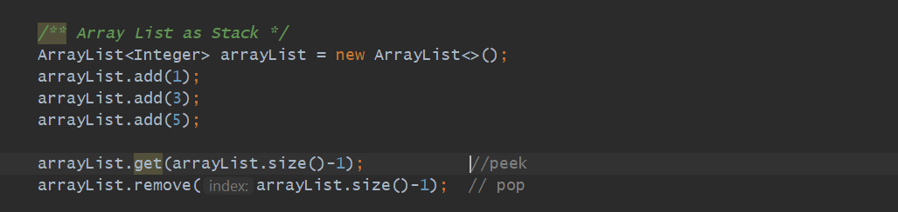

        >> Stack Extends Vector.

        >> ArrayList & Vector Stores the elements in a sequential manner.
        >> If you want to get the element in Big O(1) time then you can use arraylist.
        >> Similary In vectory also but if u need synchronization then use vector.
        >> If Efficient Insertion & Deletion then you can use Linked List.
        >> Similarly If any Situation you need LIFO behavior in less Time Complexity
           we should go for Stack 
        >> since Stack extends Vector it is Synchronized making it Thread safe.
        

        >> If you do not want to remove element from stack you just want to see top element
           use peek().
       
        >> All methods in Stack is Synchronized by default bcz it extends Vector.

since Stack Class Extends Vector Class so all the methods of Vector came to Stack.

But Stack Actually use for

        - To see What is on top.
        - We can Peek Top Element.
        - We can see Stack size.
        - these all operation we can do like push, pop, peek, empty...
        - stack all methods are synchronized.

If you want to only use Stack Functionality then only you can use push, pop, peek, remove, search...
But you are not limited you can performed all operations which vector performed like 
Insert In middle, remove from any index, get any index element bcz it extends vector.

        stack.add(1);
        stack.remove(2);
        stack.add(2, Integer.valueOf(2));
        stack.contains(2);
        stack.get(2);

    

search()
--------

search will get the index of the passed element.

in this [1, 2, 3, 4]

stack.search(3)  -> 2

bcz from top it will count and index start from 1 instead of 0.

Linked List can use as Stack
----------------------------

So, Stack is a concepts like Below which either you can implement using Stack Class or
Linked List Class.
so, Stack is a general term....can implement using Stack class or Linked List class\

Internally Inside Stack there is an Array only bcz Stack extends Vector and inside vector we are having
----------------------------------------------------------------------------------------------------------
an Array Implementation.
------------------------

How Linked List we are using as a Stack because It's a Double ended Linked List because we have a 
-------------------------------------------------------------------------------------------------
Pointer on Last element so that only we can do getLast(), removeLast(), addLast().... 
--------------------------------------------------------------------------------------
If Java Linked list would be a single linked list we can't perform this operation simple...
---------------------------------------------------------------------------------------------

Can we use ArrayList as a Stack  but not recommended but we do not have a dedicated method.
-------------------------------------------------------------------------------------------

ArrayDeque also we can use as a Stack and that is recommended bcz of better memory management.
----------------------------------------------------------------------------------------------

