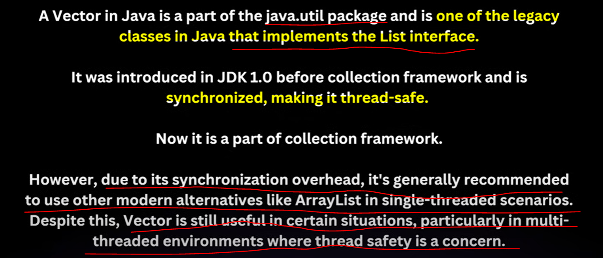
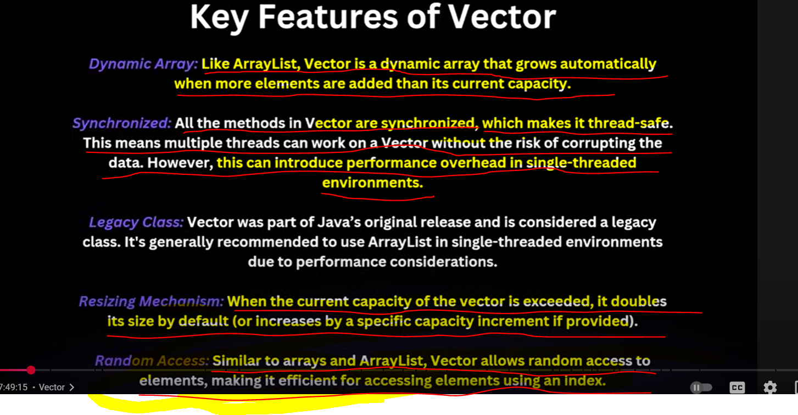
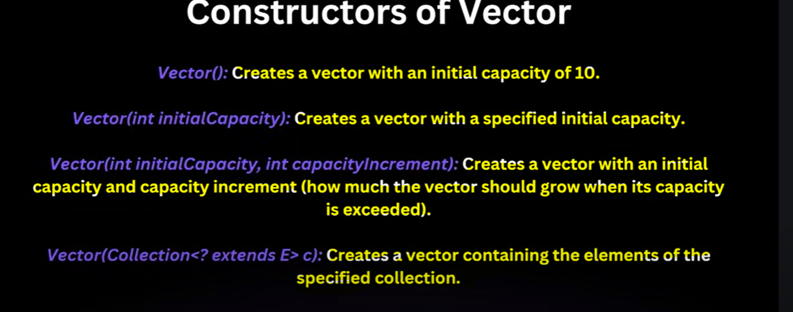
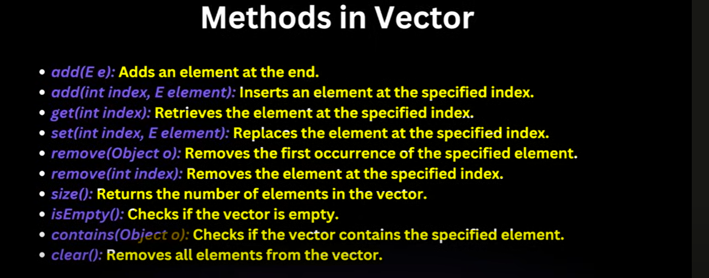
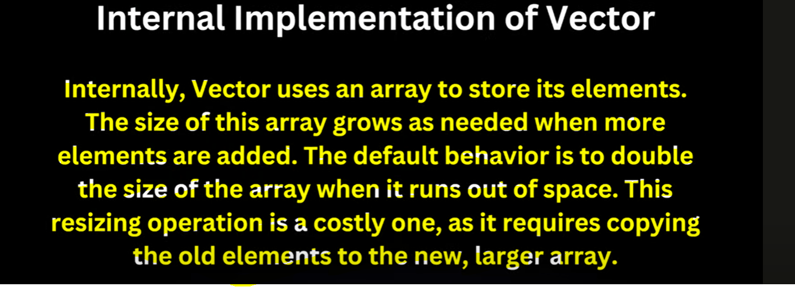
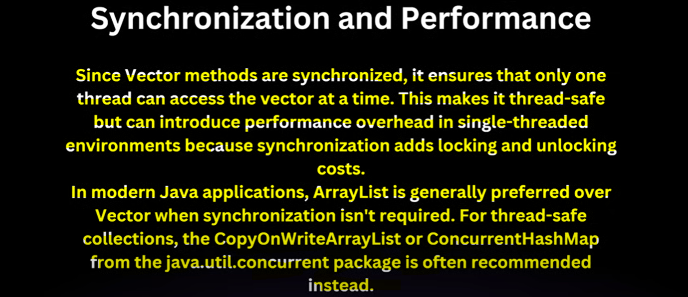
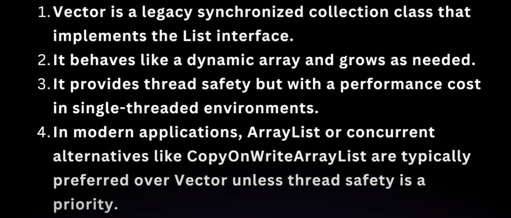
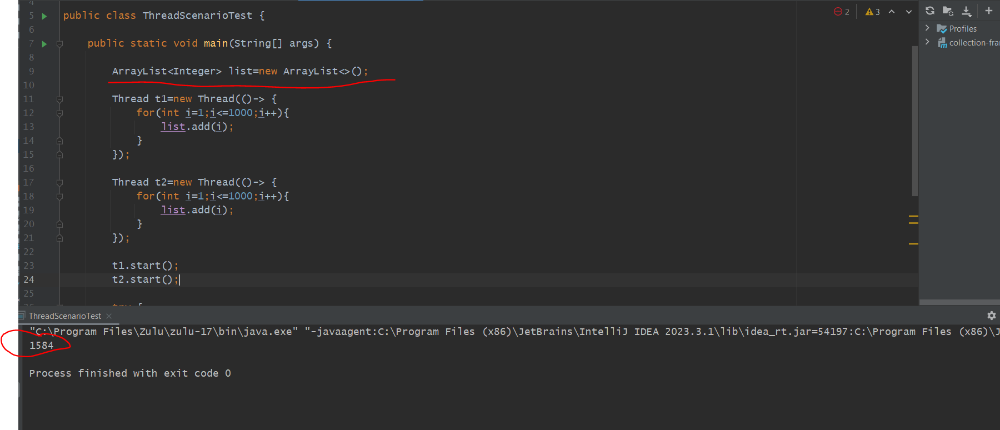
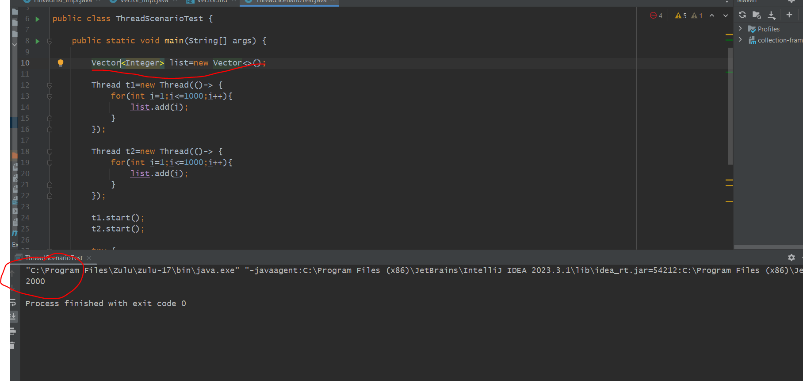

    ** In Vector Unlike an Array List we can check the Initial-Capacity or capacity.
   
    ** ArrayList Increase there Internal Array size with 1.5 but Vector will double it's size.
   
    ** Vector Initial Capacity is 10 but we can define capacity so it will grow with that capacity.

    ** Vector All methods are Synchronized.

    ** In Single threaded env we should never go for Vector bcz of locking-unlocking it slow performances.

        This is happening bcz Array list is not synchronized means not a thread safe.
        which means at same time both the threads accessed the arraylist object and while
        trying to write instead of 2 only one thread can write. 