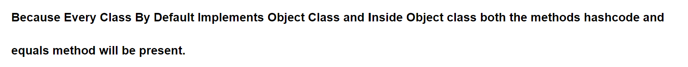
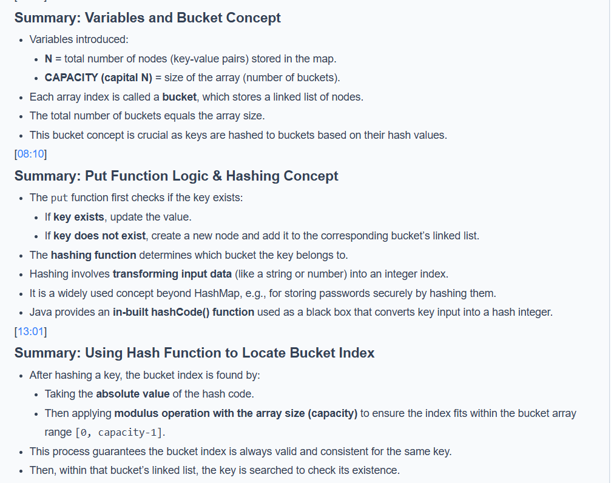
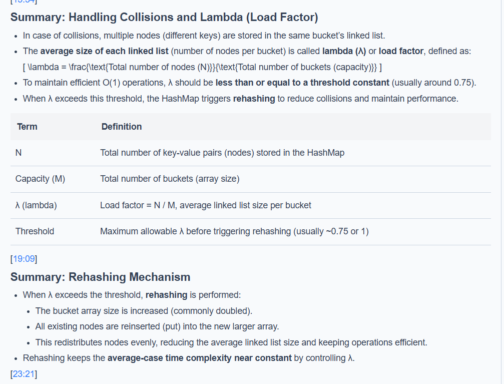
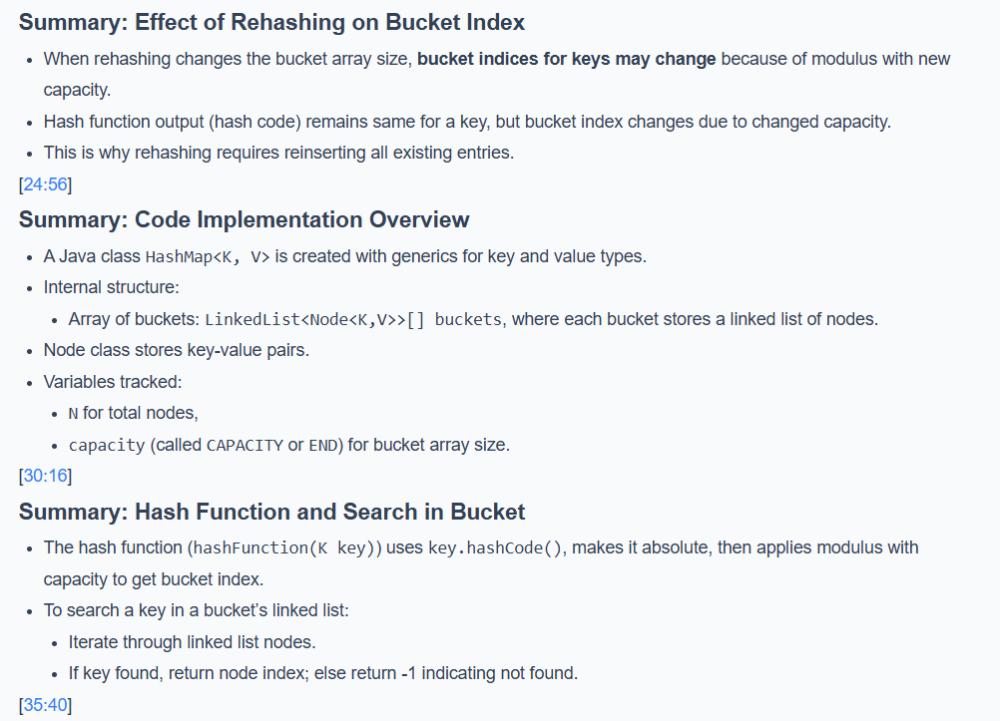
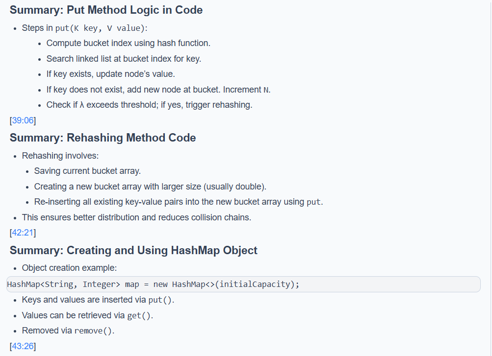
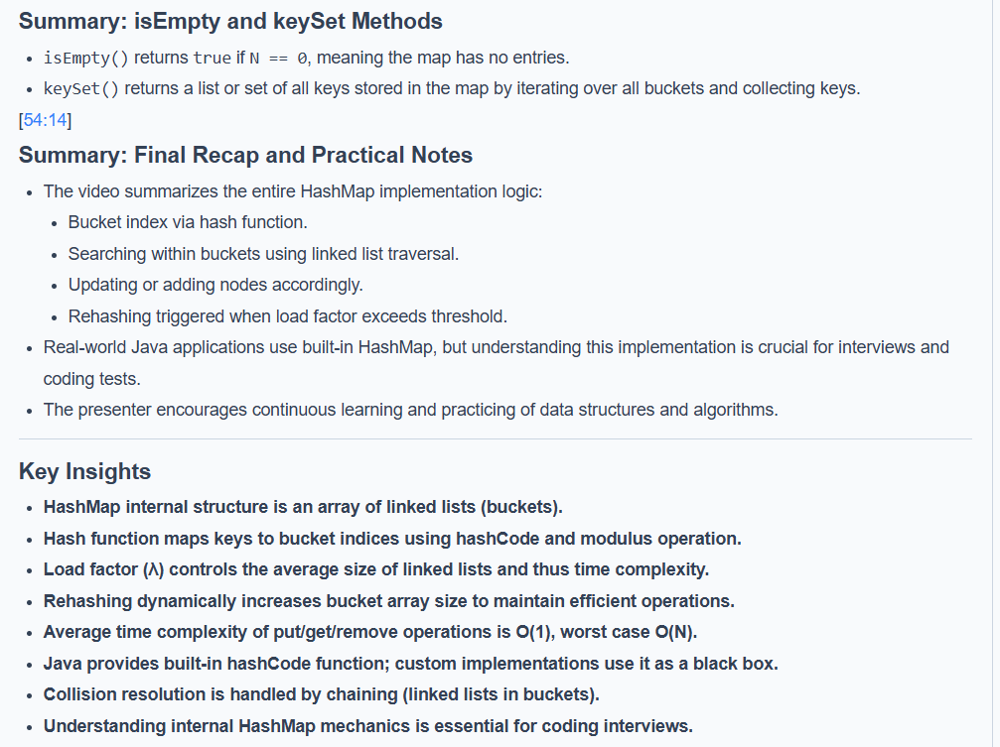
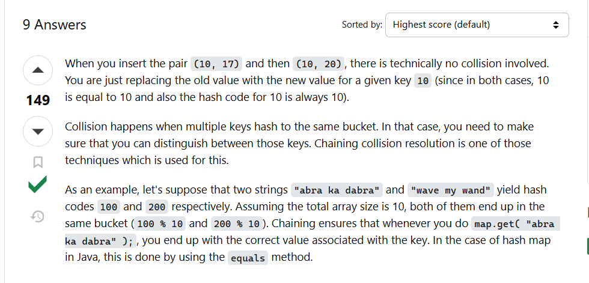
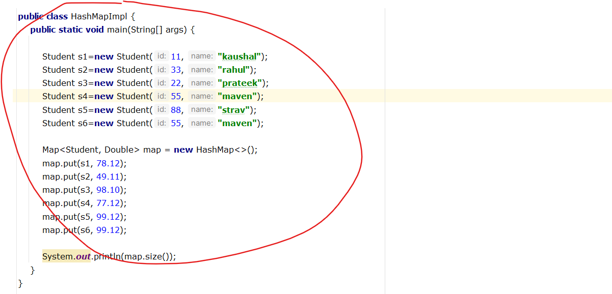

# ------------
Without Hash Code and Equlas Method it store 6 object in a map even 2 object is equals

After Implementation hashCode() and equals() method properly it will give 5 objects which is expected

