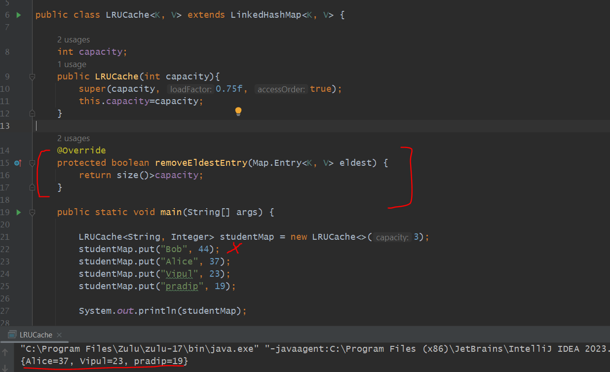
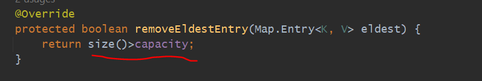
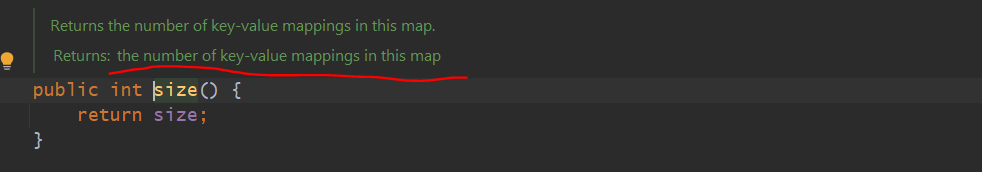
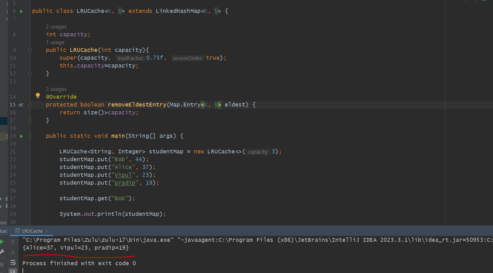
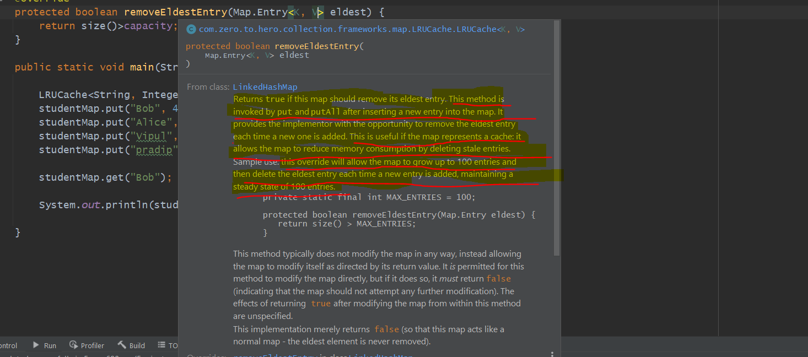
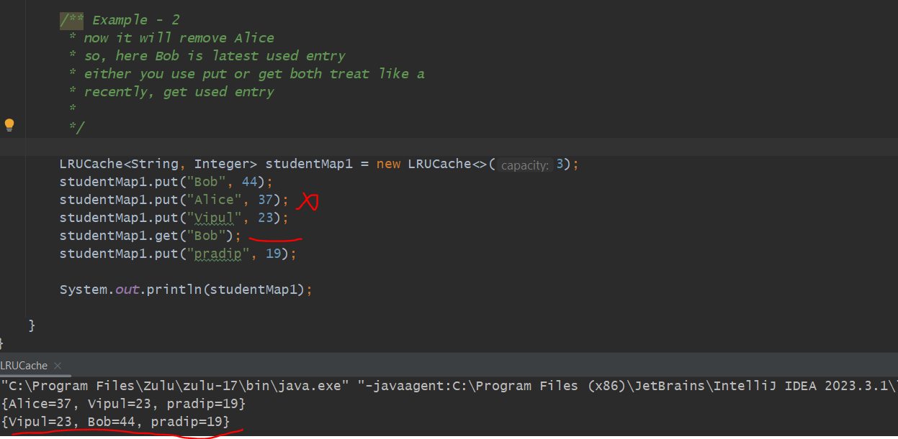

We want LRU Cache to treat like a Map.
-------------------------------------

Usecase
========

        we want to make LRU cache as a Map. Always there would be 3 entries.

        whenever 4th entry will come then the Least Recently Used (LRU) Entry
    
        should be removed.

** In this case we need to make LRU cache as a LinkedHashMap not a HashMap.

** so, Lets extends our class from Linked Hash Map so that we able to access
    all the feature of Linked Hash Map in our class.

        Bob get's removed.

        we have removed Least Recently Used entry from map.

        *** there is one method in our Linked hash Map removeEldestEntry(ealdest);

 

        *** we have given capacity 3, so once size is greater than capacity remove ealdest entry(LRU) data.

        *** so whenever this method removeEldestEntry() return true then oldest entry get removed.

        **  there is one variable size which keep the hash map size separately.

 

But If we write studentMap.get("Bob") then what will happen ????

        It removed "Bob". still its showing Alice, Vipul and Pradip. How???

        The reason is we are trying to get from Map. But Bob get removed once you entered 4th element Pradip.

  
  

        Returns true if this map should remove its eldest entry. This method is invoked by put and putAll after inserting a new entry into the map. 
        It provides the implementor with the opportunity to remove the eldest entry each time a new one is added. This is useful if the map represents a cache: 
        it allows the map to reduce memory consumption by deleting stale entries.

        Sample use: this override will allow the map to grow up to 100 entries and then delete the eldest entry each time a new entry is added, 
        maintaining a steady state of 100 entries.
        
        private static final int MAX_ENTRIES = 100;

        protected boolean removeEldestEntry(Map.Entry eldest) {
             return size() > MAX_ENTRIES;
        }

              * now it will remove Alice
         * so, here Bob is latest used entry
         * either you use put or get both treat like a
         * recently, get used entry
         *
         */

