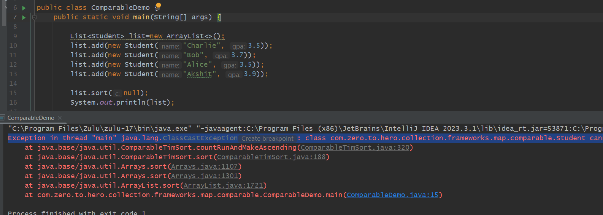
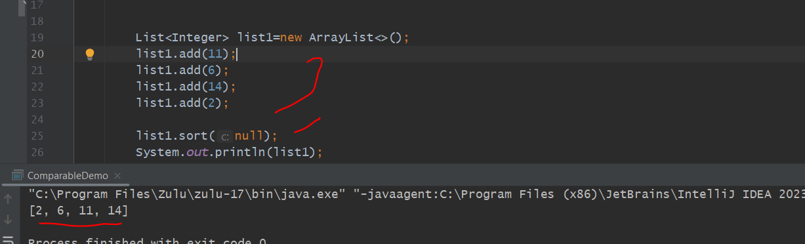
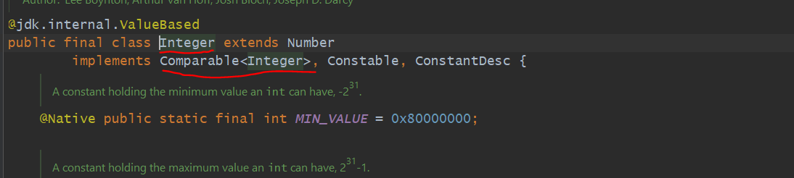
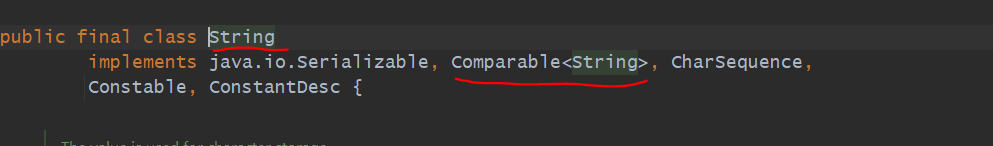

  => Whenever we want to do Custom Sorting Logic then we use Comparator.
  
  => If we want to tell to the class Itself to sort like this then Comparable.

  => In a List when we are having Custom Object class with some fields

        if we do list.sort(null);   -> it will throw exception       : Collections.sort(list); internally call list.sort(null)...
                                        Exception in thread "main" java.lang.ClassCastException: Student cannot be cast to 
                                        class java.lang.Comparable (Student is in unnamed module of loader 'app'; 
                                        java.lang.Comparable is in module java.base of loader 'bootstrap')

        
  

  => so asked here to do sort but  you have not passed comparator then How it will get to know how to do natural ordering...

  => here null means natural ordering

  => Instead of Student if we pass Integer or String object then it will work bcz String or Integer internally implements Comparable.

  => 

  => COMPARATOR WE USE WHENEVER WE WANT TO WRITE A CUSTOM LOGIC.

  => null means natural ordering

  => 

  => 

  => while we are using custom class then How we can do natural ordering just implementing comparable interface.

  => In Comparable compareTo() method is there while in comparator compare(o1, o2) method is there.

  => Comparator-> Comparator we use when we want to write a custom logic for sorting which is not natural ordering.
                  or we want to sort based on multiple logic.
                  Using Comparator we can define multiple criteria like sort based on a, b, c....
                  comparator implements outside class
  
  => Comparable-> Within class itself we are writing sorting logic. 
                  you can sot with only one criteria.
                  Comparable is a way to do natural order sorting.
                  implements within a same class.
  
Usecase
------

In our case we have to put that student first whose cgpa is high means
    in descending order need to sort based on cgpa.

  
