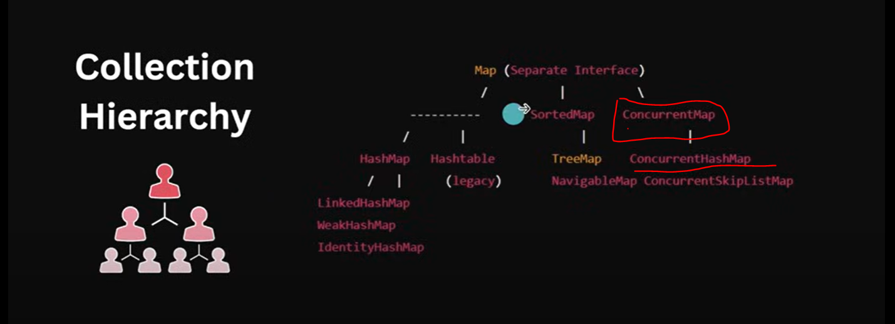

ConcurrentHashMap implements ConcurrentMap.
ConcurrentMap extends Map.

=> ConcurrentMap is an Interface where we can achieve Concurrency.

Internal Working (How It Work)
================================
Java 7 Mechanism
-----------------

java7 -> Segment based Locking -> 16 Segments -> smaller HashMap.
Only the segment being written to or read from is locked
Read: do not require locking unless there is a write operation happening on the same segment.

Write: lock

Map-> Sorted -> Thread safe  -> ConcurrentSkipListMap 

       -> Our Map will be divided into Segments.
       -> By Default 16 Segments.
       -> Eash Segments treat like a smaller HashMap.
       -> In java 7 segements based locking mechanism and all segements treats like a smaller hashmap.
       -> By default our Concurrent map will be divided into 16 smaller hashmap.
       -> In each Segemnt every hashmap is having it's own Independent Locking.
       -> Assume If we want to put or read data from any segments then only that segments get locks not orther segments.
       -> Write operation(put/remove) will lock segemnt while performing write operation.
       -> read operation do not require locking unless there is a write operation happening on the same segment.
       -> In Java 7 ConcurrentHashMap will be divided into 16 segments(smaller hash map).

Java 8 Mechanism
-----------------
Java 8 -> No Segmentation
       -> Compare and Swap Approach -> no locking except resizing or collision.
       -> Thread A last saw -> x = 42
       -> Thread A work -> x = 50
       -> If x is still 42, then change it to 50 else don't change do retry.
       -> put() -> Index ->

    -> In java8 they removed segemntations, bcz there are 16 segments they can't scaled it. it is a fixed no.
        If our HashMap is too big then there will be so much waitings. If a big map, so many segemnts, Inside segments many buckets, and many 
        key value pairs. just as an example at a same time if want to update or put a 3 to 4 values in same segemnts then we need to wait.  

    -> in Java 8 It uses compare and swap and here no locking required.

    -> In compare-and-swap no locking except resizing or collision occurred. If resizing happening or collision occuerrd that case only locking applicable otherwise not.

    -> Assume There is a Thread A which want to update value of x. he saw x value is 42. he want to update x value to 50 then what Compare and swap will do while start 
         comparing again it will check is the x value he saw last time 42 is still 42 then change it to 50 if not then don't change do retry. so here no locking there is running one 
         process or one thread is running he saw x is 42 he want to change it to 50 it may happend in this duration another thread can update/change value of x. If x is still 42, 
         then change it to 50 else don't change do retry. In retry again it will go to first step see what is the value of x and do same process.

    -> In retry again itwill go to first step see what is the value of x he saw x=62 thread want to change to 60 and again it will go and check still x=62 then change it else don't change do retry.

    -> you might say it would be then continuously loop running in that case if Compare and Swap is failing repeatedly then thread will wait for some time or go back 
         or he will do after sort random time.so that cpu should not waste. complexity will be more. we have given example using some variable let's see in case of Map.

    -> Assume you are putting something. if you do put() hashing will do, you will find some index value. and once you are going to insert in that particular index again it will do 
         compare and swap to check empty or not.in update also it same.
       
    -> Collision-> we said locking will applicable either in case resizing or collision. which means In case of collision we have to work with using linked list so there things become 
         complex. so we put lock on that particular bucket in case collision, so lock apply on particular bucket not in complete hashmap in case of collision.
    
    -> Resizing-> we read that once capacity become 0.75(load factor) then again map will do resizing hashmap doubled of the size, same things here also once size
          will be 0.75 times then we resize the same thing happen here also when after threshold 
       
    -> Resizing process is different in case of hashmap and consurrenthashmap. In case of hashmap if internal array size become more than threshold we doubled the array size.
         so if capacity become more than, load factor 0.75 so capacity(16) * 0.75(load factor) then we doubled the hashmap size. But In case of ConcurrentHashMap size won't 
         doubled it go step by step incremntal resizing if size is more then we add one more bucket and lock will be in case of resizing and collission. 
