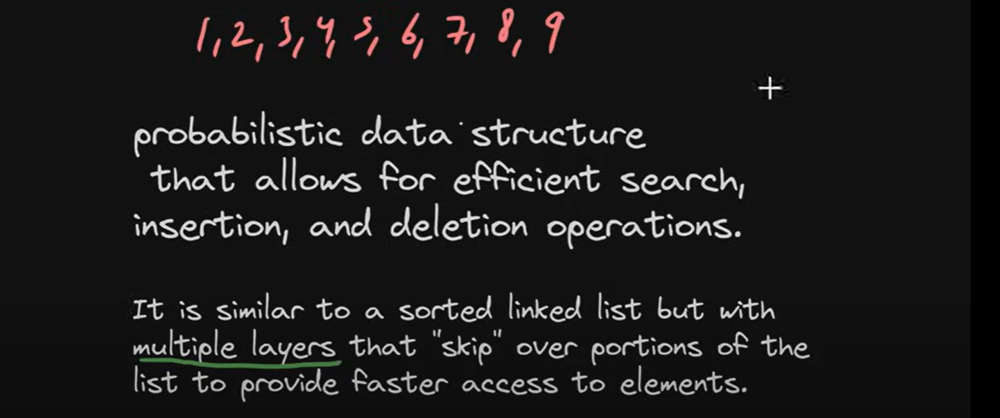
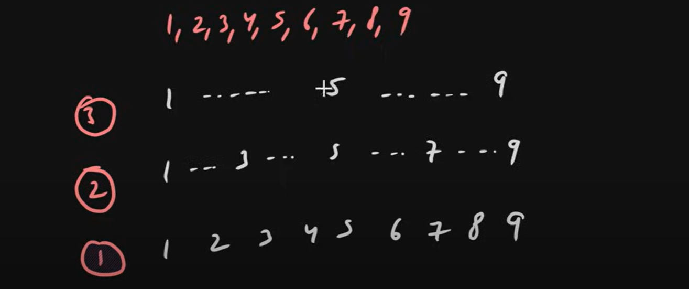
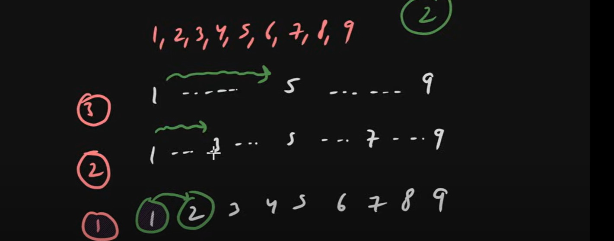

want concurrency in HashMap use - ConcurrentHashMap -> concurrent version of HashMap
want concurrency in a sorted manner use - concurrentskiplistmap -> concurrent version of TreeMap

  In ConcurrentSkipListMap data will be store in a data structure name "SkipList".
  
  Like Map store data in Array so here ConcurrentSkipListMap store data into SKipList.
  
  
  
  Hash Map store data in Arrays, Tree Map store data in Red Black Self Balancing Binary Search Tree.

  ConcurrentSkipListMap stored data in a sorted Manner and we achieve concurrency as well.
  
  We can say Synchronized Tree Map or Thread Safe Tree Map but here data stored in a new data structured "SkipList".
  
  
  
  Skip List => Probabilistic Data Structure that allows for efficient search, insertion and deletion operations.

  Skip List => It is similar to a sorted linked list but multiple layers that "skip" over portions of the list to provide faster 
                access to elements.

  

  
UseCase
========

 Below numbers we want to put in skip list

  1, 2, 3, 4, 5, 6, 7, 8, 9

 
  Skip List    -> Sorted elements
               -> multiple Layers like tree
               -> fast access

  
  

  ** at Last Layer layer(1) all elements will be presents.
  ** at next Layer layer(2) we can skip few elements.
  ** at top most layer we skip few more elements and store it.
   so it looks like below image.

  

  so, We have multiple Layers of Linked List.
 
  
How It Search
-------------

 let's say we want to search element 2. so at top layer it will check like 2 is greater than 1 so it will go next element
  then it will see 5 so 2 is less than 5 so element not present in this list. so it will go to next layer 2 from 3...
  At layer 2 will check 2 is greater than 1 so go to next element 3 so 2 is less than 3 so it not find again it will go
 to next layer and it will find after 1 we found 2...

 

 Time Complexity -> O(log n)

  => Better than a Linear Search.

Discussion
----------

=> Tree Map was Self Balanced Binary Search Tree why we not used here???

In Self Balanced Binary Search Tree there is a complex Algorithms to balanced the elements.
so that kind requirements is not here. here the things are not that much restricted.

for example i want to insert 1 element 3.5, so here not 100% surety that all the elements we have to touch like RB tree
here things will do randomly. not much restricted.

In Red Black tree we were doing constant re-balancing so that elements not un-balanced. in worst case complexity O(n).

It's a probabilistic data structure. we can achieve Concurrency also here.

ConcurrentSkipListMap -> Key Value Pairs will store in a Skip List Data Structure.
---------------------------------------------------------------------------------

 
       ConcurrentSkipListMap Implements ConcurrentNavigableMap.
       ConcurrentNavigableMap extends ConcurrentMap and NavigableMap.
       

Summary (UseCase)
========

Want to sort keys entry use - TreeMap 
want closest entry like(first-entry, last key) use - NavigableMap
want concurrency in HashMap use - ConcurrentHashMap -> concurrent version of HashMap
want concurrency in a sorted manner use - concurrentskiplistmap -> concurrent version of TreeMap

  
  
  