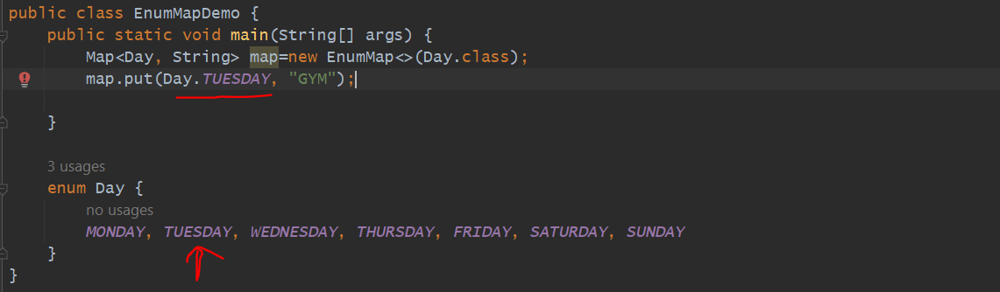
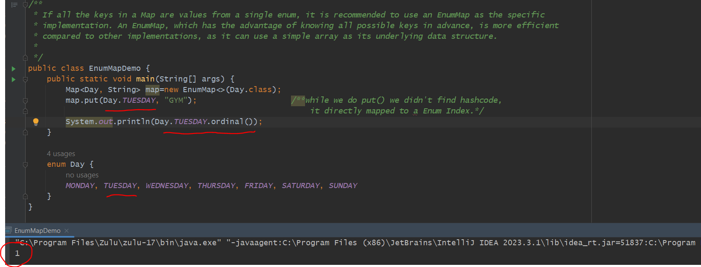
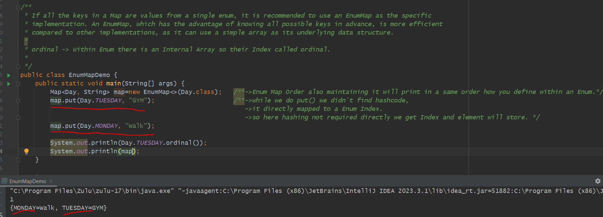
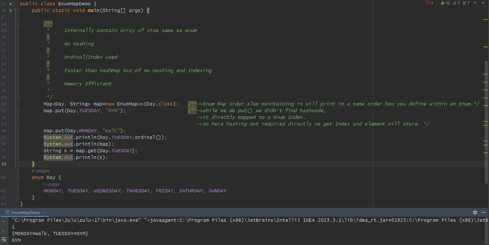

If all the keys in a Map are values from a single enum, it is recommended to use an EnumMap as the specific 
implementation. An EnumMap, which has the advantage of knowing all possible keys in advance, is more efficient 
compared to other implementations, as it can use a simple array as its underlying data structure.

In EnumMap Constructor you have to define which Enum you are defining in a Key.

=> EnumMap will know all possible Keys in advance
---------------------------------------------------

=> one Benefit is No need to do Array Resizing bcz all key's load at start itself
---------------------------------------------------------------------------------

Pros - Cons
===========

In HashMap we have to resize or rehash once elements more than the capacity of an internal array. 

Automatically EnumMap will know the size of Map so no need to do resize.

In a HashMap finding hashcode() then bucket index but Inside a Enum there is an Array. each elements in a Enum will
be a Index called Ordinal. all enum elements having an index. 

here while we do put we didn't find hashcode it directly mapped to a Enum Index.

ordinal -> Within Enum there is an Internal Array so their Index called ordinal.

so here hashing not required directly we get Index and element will store

Enum Map Order also maintaining it will print in a same order how you define within an Enum.

while we do map.put(Day.TUESDAY, "GYM");
 
    then it will find ordinal. then it will go to Array at index 1 and store value Gym.

while we do map.get(Day.TUESDAY);

    First it will find ordinal. then it will go to Array at index 1 and get value Gym.

Important Points:-
------------------

    Internally contain Array of size same as enum
    
    No Hashing

    Ordinal/Index used

    Faster than HashMap bcz of no Hashing and Indexing

    Memory Efficient

    

    

