* Map does not extends Collection.

* Map is a separate Interface.

* Hash Map not maintain Insertion order.
  

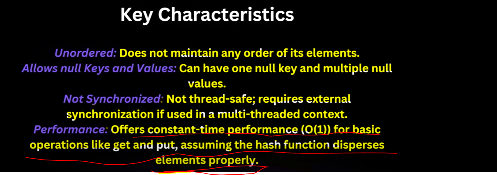

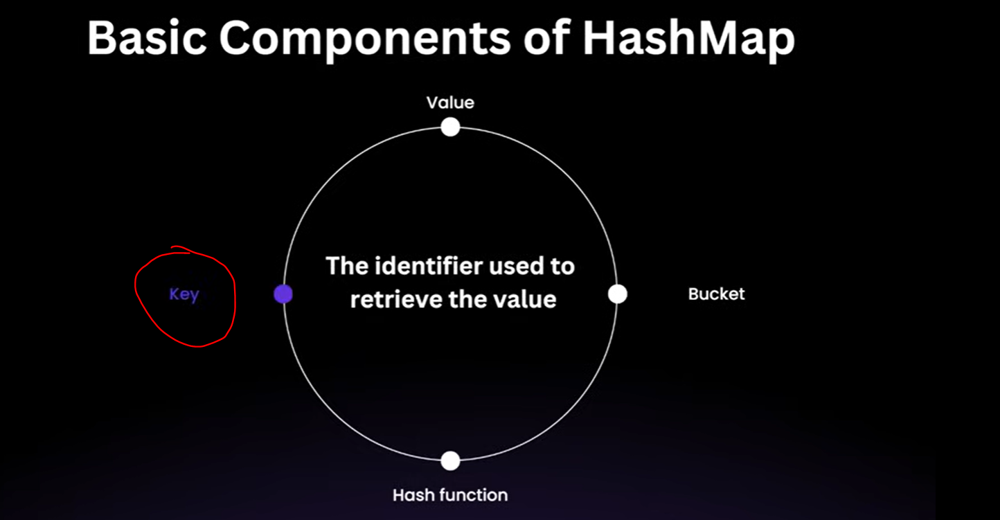

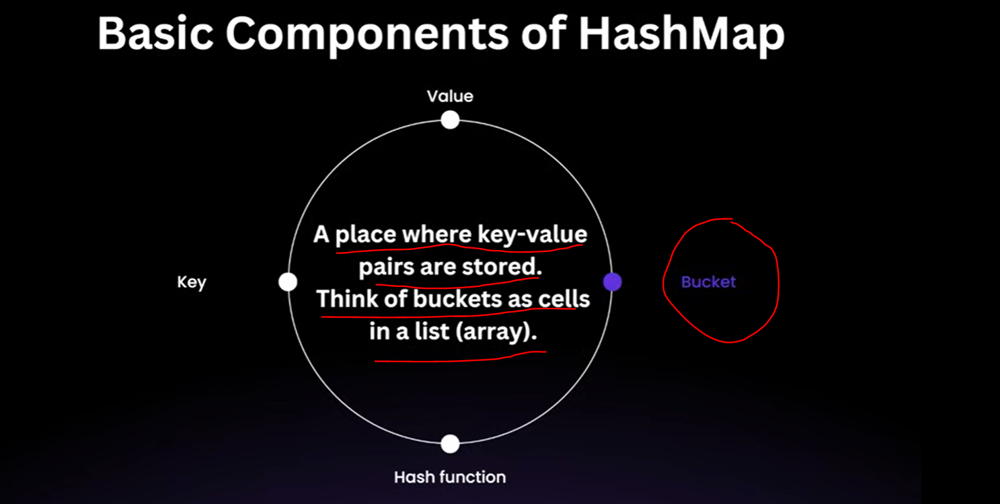

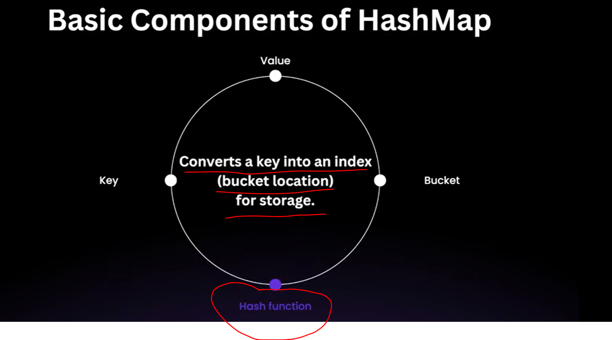

    Primary Purpose of Hash Function is :

        You can take an Input of any mo. of size In Output you will get a fixed sized output.

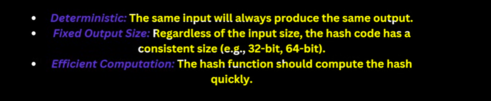

How Data is Stored in HashMap
-----------------------------

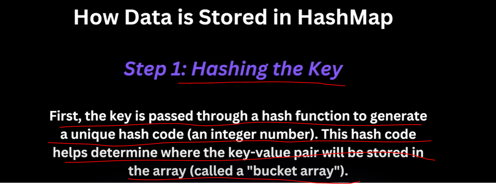

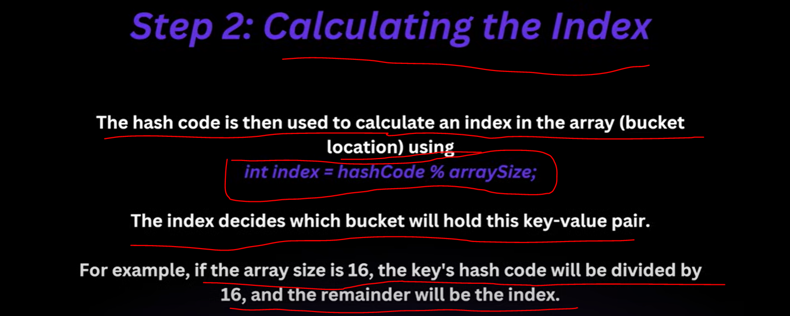

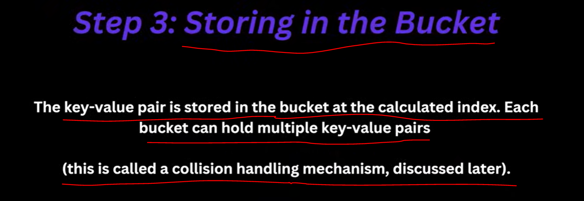

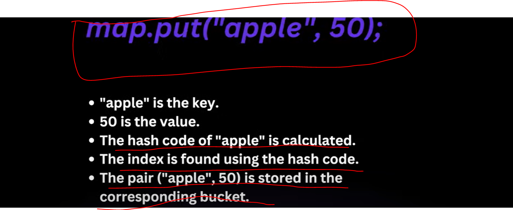

How Hash Map Retrieve Data
--------------------------

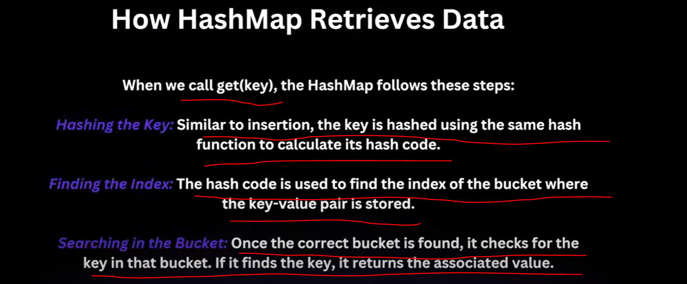

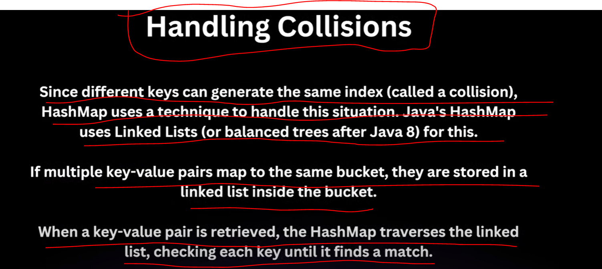

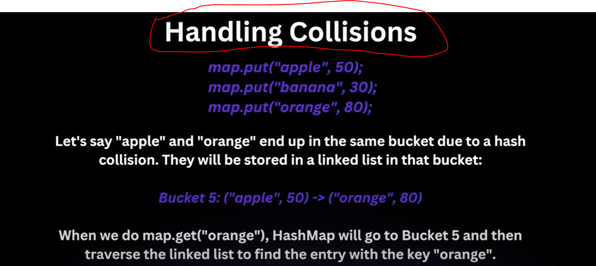

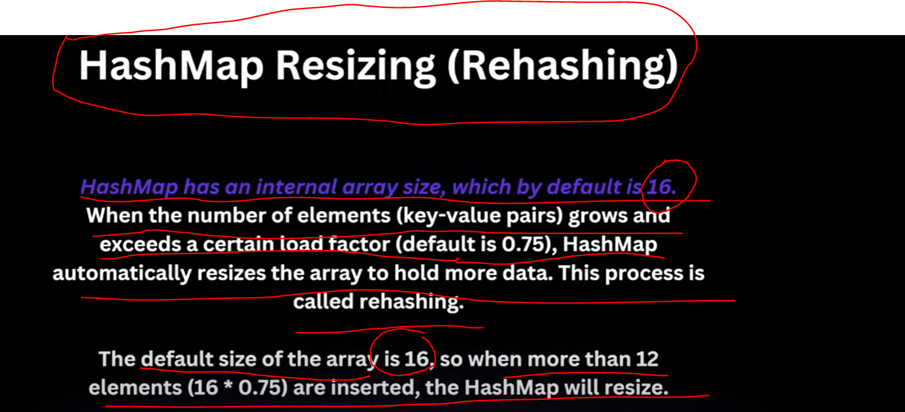

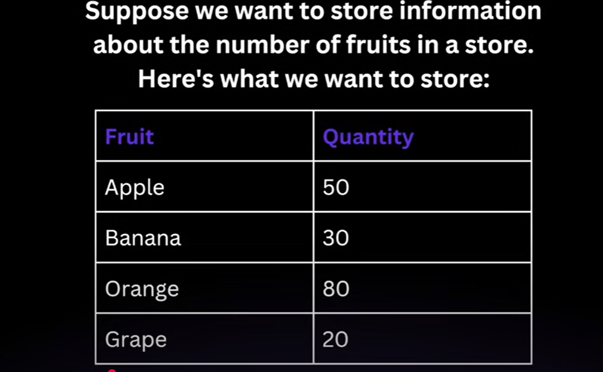

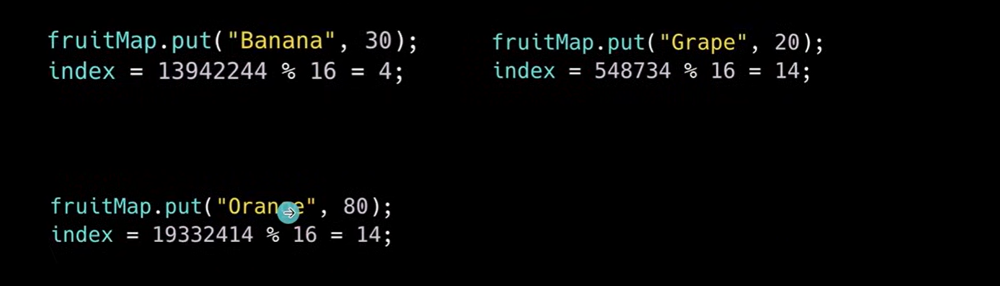

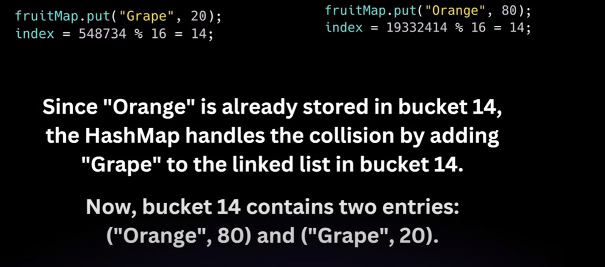

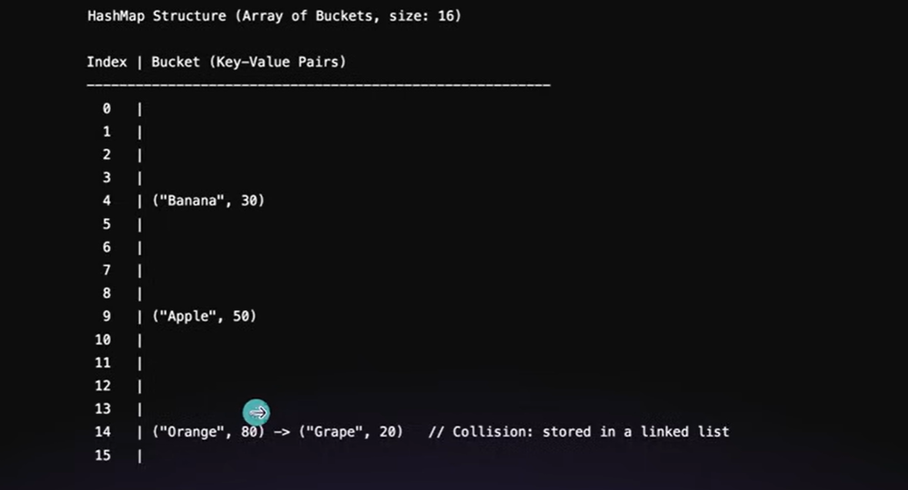

        we want to store a custom Object Student in Hash Map. we will create a class Student and that object

        we will store in HashMap object. 

        Here we saw in Example of Orange and Grape Collision occurred. 

        then we saw during Retrieval this linked list will get traversed and checked what we are trying to get
        that is present in our linkedlist or not. so we check using map.get("Grape"). then this linkedlist get traversed
        so first it will check the first Item is equal to Grape or not. if not then will go to next element and check
        either 2nd element is equal to grape or not If yes then we will return 20. so, How it get check?????

        >> The equality will be check with the help of equal() method.

        >> But If we have a class called Student with 2 fields id and name. and we have a HashMap of type Student and marks.

   

   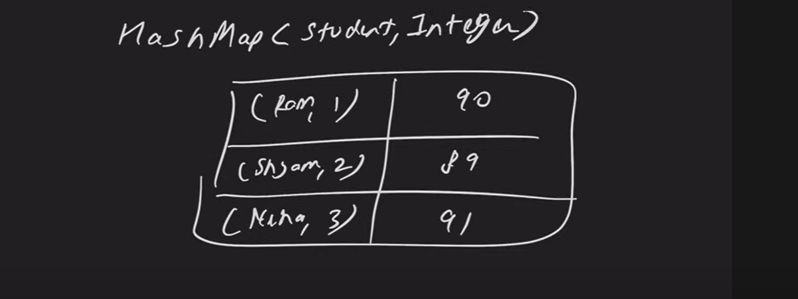

   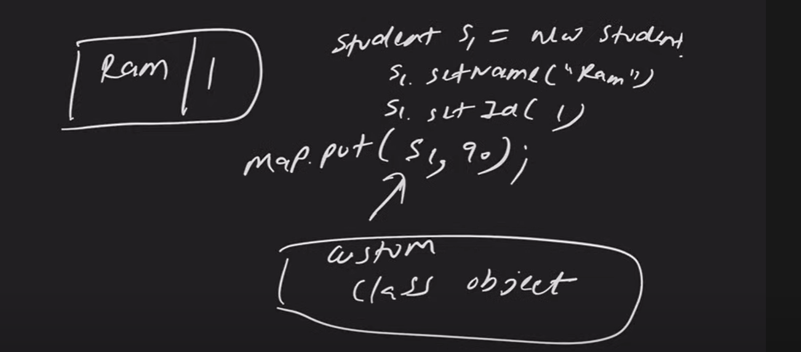

   so, here key is Student and value is Integer.

   Earlier In our HashMap as a key we were having Either String or Integer. but now we are having Custom object
   Student as a key.

   so, By default hashcode and equals method would be there.

   Because Every Class By Default Implements Object Class and Inside Object class both the methods hashcode and
   ------------------------------------------------------------------------------------------------------------
   equals method will be present.
   ------------------------------ 

 Let's see What is Role of hashcode inside an Object
====================================================

    <> hashcode will be generated for an object using Memory address.
    <> which means all the instances of Student class we create will have a different hashcode.
    <> equals also see the reference or address.
    <> so, here both hashcode & equals using memory address only let's see what would be the problem in this case.

   let's see the Problem -> 

       public class HashCodeAndEqualMethod {
       public static void main(String[] args) {
    
       HashMap<Student, String> map=new HashMap<>();
            Student s1=new Student("Alice", 1);
            Student s2=new Student("Bob", 2);
            Student s3=new Student("Alice", 1);  // here s1 is same student as s3

        /** now we have 3 objects but actually we have only 2 student */

        map.put(s1, "Engineer");  // hashcode --> index
        map.put(s2, "Designer");  // hashcode --> index
        map.put(s3, "Manager");   // hashcode --> index

        /** Now we want s3 which is Alice only his designation replace with manager
         * But will it work
         *
         * as we know hashcode will get generate from that we can find Index for a key, here key is student
         *
         * Because hashcode definition we have not given. Student extend Object class then inside Object class hashcode.
         *
         * so, with the help of Memory Address hashcode generated. bcz we have used here new keyword so hashcode will always be different.
         * so, both object will be place on a different Index(Bucket)
         * so, Inside Map there will be a 3 entries.
         * 
         *
         * */
        }
        }

   let's see another example ->

   

   
   Analysis :-

      we want actually in case of custom object as a key in HashMap, should generate the same hashcode as s1.
      the reason is hashcode for object is generating through Memory address intead of class fields that the reason
      its generating different for same object field. 

   

   >> Map size should be 2.
   >> Student value s1 should be Manager
 

  How we can tell Both the Object is same using override hashcode() & equals() method
-----------------------------------------------------------------------------------------

   we want every student should have a different hashcode and while checking equality check id and name both. 

   

      
      Inside Objects.hash() internally using
      
      Arrays.hashCode(values);

   

   

      It will make sure If Input is same then output(hashcode) will also be a same.

      equals() will call intern() method.

   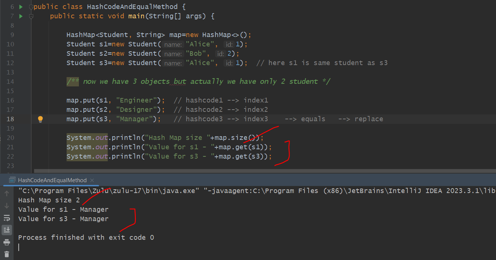

   -> so whenever using custom object in Hash map always make sure to override hashcode() and equals() method.

   -> let's take If we are using Set. In a Set there will be a Unique elements. In set if we add these 3 students objs
      all 3 get store but should store only 2. In that case we also have to write hashcode and equals methods.

  Hash Map Principle is Going to use in Hash Set.
  -----------------------------------------------

   Time Complexity
   ===============

   

   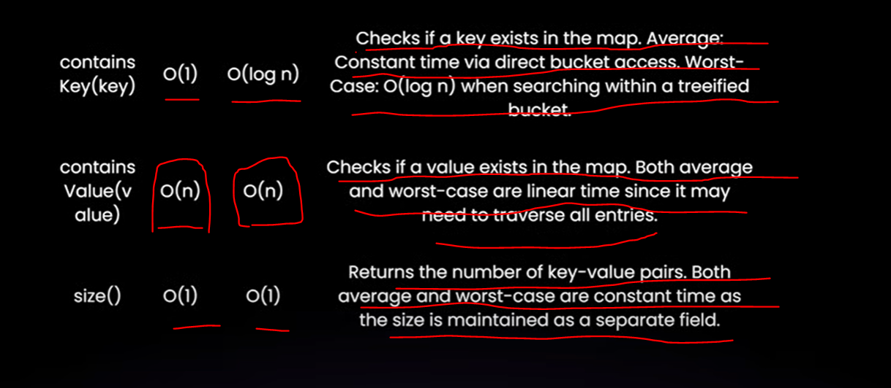

   
      

