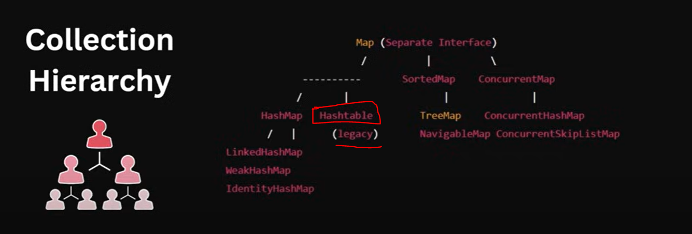
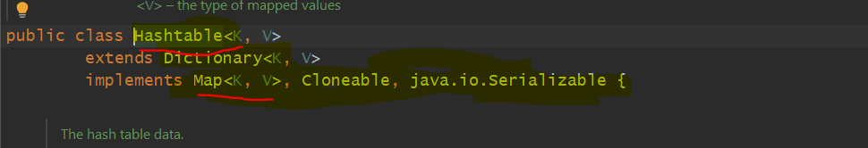
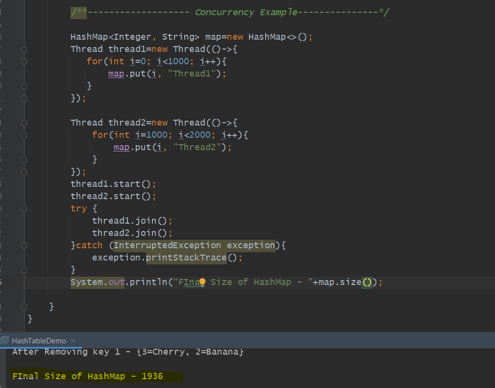
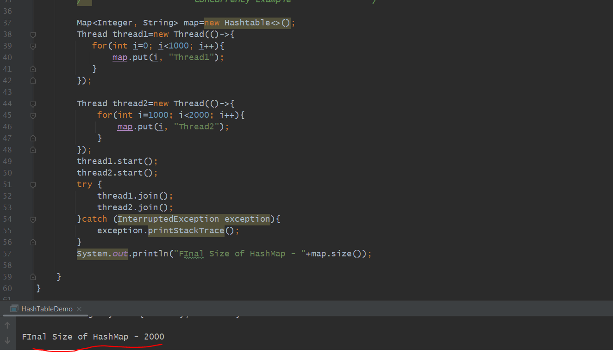

HashTable is a Legacy Class. we won't use much.

HashTable was in JDK 1.0 when Collection Framework was not present.

=> HashTable Implements Map just like HashMap But there are few differences from HashMap.

=> 

Hash Table Characteristics (Difference between HashMap - HashTable)
===================================================================

>>> HashTable is Synchronized so it's a Thread Safe.

>>> No Null Key or Null Values.

>>> It's a Legacy Class and get Replaced with ConcurrentHashMap.

>>> Slower than HashMap bcz of Synchronized multiple threads trying to get accessed.

>>> HashTable key and value should not be null will throw Exception

>>> The system How it's getting used in HashMap like finding hashcode() calculating Bucket Index same things happening in HashTable.

>>> In HashMap after a certain Threshold will use Binary Search tree if Collision occurred but here only linked list if collision occurred.

Ideally o/p should come 2000 but not coming in Hash Map bcz HashMap is not Thread safe, where at a same time Thread1 and Thread2 is running
so in this case instead of increase 2 it will increase 1. so instead of 2 entry it will have one entry either thread1 or thread2. what should happen
when Thread 1 using map then at that time should get lock.

If i changed it to HashTable then 2000 will come bcz HashTable is Thread safe.
Hashtable meje all methods to synchronize.

which means only one thread can modify a Map at same time. 
All methods are synchronized in Hashtable including get()
At same time only one thread can read a data from hashtable.

Limitation
---------

Both method put and get are synchronized in Hashtable. which means only one thread can modify a Map at same time. At same time only one thread can read a data from hashtable.

bcz of this, limitations ConcurrentHashMap Introduced. 

In HashTable get() method also synchronized, so complete hashtable get locked. so the Thread who want to Read they also need to wait...

bcz of this Reason ConcurrentHashMap came. 
. 

