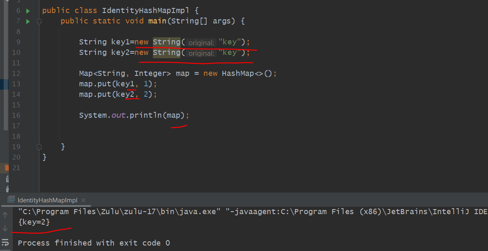
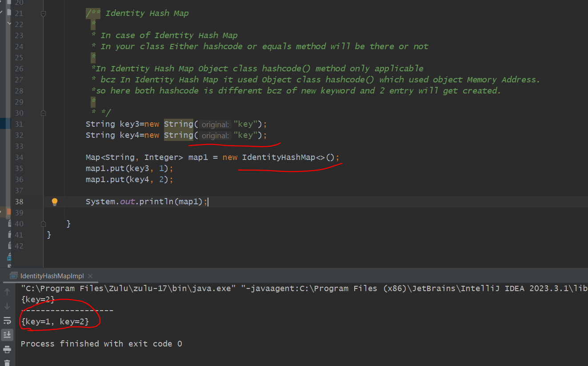
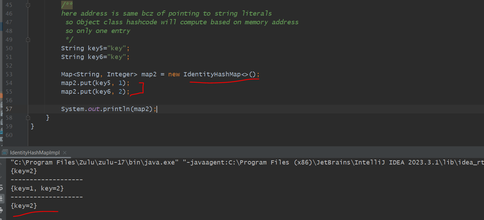

here both the address will be different bcz we are creating in Heap memory using new String().

If we have a class Inside that class no hashcode() method ...then the Object class hashcode will be used

Object class hashcode actually get calculated using Memory Address...

But here we are having String class is having their own implementation based on String value.

so here content is same "key" so same hashcode will be generated and will go to same index bucket and 

and check equals() method content is same so replace value. so in hash map only 1 entry.

Identity HashMap
----------------

If we change above example to Identity HashMap then 2 entry will get created.

        /** Identity Hash Map
         *
         * In case of Identity Hash Map
         * In your class Either hashcode or equals method will be there or not
         *
         *In Identity Hash Map Object class hashcode() method only applicable
         * bcz In Identity Hash Map it used Object class hashcode() which used object Memory Address.
         *so here both hashcode is different bcz of new keyword and 2 entry will get created.

            so here it will use IdentityHashCode and ==

=> let's assume both hashcode is same somehow then also here equals() method won't be applicable
=> here equality get checked (==) means reference memory address

=> so here it will use IdentityHashCode and ==

Example
--------
         so Object class hashcode will compute based on memory address
         so only one entry 

