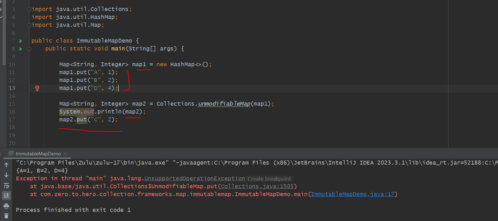
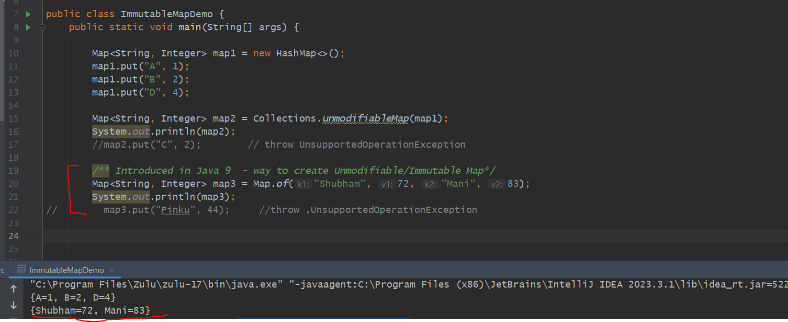
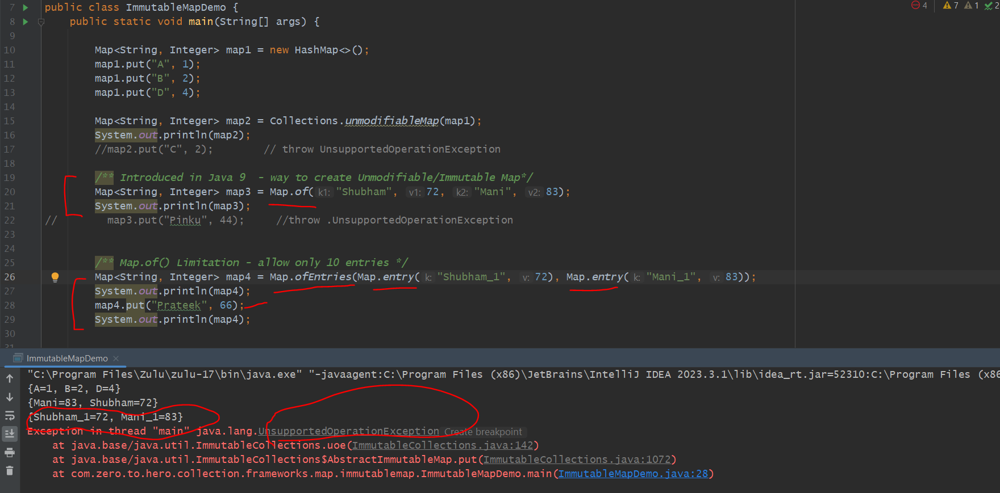

Returns an unmodifiable view of the specified map. Query operations on the returned map "read through" to the specified map, 
and attempts to modify the returned map, whether direct or via its collection views, result in an UnsupportedOperationException.
The returned map will be serializable if the specified map is serializable.

ImmutableMap
------------

    => A Map whose content we can not change or modify once it is instantiated.

    => We can not add / remove / update

    => If you try to add an elements in unmodifiableMap() then it will throw - UnsupportedOperationException

    => 

Drawbacks
==========

you have created a View of an Original Map. but there might be anyone can change original map(map1) itself and you do not want allow to do that

so, here there are 2 copies one can change and one can't change.

=> So, Because of It there is one feature come in Java 9 - Map.of(-,-,-,-);

=> here you just define key and value then map will be automatically create so a clean way to create an unmodifiable/immutable map.

Limitations : Map.Of() -> only allow 10 Entries
-----------------------------------------------

