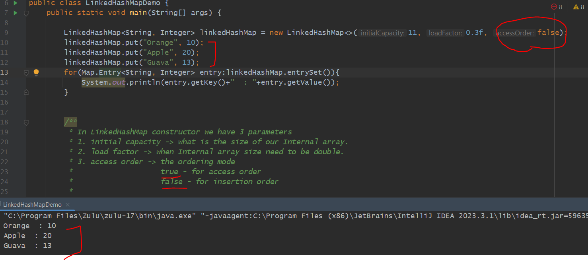
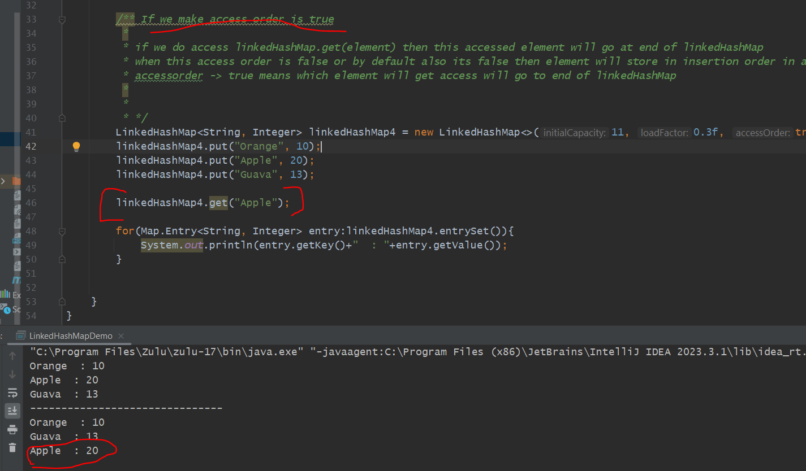
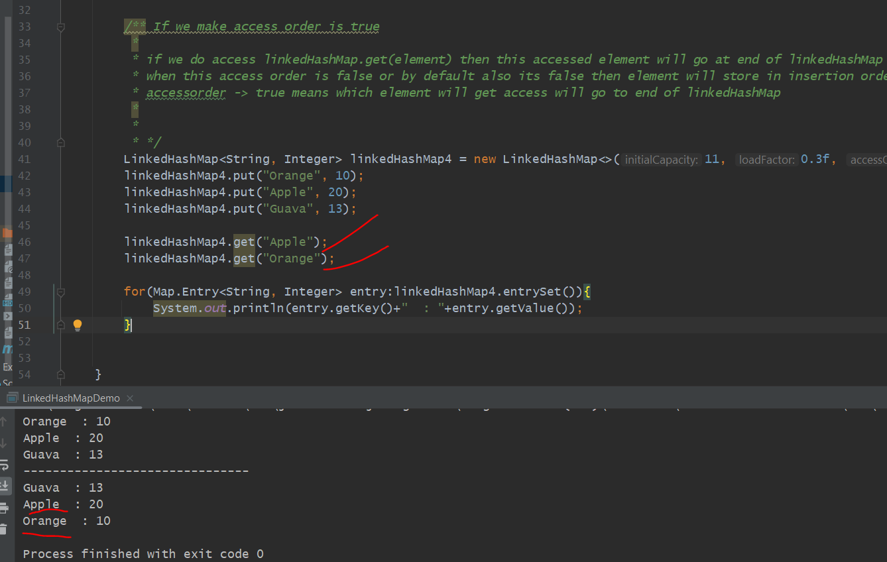
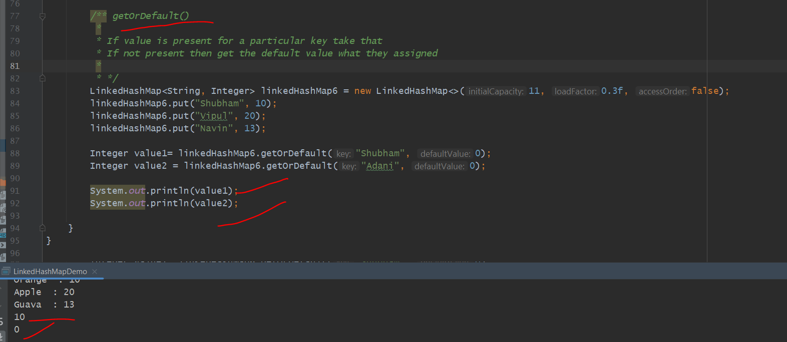
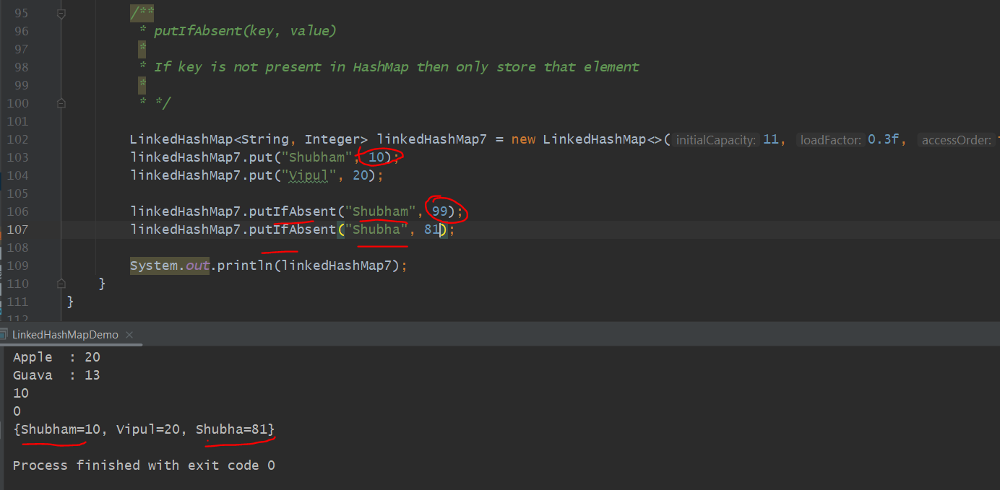

 + Linked Hash Map Maintaining the insertion Order this is the main difference between HashMap and Linked HashMap.

 + In LinkedHash Map there is a Double Linked List which keep all the entries with there in the order how we insert.

 + This Doubly Linked List will be uses by LinkedHashMap to store the insertion order bcz of this LinkedHashMap become bit slow,

    due to overhead of this doubly linked list in comparison to HashMap.

 + This is a Sub class of Hash Map so Time Complexity will be O(1) but just performance become little-bit slow.

 + So bit, more memory it will take comparison to HashMap.

 + Linked Hash Map only we can use while we need to maintain order.

       * In LinkedHashMap constructor we have 3 parameters
         * 1. initial capacity -> what is the size of our Internal array.
         * 2. load factor -> when Internal array size need to be double.
         * 3. access order -> the ordering mode
         *                    true - for access order
         *                    false - for insertion order

=> By default access order is false, which means in which order you are inserting records in same order we were getting.

=> 

If we make access order is true
-------------------------------

        /** If we make access order is true
         *
         * if we do access linkedHashMap.get(element) then this accessed element will go at end of linkedHashMap
         * when this access order is false or by default also its false then element will store in insertion order in a linkedlist
         * accessorder -> true means which element will get access will go to end of linkedHashMap
         *
         *
         * */

 

 

        /**
         *
         * There is a Mechanism Least Recently Used (LRU)
         * In this LRU Algorithm we keep a track of that elements which is Lease Recently accessed.
         * which means a old data or the data which is not being used.
         * So, The elements is not used frequently we keep on top, so that easily we can remove.
         *
         *
         * Use - Case
         *
         * There are some entries or data need to Remove Least Recently Used data
         * actually so many data getting accessing so it's difficult to find out the data which is Least Recently Used.
         * so, In that Case we can make access order true and we can use Linked Hash Map.
         *
         *In a Caching-> there is a Cache Eviction Strategy
         * which means if you are going to save every thing in a cache then your disk become full.
         * so you can remove Least Recently used data.
         */

  getOrDefault method
-------------------------

putIfAbsent method
-------------------

      Instead of put method if you not pass putIfAbsent() method then it will replace the existing key entries with new entry
      that's the reason we are using putIfAbsent() method If key not exists then only store entry in a map.

  ** LinkedHashMap also not a Thread Safe just like a HashMap.

   