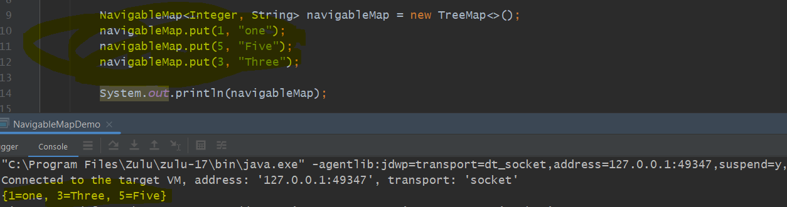

        NavigableMap<Integer, String> navigableMap1 = new TreeMap<>();
        navigableMap1.put(1, "one");
        navigableMap1.put(5, "Five");
        navigableMap1.put(3, "Three");

        System.out.println(navigableMap1);
        System.out.println(navigableMap1.lowerKey(4)); /** o/p-3, lowerKey:  Returns the greatest key strictly less than the given key, or null if there is no such key.*/
        System.out.println(navigableMap1.higherKey(4));/** op-5, higherKey: Returns the least key strictly greater than the given key, or null if there is no such key.*/
        System.out.println(navigableMap1.higherEntry(4));
        System.out.println(navigableMap1.lowerEntry(4));
        System.out.println(navigableMap1.floorEntry(4)); /** Returns a key-value mapping associated with the greatest key less than or equal to the given key, or null if there is no such key.*/
        System.out.println(navigableMap1.ceilingEntry(4));
        System.out.println(navigableMap1.descendingKeySet()); /** descendingKeySet- Returns a reverse order NavigableSet view of the keys contained in this map*/
        System.out.println(navigableMap1.descendingMap());/** descendingMap- Returns a reverse order view of the mappings contained in this map*/
        System.out.println(navigableMap1.lastEntry());/** lastEntry- Returns a key-value mapping associated with the greatest key in this map, or null if the map is empty.*/
        System.out.println(navigableMap1.firstEntry());/**firstEntry- Returns a key-value mapping associated with the least key in this map, */
        System.out.println(navigableMap1.headMap(3));/** headMap- Returns a view of the portion of this map whose keys are strictly less than toKey. */
        System.out.println(navigableMap1.headMap(3, true));/** headMap-Returns a view of the portion of this map whose keys are less than (or equal to, if inclusive is true) toKey*/
        System.out.println(navigableMap1.tailMap(3));/** tailMap- Returns a view of the portion of this map whose keys are greater than or equal to fromKey.*/
        System.out.println(navigableMap1.tailMap(3, false));/** tailMap- Returns a view of the portion of this map whose keys are greater than (or equal to, if inclusive is true) fromKey.*/
        System.out.println(navigableMap1.subMap(2, 5));/** Returns a view of the portion of this map whose keys range from fromKey, inclusive, to toKey, exclusive. (If fromKey and toKey are equal, the returned map is empty.) */

Map, NavigableMap, SortedMap all 3 are an Interface and TreeMap is an Implementation class of it.

so we can use any Interface as a reference obj based on Requirements.

