                            TreeMap  ( Red Black Tree )
                         Self Balancing Binary Search Tree

                ---------------------------------------------------

Sorted Map is an Interface.

SortedMap extends Map Interface.

TreeMap Implements Navigable Map and Navigable Map extends Sorted Map Interface.

Sorted Map extends Map Interface.

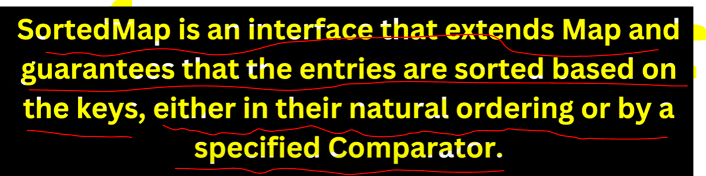

If you want to sort based on key then need to use Sorted Map. which is an Interface so you must have to
you their Implementation class like TreeMap or Navigable Map.

 ** It sorts keys either in natural ordering which means within that class you must have written or
    implemented a Comparable Interface.
 
 **  Within Tree Map constructor you can pass Comparator object also so they will sort accordingly.

 ** Like if we are using a Key like String or Integer they by default Implements Comparable interface
    if any class not then we need to pass comparator.

 ** 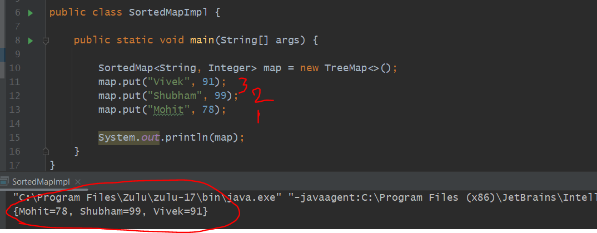

 ** 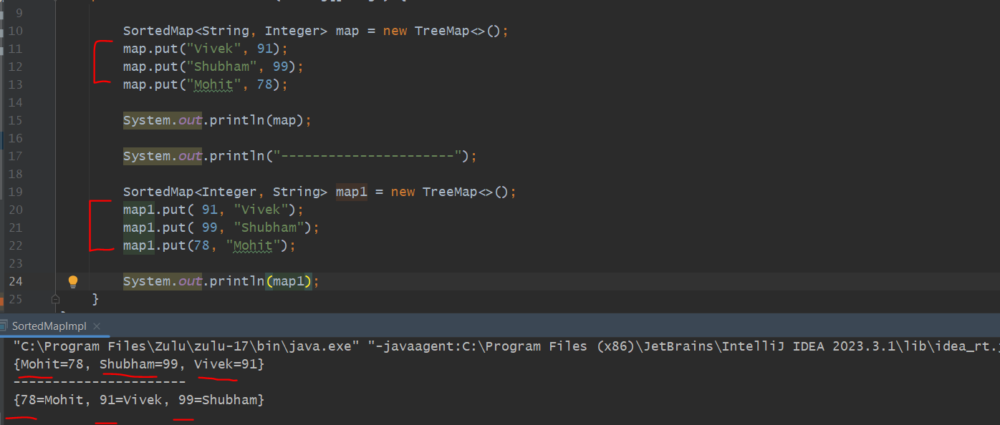

In a Tree Map both the keys String type and Integer type stored the values as in sorted order based on key.
The reason is bcz Integer and String both Implements Comparable Interface.

Question: Why we are using Sorted Map as a Reference Object we can use Map as well  ??
------------------------------------------------------------------------------------

The Reason is Sorted Map will give some other additional features also.

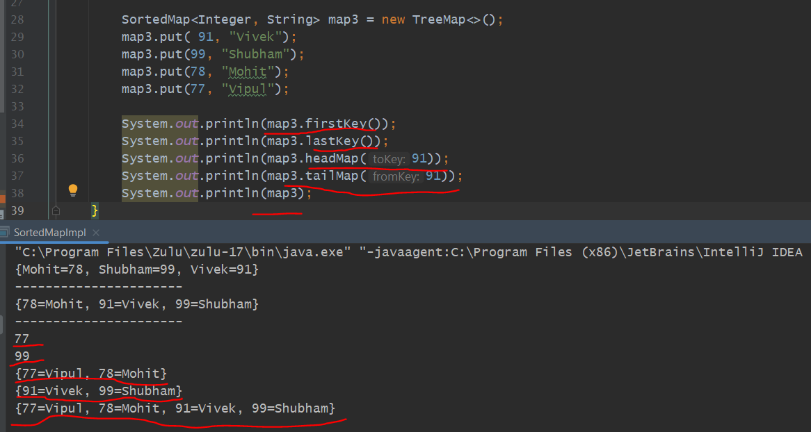

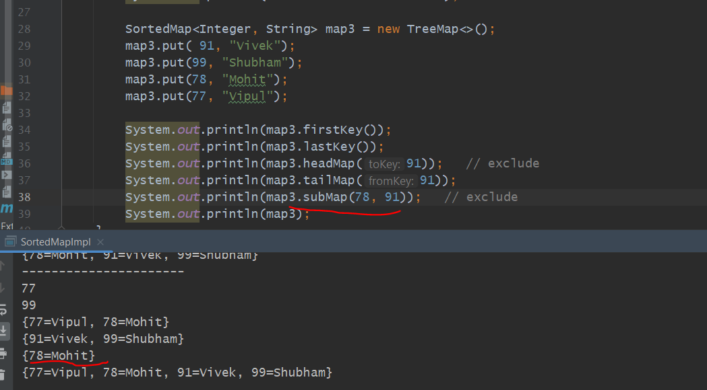

=> This is Integer Natural Ordering...bcz Integer internally implements comparable interface.

=> I want to sort the key on descending order so i can pass comparator in Tree Map constructor.
   --------------------------------------------------------------------------------------------

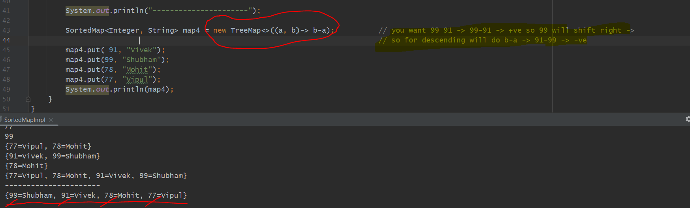

Example
----------

1. Now In our Tree Map In a Key let's use Student object and sort based on name using Comparable in desc order

2. let's use Student object as a key and sort based on gpa using Comparator If gpa is same
   then sort based on name.

If you are using Custom Object as a key and you have not Implemented Comparable or Comparator Interface It
will throw an exception. JVM will not assume on which field you want to sort and print asc/desc.

    for that let's Implement's Comparable Interface.

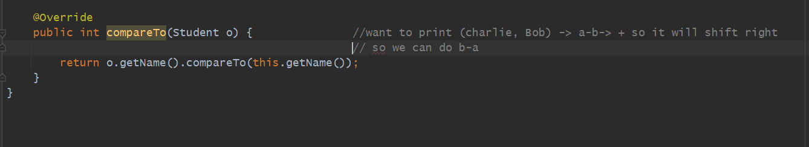

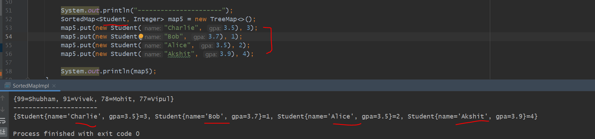

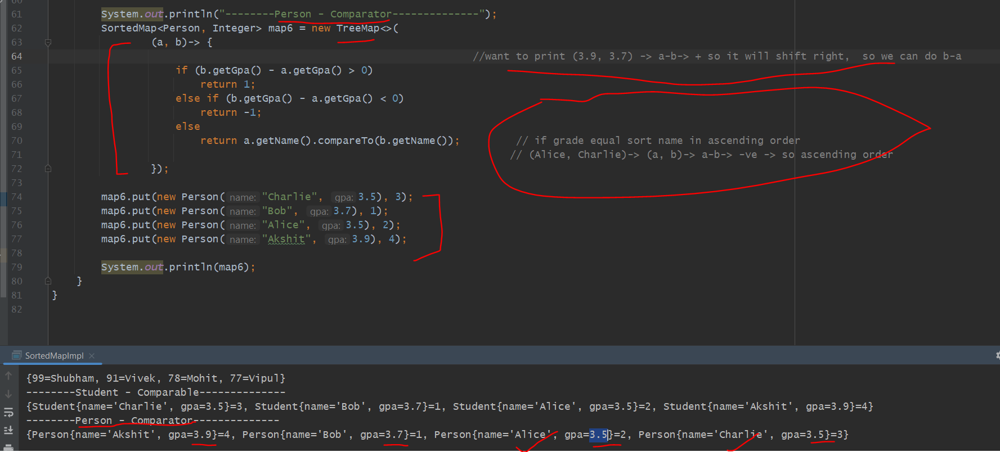

=> Tree Map should not have a null key otw will throw NullPointerException
    The Reason is Tree Map Internally uses Comparable for Integer or String class to sort
   that's the Reason will throw NullPointerException

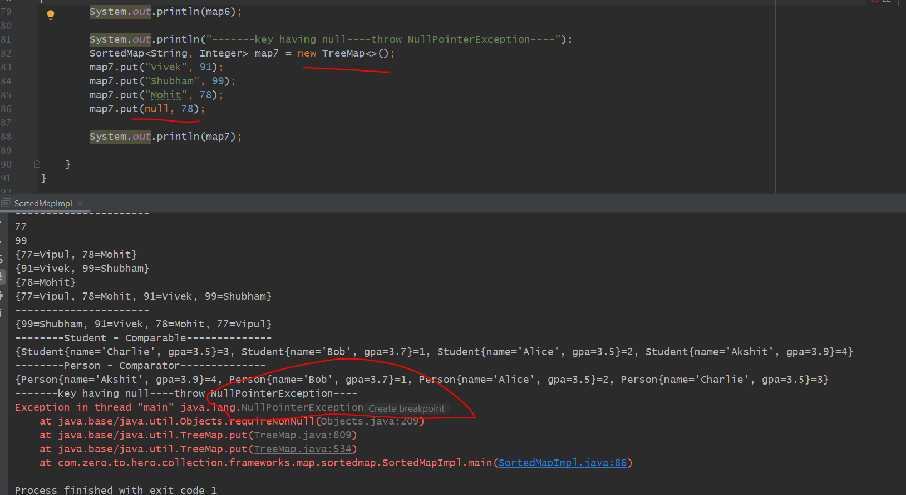

Internal Implementation
------------------------

    Tree Map Internally uses Red Black tree. 
    Red Black Tree is a Self Balancing Binary Search Tree.
    We know in Hash map put() and get() calls and their Time Complexity are O(1)
    But here In Tree Map Time Complexity is O(logn) bcz we are doing sorting.
    Tree is a Self Balancing Binary Search Tree
    If we store any element It should store in a sorted manner. 
    So It arranges in a way so that order should be maintained.
    TreeMap Implements Navigable Map and Navigable Map Extends Sorted Map.

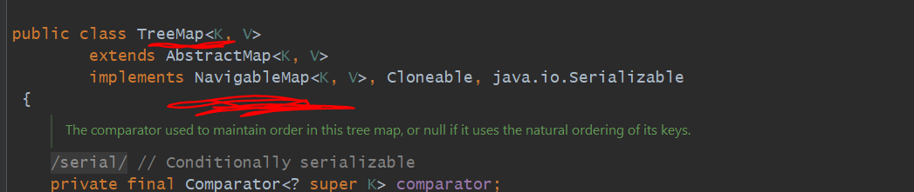

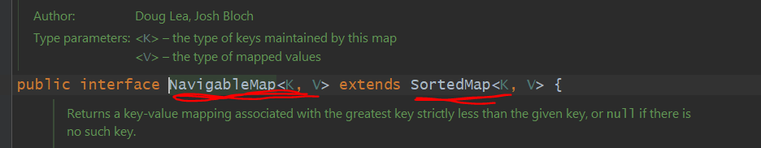

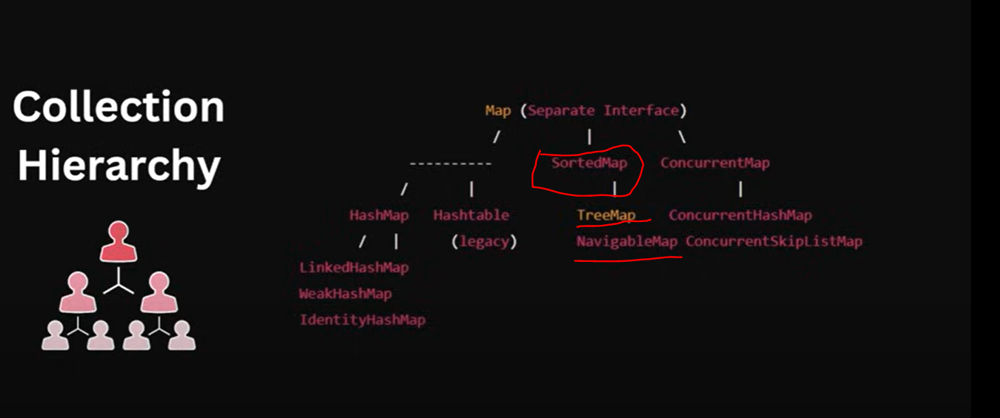

=> NavigableMap Extends SortedMap. TreeMap Implements NavigableMap.
    SortedMap and Navigable Map both are Interfaces.
    Tree Map is the Implementation of Navigable Map in term sorted map.

