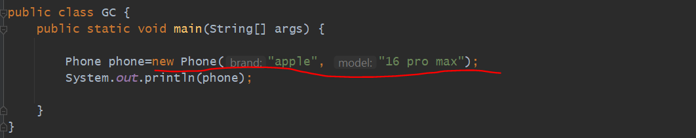
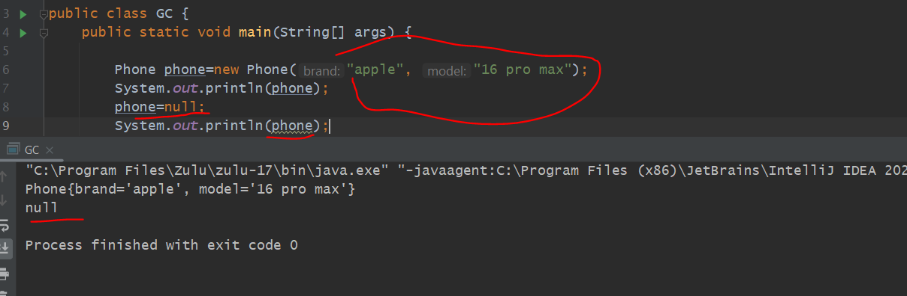
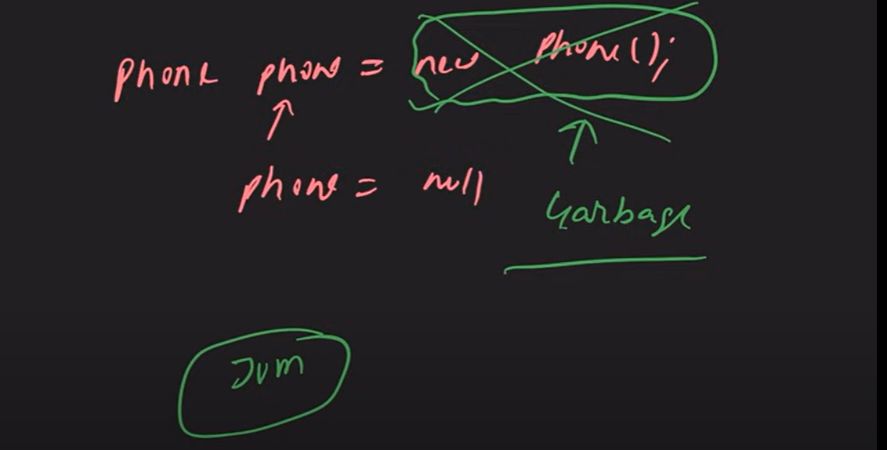
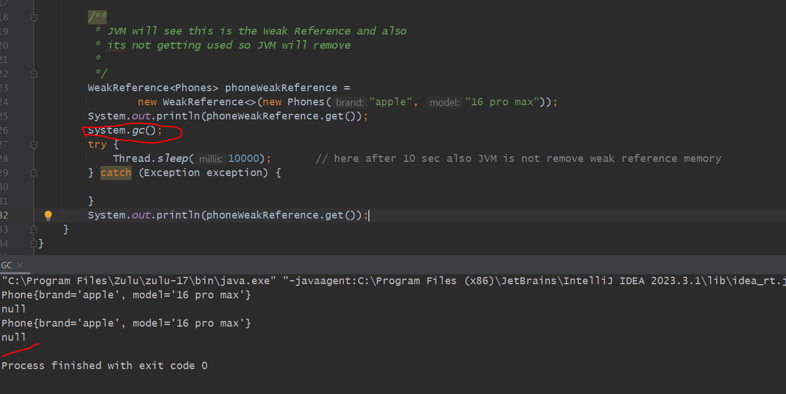
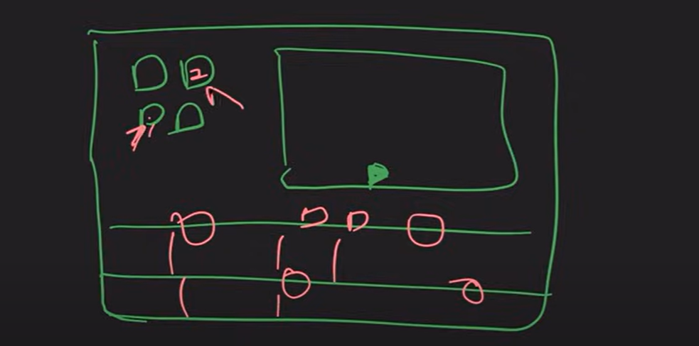
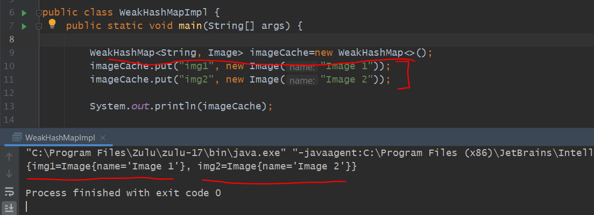
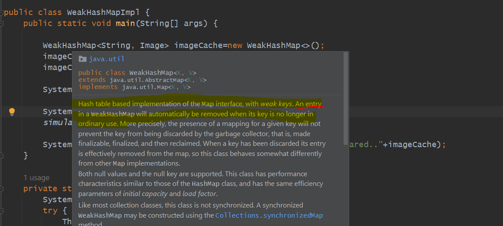
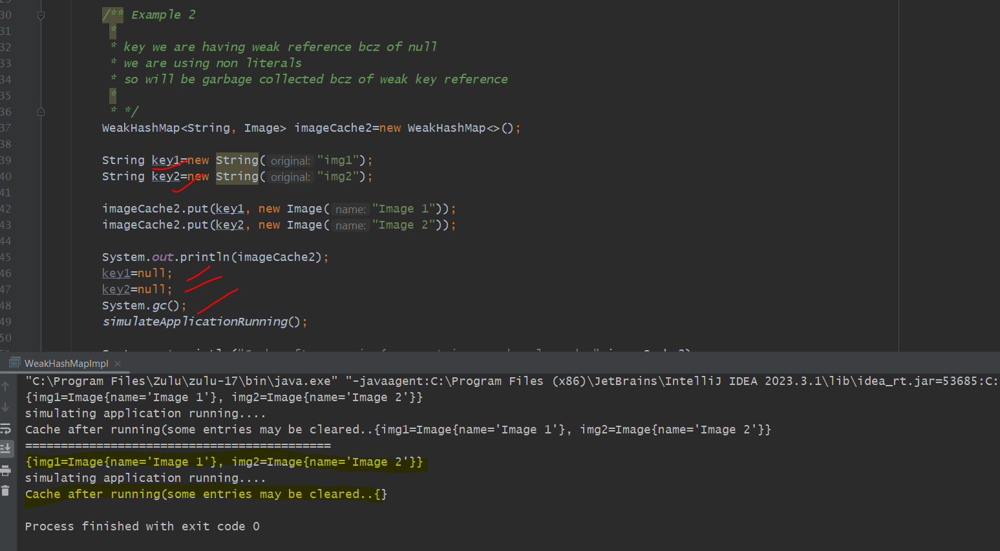

Before WeakHashMap Let's see Garbage Collection

   
   
we have created an object in a Heap Memory. and this object [new Phone("apple", "16 pro max")] memory
allocated in a Heap. we were one reference phone which was pointing to that memory object but we setted it to
null so now no one can use that memory bcz of no reference.

Now JVM will see there are no ref for this memory and no one can use so it will be garbage collected.

Example
-------

just as an example we have a pen and a notebook at home. no one is using it so simply notepad is wasting space so we can replece
that obj so that there would be some space at home.

Strong Reference- Weak Reference
=====================

    Phone phone = new Phone();      -> phone- is Strong Reference

        phone - is Strong Reference
        bcz directly we can access our object with this reference

  Note - System.gc()
         Tell JVM to do garbage collection. but its not always true when we call System.gc() always jvm will do garbage collection.
         Garbage collection is an automated process in java.

Weak Reference
==============

forcefully we did system.gc() so it remove their reference

        /**
         * JVM will see this is the Weak Reference and also
         * its not getting used so JVM will remove
         *
         */

-> WeakReference we just use in our code for Caching.

-> bcz if we won't get data in cache then we can get it from database.

WeakHashMap 
============

Usecase
--------

   just assume we are editing some video. there is an Image which we are using multiple times.
   since its getting used multiple times so we are storing this into cache memory. 
   Now when we are going to use another image and this image not going to use then we can remove this Image from cache.
   That one we are demonstrating with the help of Weak HashMap.
   

   we are not having any strong reference here.
   
   we have given time 10 sec. bcz of weak reference it should be removed after use.
   even we have given System.gc() means forcefully asking JVM to do garbage collection then also not garbage collecting.
   => An entry in a WeakHashMap will automatically be removed when its key is no longer in ordinary use

   

    so we are having a weak keys in WeakHashMap. which means only key will be removed
    only keys will get garbage collected. values also can garbage collected if they have no strong reference.
    JVM will see if any key is having weak reference they removed the key so entire entry will be removed.

    => why it's not getting removed bcz these keys are a string literals. it will get stored in String pool bcz of it
        it become a strong referenced.

    => Within String Pool String Literals are strong literals through out of the programs.

  so we have to make sure that key's should be garbage collected so that we have to make keys non-literals.
    
  

    

       