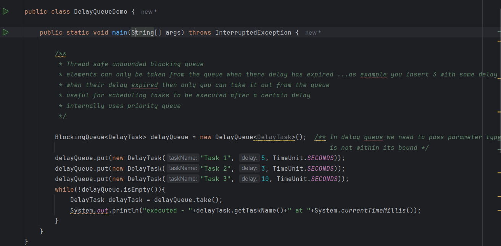
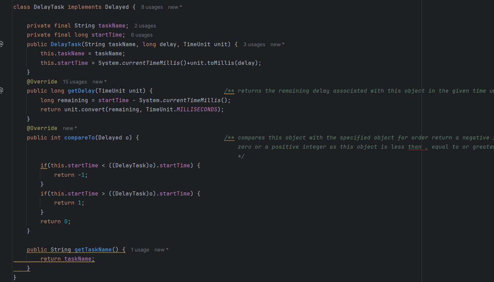
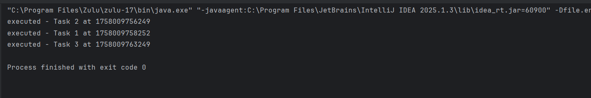
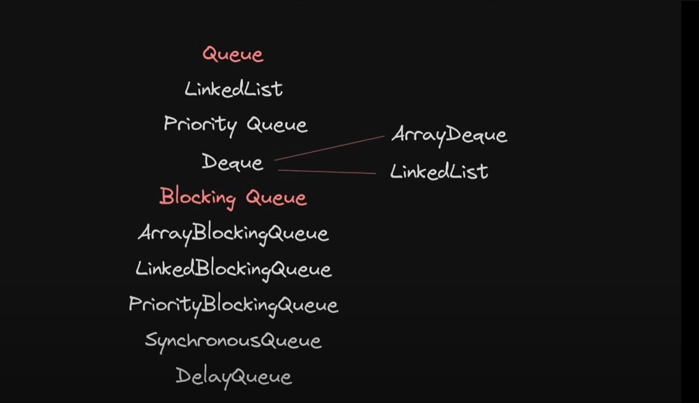
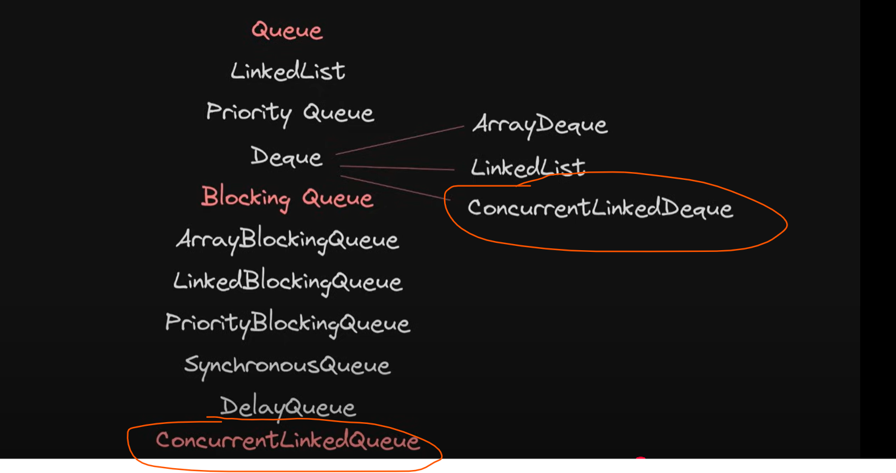

# Delay Queue

            /**
         * Thread safe unbounded blocking queue
         * elements can only be taken from the queue when there delay has expired ...as example you insert 3 with some delay 4 with some delay
         * when their delay expired then only you can take it out from the queue
         * useful for scheduling tasks to be executed after a certain delay
         * internally uses priority queue
         */

=> It first execute task 2 then task 1 then task 3

=> while queue is going to take element (take() method call) from delay queue it is going to call getDelay()
  overriden method and it actually internally uses the priority queue which one have less delay
  that task will be executed first.

# Queue Summary

we have done with 
    - Queue
    - DeQueue
    - BlockingQueue

=> In a Queue LinkedList and PriorityQueue both are not thread safe
=> In a Dequeu, ArrayDeque and LinkedList both not thread safe

# BlockingQueue
        for a thread safe we went through blockingqueue as name suggested it block each other under
        certain conditions. blocking queue only needed when two threads want to communicate with each
        other and there are some situations where we don't want to block the threads but we want to access
        the queue, this is where non-blocking thread safe queue come into picture.

# Important points

    blocking queue only needed when two threads want to communicate with each
        other and there are some situations where we don't want to block the threads but we want to access
        the queue, this is where non-blocking thread safe queue come into picture.

    => ConcurrentLinkedQueue
    
    => ConcurrentLinkedDeQueue

