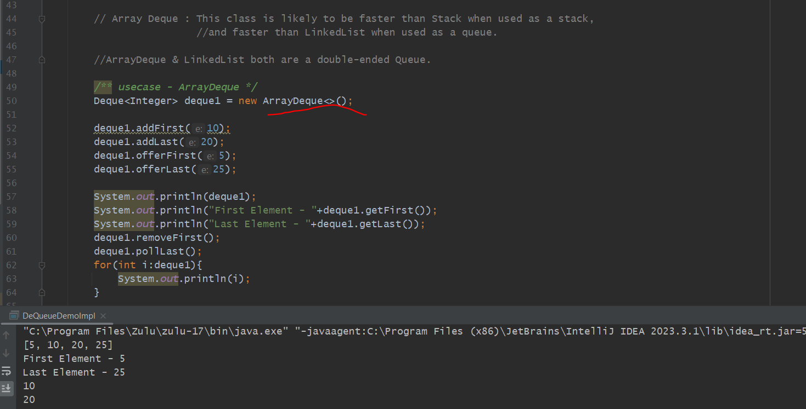
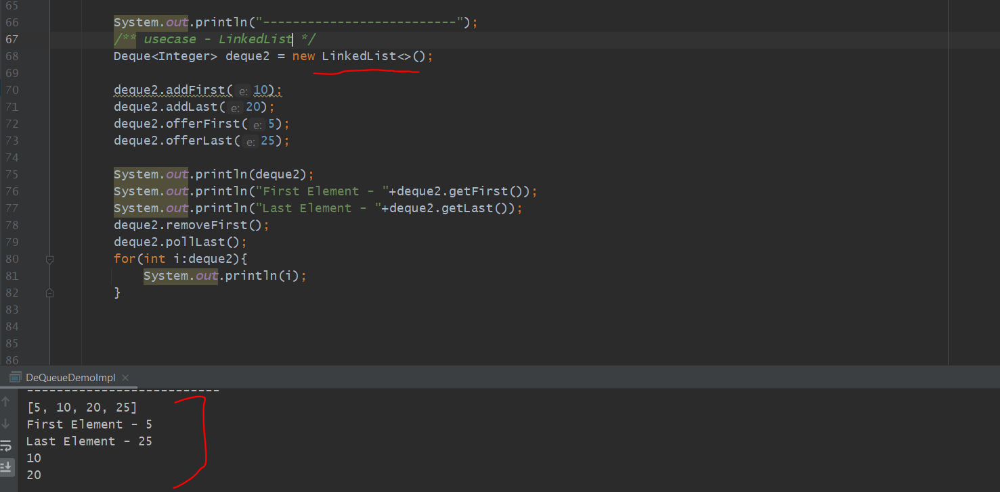
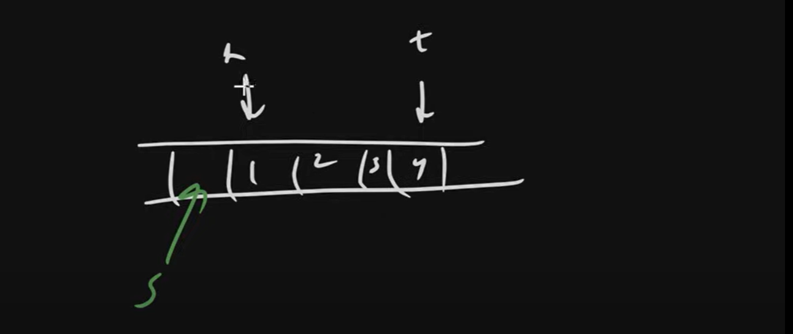
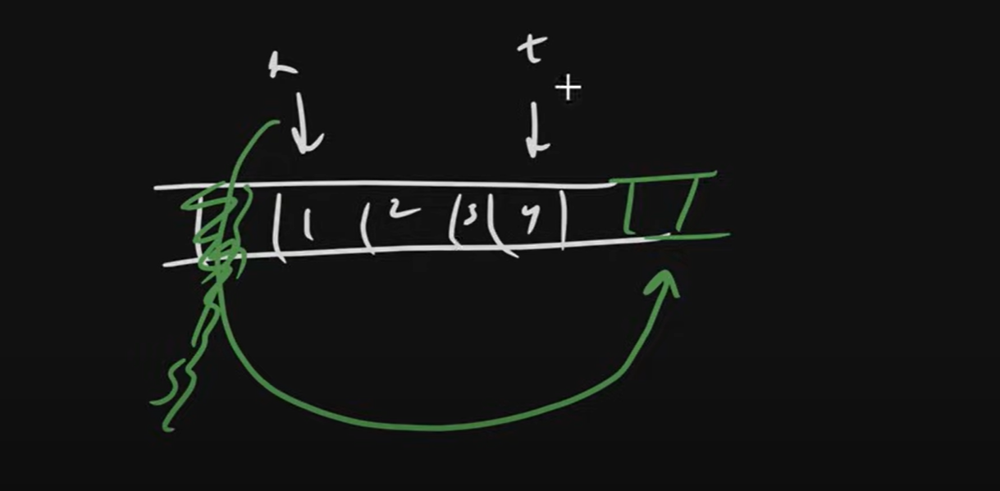
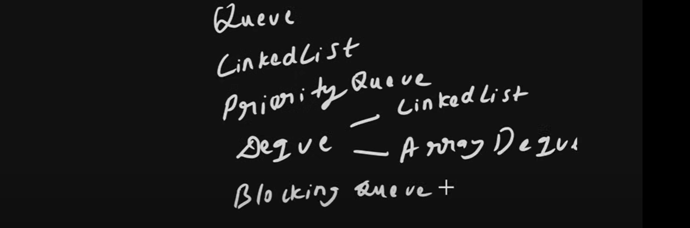

 DeQueue - Double Ended Queue
 ============================

        // double ended queue
        // allows insertion and deletion of elements from both ends.
        // versatile than regular queues and stacks because they support all the operations of both

        /**
         * INSERTIONS METHODS
         *
         * addFirst(E e) - Inserts the specified element at the front.
         * addLast(E e) - Inserts the specified element at the end.
         * offerFirst(E e) - Inserts the specified element at the front if possible.
         * offerLast(E e) - Inserts the specified element at the end If possible.
         *
         */

        /**
         * REMOVAL METHODS
         *
         * removeFirst() - Retrieves and removes the first element, or throw exception If empty.
         * removeLast() - Retrieves and removes the last element, or throw exception If empty.
         * pollFirst() - Retrieves and removes the first element, or return null If empty.
         * pollLast() - Retrieves and removes the last element, or return null If empty.
         *
         */

        /**
         * EXAMINATION METHODS
         *
         * getFirst() - Retrieves, but does not remove the first element.
         * getLast() - Retrieves, but does not remove the last element.
         * peekFirst() - Retrieves, but does not remove, the first element. or return null If empty.
         * peekLast() - Retrieves, but does not remove, the last element. or return null If empty.
         *
         */

        /**
         * STACK METHODS
         *
         * push(E e) - Adds an element at the front (equivalent to addFirst(E e)).
         * pop() - Removes and returns the first element (equivalent to removeFirst()).
         *
         */

ArrayDeque
==========

Resizable-array implementation of the Deque interface. Array deques have no capacity restrictions; they grow as necessary to support usage. 

They are not thread-safe; in the absence of external synchronization, they do not support concurrent access by multiple threads. 

Null elements are prohibited. 

=> This class is likely to be faster than Stack when used as a stack, and faster than LinkedList when used as a queue.

Result is exact same while we use Deque implementation class either LinkedList or ArrayDeque.

If Both are Exact same then why we Introduce 2 data structure implementation where is difference then

Reason:
---------

In case of Queue (ArrayDeque) It's Fast. Internally we have an Array. so Faster Iteration bcz Array is having Contiguous Memory Allocation.
low memory bcz we are not storing any pointer
no null allowed 

I recommended to use ArrayDeque only, If you have to Implement Deque unless if you have a specific requirements of linked list. 

In ArrayDeque there is an Internal Array, If there size is full it would be double.

LinkedList we can only use while want to insert delete in middle of the position.

Discussion
----------

In a ArrayDeque If we remove an element from starting then do we shift an element.

No, Because here the Array is use that is Circular Array.

which means there will be 2 pointers Head and Tail that pointer we move.

actually no need to move an element.

If we insert at starting then head-- if we insert at end tail++

here actually its not Circular but we make circular with play with indexes.

Wrap around will happen while we use module formula. if we have 4 index....0%4=0,1%4=1, 2%4=2,3%4=3,4%4=0....

If size is full means Head=tail then size will be double.

