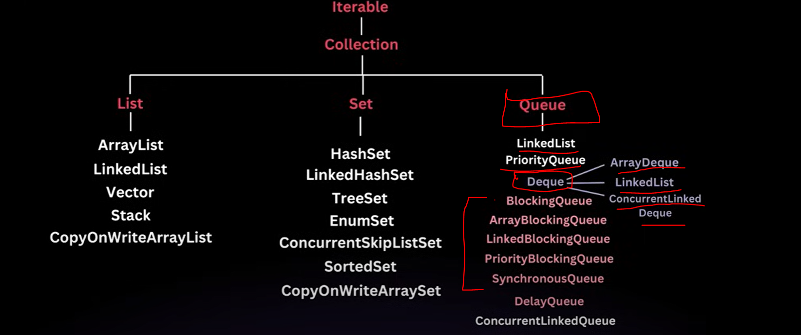
  
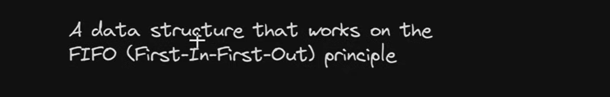

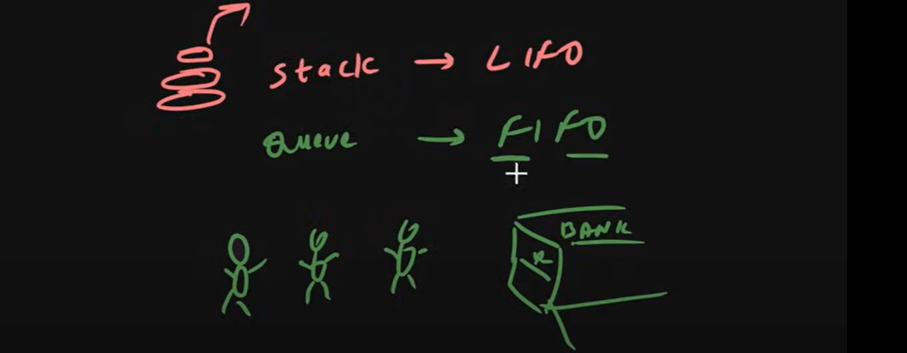

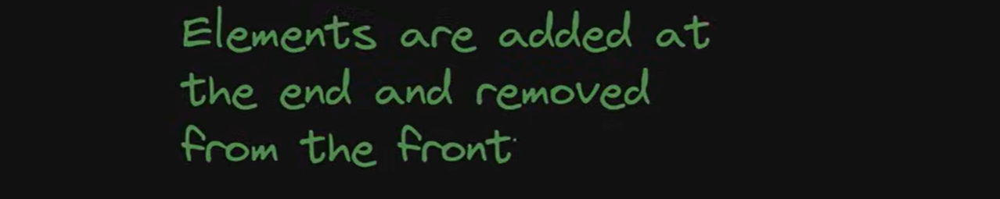

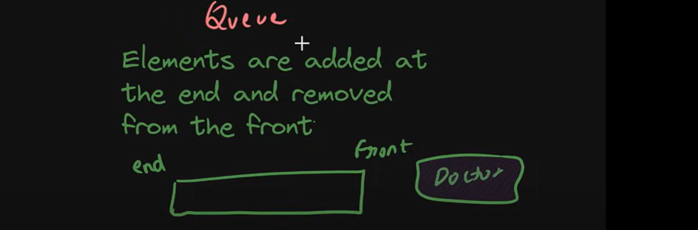

 Queue we can Implement in a multiple ways:-
 -------------------------------------------

as we know Linked list can act as a stack. we are adding elements at top of the stack. similarly LinkedList can
act as a Queue also.

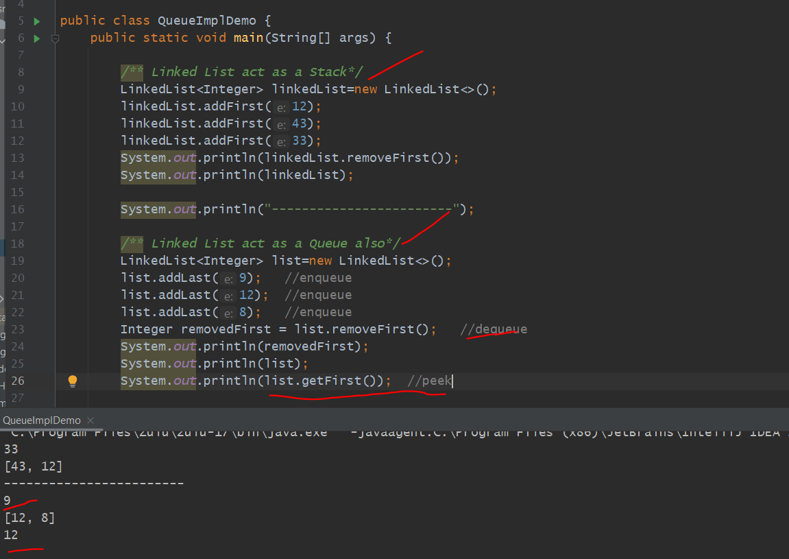

=> Linked List we can use as a Stack & Queue as well. so there is a complexity like addLast removefirst...so Java Introduced one Interface called Queue.

=> LinkedList is an Implementation class of Queue Interface. LinkedList Implements DeQueue. Dequeue extends Queue Interface.

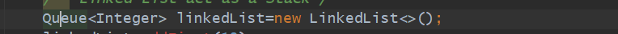

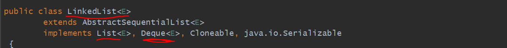

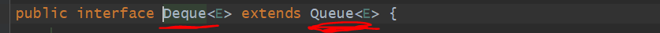

=> 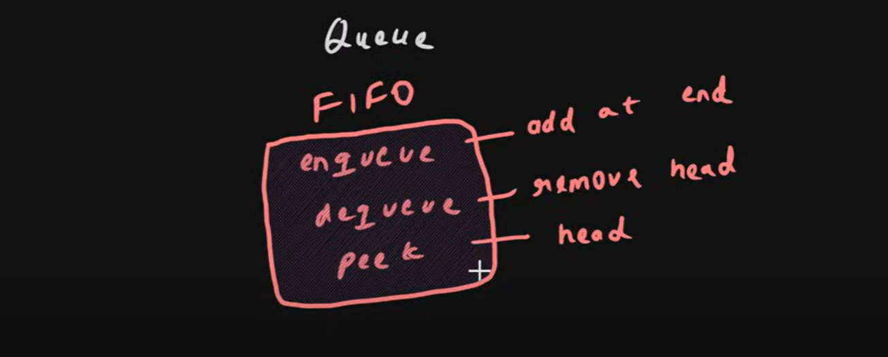

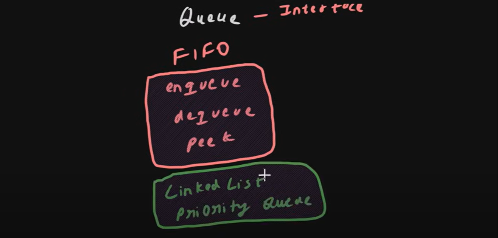

=> Queue is an Interface so we can't Instantiate directly. so for that we have an Implementation classes...like 
   LinkedList and PriorityQueue.

=>   Interface       Queue
     Impl Class      LinkedList, PriorityQueue

Queue Operations
================

enqueue: is a process to add an elements
     method:         add()                    - throw exception if not able to add, return true if added
     cors method:    offer()                  - return false, if not able to add, return true if added

dequeue: is a process to remove an elements
     method:         remove()                 - throw exception if empty
     cors method:    poll()                   - better, return null if empty

peek:    is a process to view an element at first
     method:         peek()                   - better, return null if empty
     cors method:    element()                - throw exception if empty

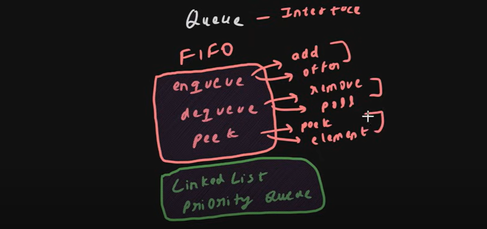

Queue 1st Implementation class :  LinkedList
---------------------------------------------

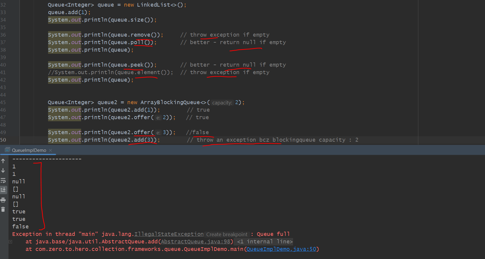

**** Work is same just error Handling is different**********

Queue 2nd Implementation class :  PriorityQueue
---------------------------------------------

