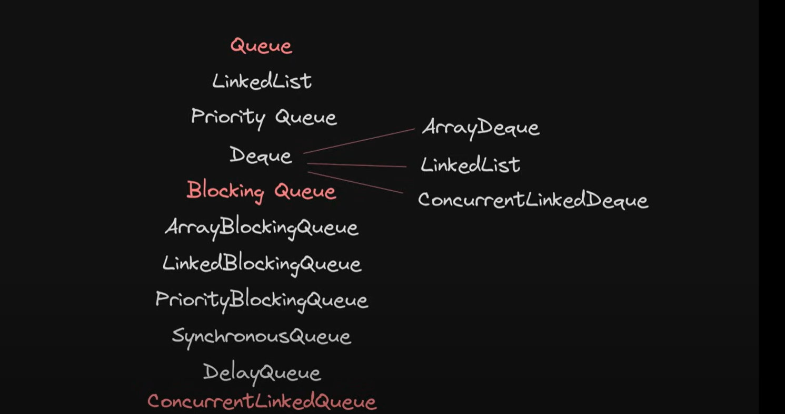
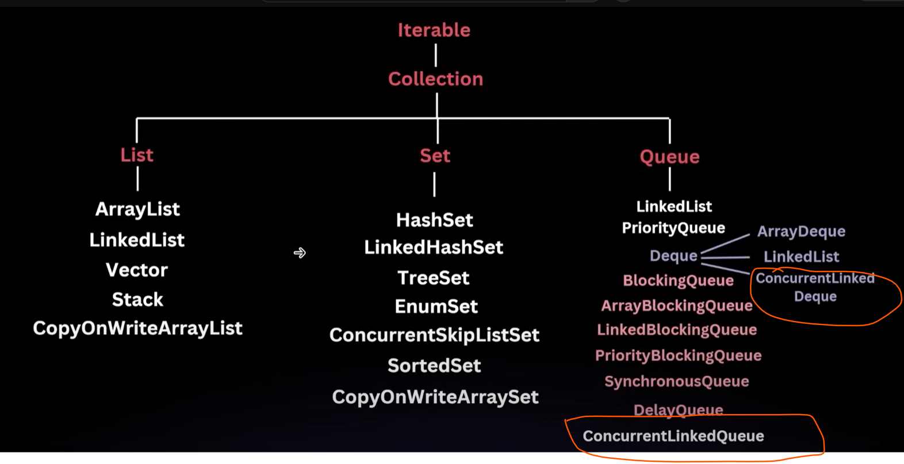

  # ConcurrentLinkedDeQueue
  
    BlockingQueue only needed when two threads wants to communicate with each other and there are some situations 
    where we don't want to block the threads but want to access the queue, this is where non-blocking thread safe queue come into
    picture.

=> ConcurrentLinkedQueue

=> ConcurrentLinkedDeQueue

# ConcurrentLinkedDeQueue - An Implementation of the Queue interface that supports lock-free, thread-safe operations

# ConcurrentLinkedDeQueue   - Concurrent version of Dequeue

    ConcurrentLinkedDeQueue - Non Blocking Thread Safe Double Ended Queue

    Uses Compare and Swap technique

=> What all operations perform in normal deque we can perform here as well.

=> since, Its a double ended queue we can perform operation in both first and last add/remove elements.

=> This is Thread Safe and a non-blocking because of Compare and Swap Technique.

