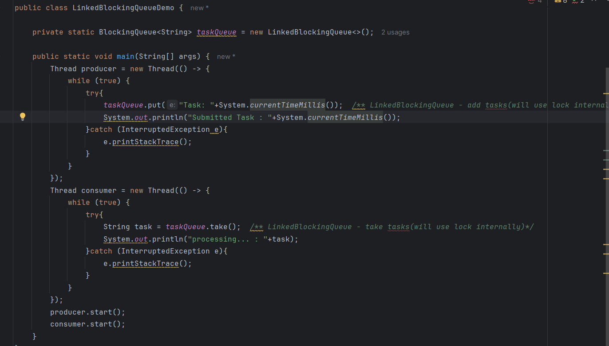
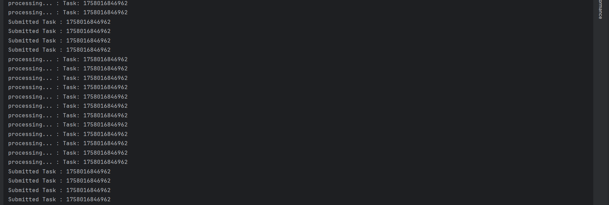
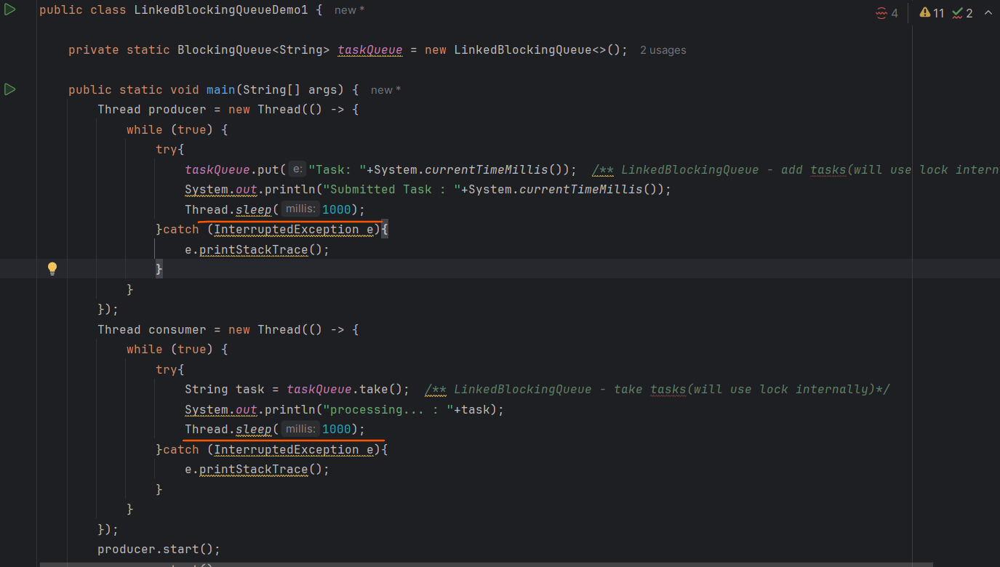
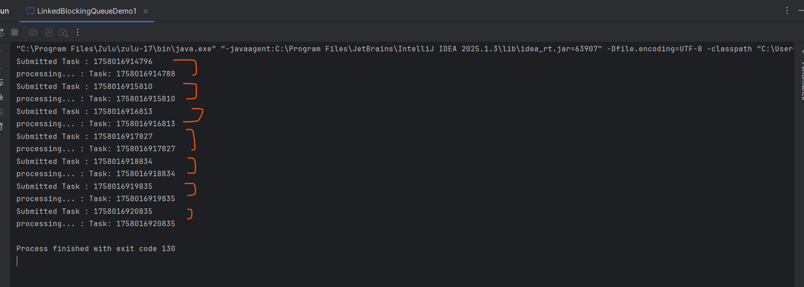
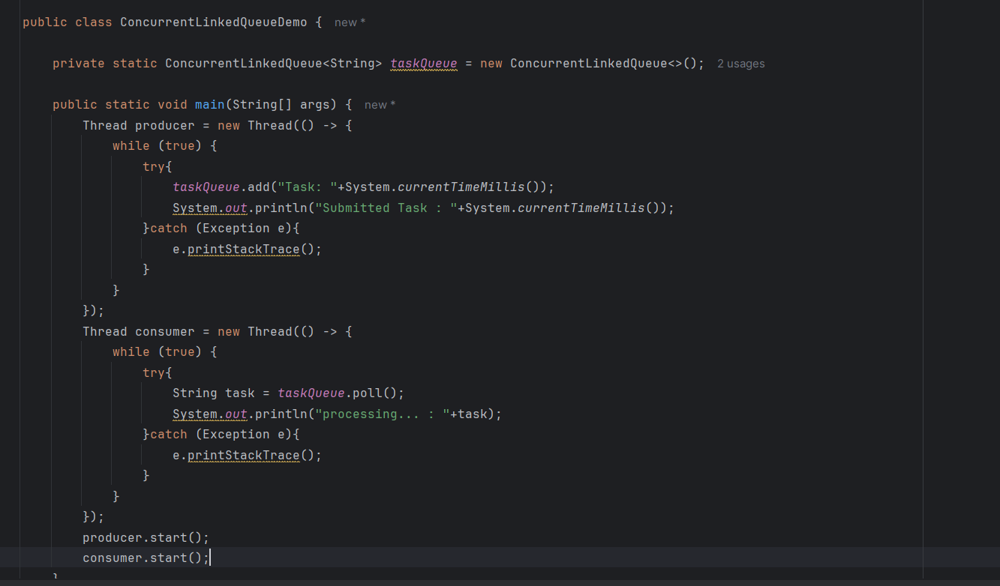
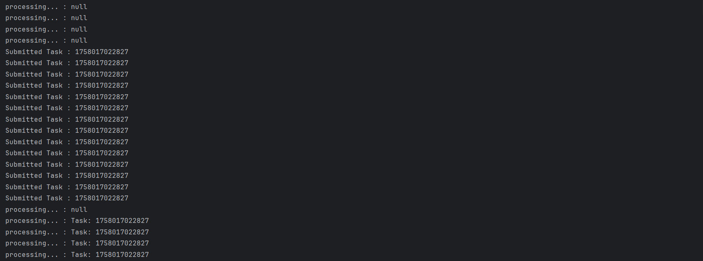
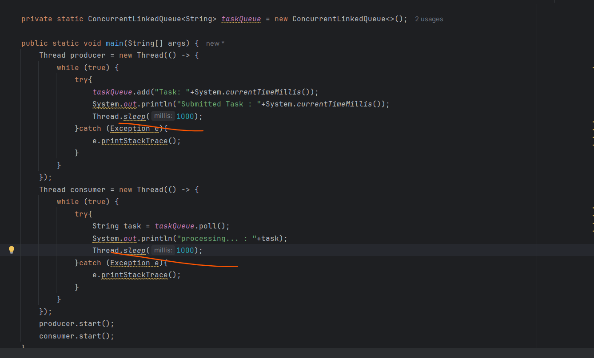
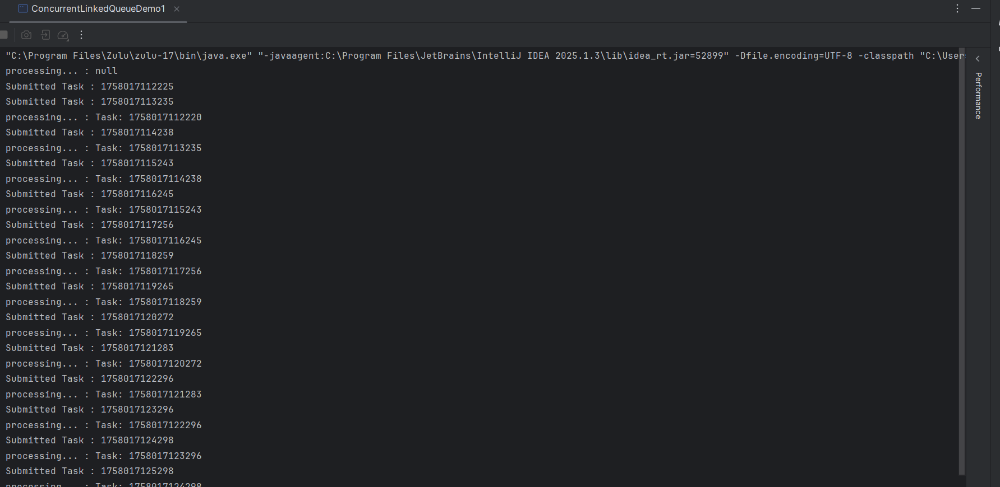

# ConcurrentLinkedQueue

    An Implementation of the Queue Interface that supposrts lock-free thread-safe operations.

    
    Like HashMap, ConcurrentLinkedQueue alsouses compare and swap technique internally.

    we have done with 
    - Queue
    - DeQueue
    - BlockingQueue

=> In a Queue LinkedList and PriorityQueue both are not thread safe
=> In a DeQueue ArrayDequeue and LinkedList both are not thread safe

# BlockingQueue -

    for a thread safe, we went through blocking queue as the name suggested it block each other under certain conditions.
     BlockingQueue only needed when two threads wants to communicate with each other and there are some situations 
    where we don't want to block the threads but want to access the queue, this is where non-blocking thread safe queue come into
    picture.

# Important points

    BlockingQueue only needed when two threads wants to communicate with each other and there are some situations 
    where we don't want to block the threads but want to access the queue, this is where non-blocking thread safe queue come into
    picture.

=> ConcurrentLinkedQueue

=> ConcurrentLinkedDeQueue

img 5

img

# Now the Question is ---

    In case of Blocking Queue there will be 2 cases 
    
    1. Is put() and put() can run together  -> No
    2. Is put() and take() can run together  -> No

    because, the things are blocking here, and that's the meaning of thread - safe.

    But In ConcurrentLinkedQueue we can do both above operations together because of this ConcurrentLinkedQueue
    will have high throughput.

# Use cases

    We are creating a Task Submission System where multiple producers continuously adding a tasks and
    multiple consumers processing the tasks.

    we have to perform things consurrently without slowing each other...

img3

=> Now What put will do here it will put a lock . when he putting elements he put a lock so,
    no other threads can access the queue. In some situations we need blocking but it would be
    delay because of lock

  In this TaskSubmission System, while submitting a task why are you blocking a consumers you
    should allow him to consume the tasks from the queue, so to achieve this lock-free thread safe we will use ConcurrentLinkedQueue.
  

# Blocking Example - LinkedBlockingQueue

    one producer submitting then only consumer consuming ...while submitting task it block consumer
    not to consume and block another producer not to produce as well...

# Non-Blocking Example - ConcurrentLinkedQueue

    now the things are not getting block so performance will increased.

    => Now same thing we discuss earlier in one of the data structure lock-free thread-safe

    => We used in ConsurrentHashMap, we were using compare and swap technique

    => same in ConcurrentLinkedQueue also using compare and swap technique

# Compare & Swap Technique

    Now In Queue we can add any elements at tail.

    Assume now I am adding an element in queue then we will see where is our tail pointer.

    before adding we saw where is our tail pointer.

    now while in actual we are adding because this is multithread environment so in a mili seconds anythings can happen.

    so, while actual we are adding we will check is tail position is same if same we will add there if tail is not there
    which mean some other thread add an element in a queue , which mean we need to do retry.

    same thing happening here ConcurrentLinkedQueue will use Compare & Swap Technique internally

    so there will be a linkedlist one head and one tail and all other things can perform using Compare & Swap Technique.