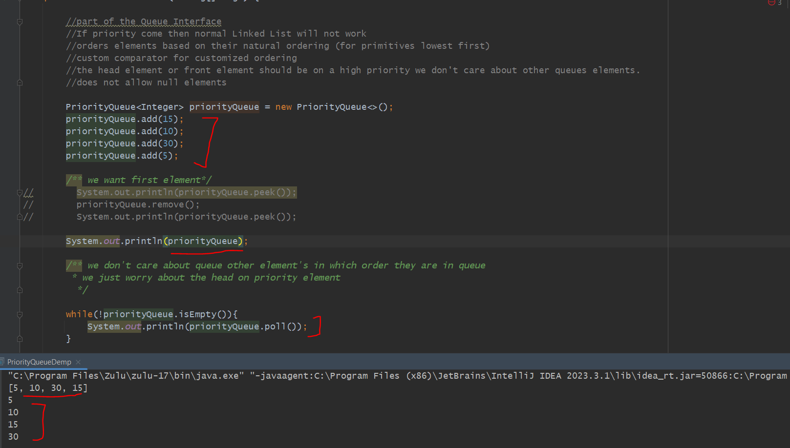
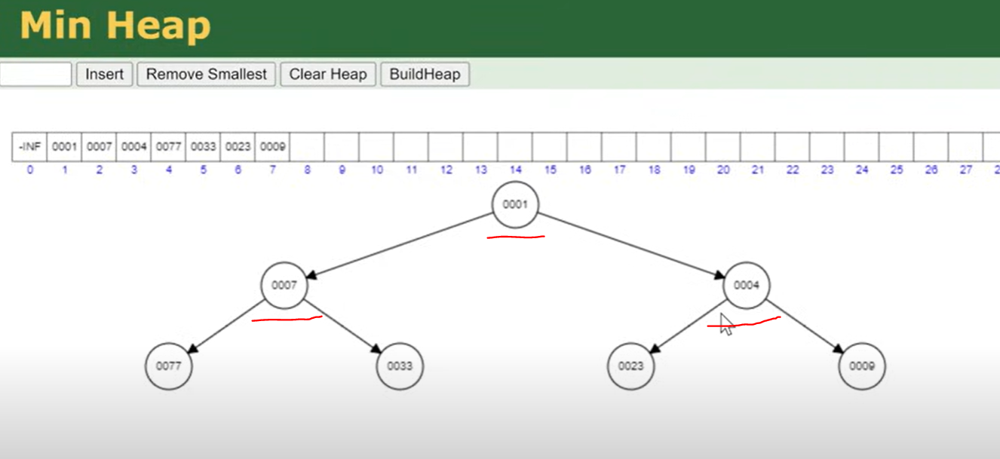
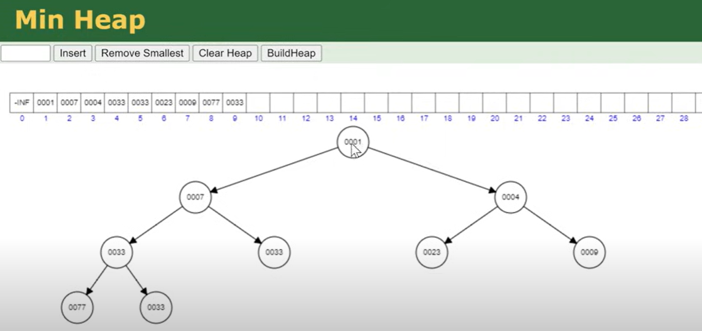
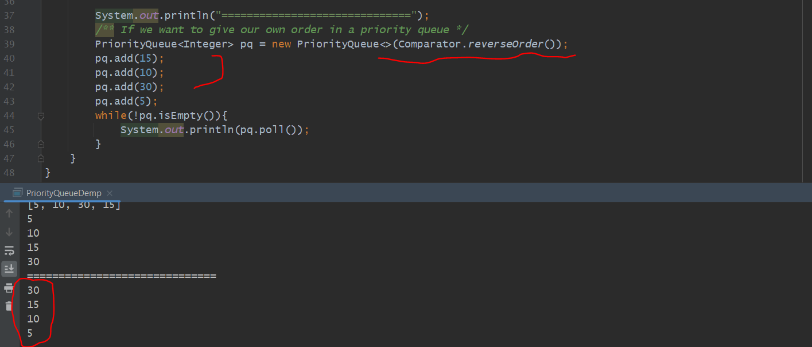
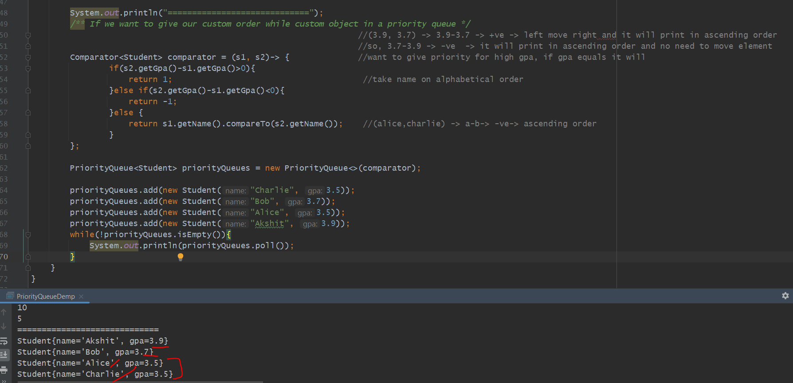

1st Implementation class of a Queue Interface - LinkedList

2nd Implementation class of a Queue Interface - Priority Queue

        //part of the Queue Interface
        //If priority come then normal Linked List will not work
        //orders elements based on their natural ordering (for primitives lowest first)
        //custom comparator for customized ordering
        //the head element or front element should be on a high priority we don't care about other queues elements.
        //does not allow null elements 

Observations
------------

If we see here Priority queue not stored elements in a sorted order but while it start picking from head or front based on priority 
the elements moved to head and print. so priority queue not care about stored elements in a queue it only focused on the priority element
moved to front. if it's primitive data it will move in a natural order. 1,2,3,4,5....highest priority = 1, a,b,c,d,e,f.....highest priority = a

Internal Working
================

Priority Queue is Implemented as a min-heap by default(for natural-ordering).
Min-Heap is a Binary Tree.

you can see every node value is either less than or equal to their Child node.

Now with this property on top element will be the smallest element.

If we insert anything Time Complexity - O(log n)   - bcz here it look one side either go left or right, get rearranged their positions

If we remove anything Time Complexity - O(log n)   - bcz here it look one side either go left or right, get rearranged their positions

If we peek the element Time Complexity - O(1) will peek top element 

=> If all element get iterate - Time complexity - O(n)
=> If half element get iterate - Time complexity - O(log n)

That's the reason when we remove any element from priority queue on top smallest element will come.

Custom Order (If we want to give our own order that also we can use)
--------------------------------------------------------------------

