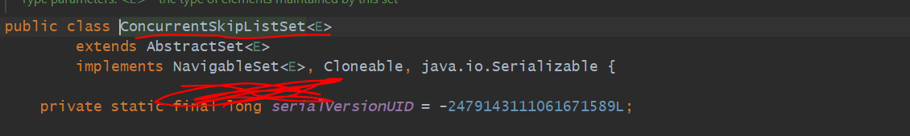
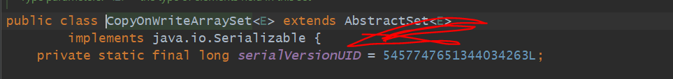
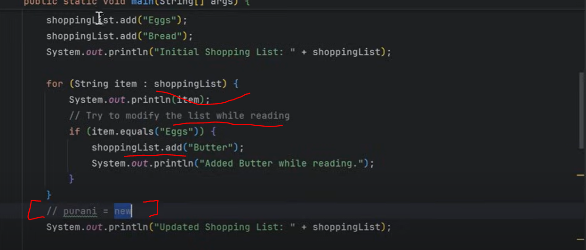
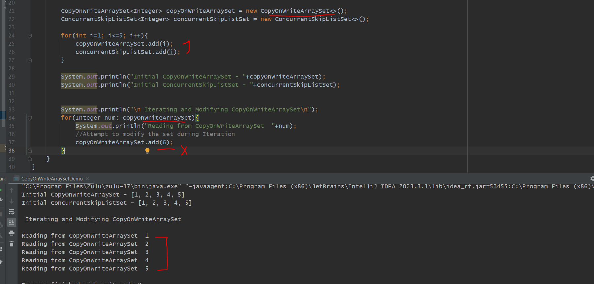
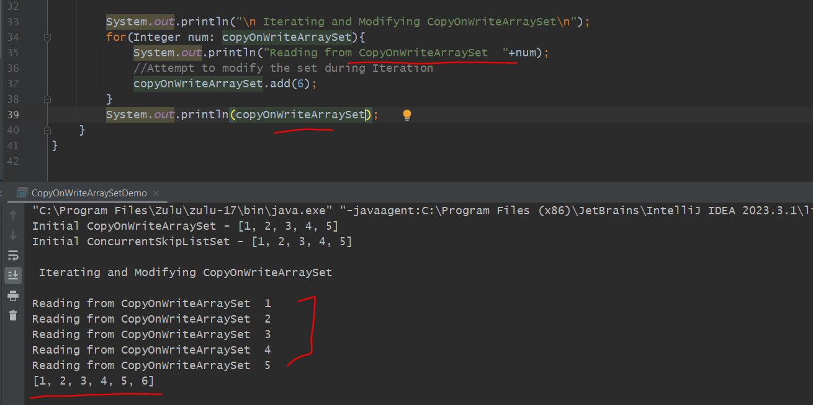
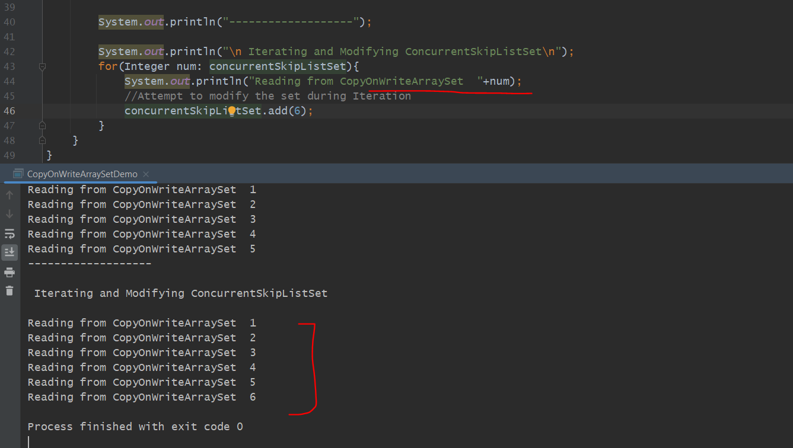

We Already know about CopyOnWriteArrayList similar stories here also but let's see why again we are going through

=> Traditional Implementations of Set like TreeSet, HashSet, LinkedHashSet these all are not thread - safe.
   If at same time multiple threads try to modify then data will be data corruption or might be a chance
   ConcurrentModificationException may occurred. 

=> you can say for Thread Safety already we went through ConcurrentSkipListSet but obviously that will store a
   sorted elements. there might be a different requirement that when things are sorted and things are on ranged based 
   smaller than this larger than this like that in that kind of cases we use ConcurrentSkipListSet. In skipListSet 
   there is a skipList data structure getting used. But in case of CopyOnWriteArraySet there is an internal array

=> But in case of CopyOnWriteArraySet there is an internal arrays, not going to store elements in a sorted manner.
   so both having different usecases.

Diff CopyOnWriteArraySet and ConcurrentSkipListSet
----------------------------------------------------
CopyOnWriteArraySet- extends AbstractSet so elements will be store in a unique way.
ConcurrentSkipListSet- extends AbstractSet and implements Navigable Set so elements store in a sorted order. things are on 
                       ranged based smaller than this larger than this like that in that kind of cases we use ConcurrentSkipListSet

Use-cases
===========

Copy-On-Write Mechanism -> When we add or remove any elements then a new copy will be created of an internal array.

        // Thread - Safe
        // No Duplicate Elements
        // Copy-On-Write Mechanism

Discussion
==============

Iterators Do not Reflect Modifications

 => In our List cases for CopyOnWriteArrayList, while we Iterate it won't reflect modifications records in list
    when loop finish then only updated elements will be reflected latest changes.

 => 

 => If here shopping list is an array list then exception will occurred bcz while we are reading we modifying.
    but if we make shoppinglist to CopyOnWriteArrayList then ConcurrentModification Exception not occurred. 
    But while we were doing loop we are looking into a stable copy/snapshots of shoppingList. it will be modified
    But It will modify on a new Copy. when we come after loop then only old list reference will be replaced with a 
    newly copiedList.

Example
========

CopyOnWriteArraySet - while it iterating it iterate on a stable photo

If we print after loop then that will be the latest data and 6 will come. [old ref replace with new copiedref]

concurrentSkipListSet

we can see 6 also printed.

because of this we say weakly consistent for a ConcurrentSkipListSet

because while we iterating may it reflect or may be not reflect

may be while iterating last element and trying to add then might be 6 not print.

we can see 6 not printed

