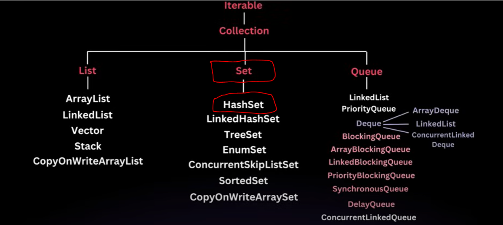
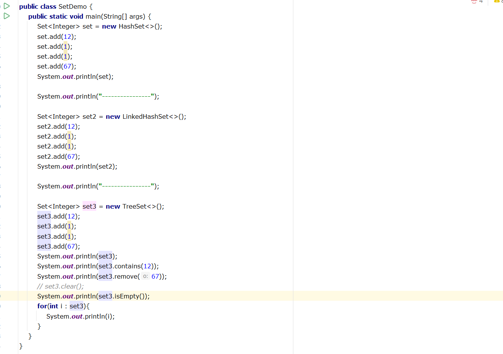
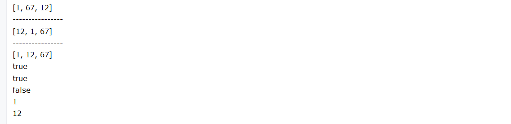
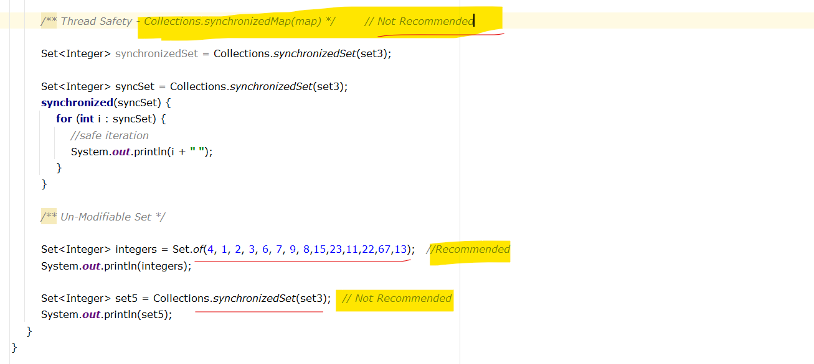
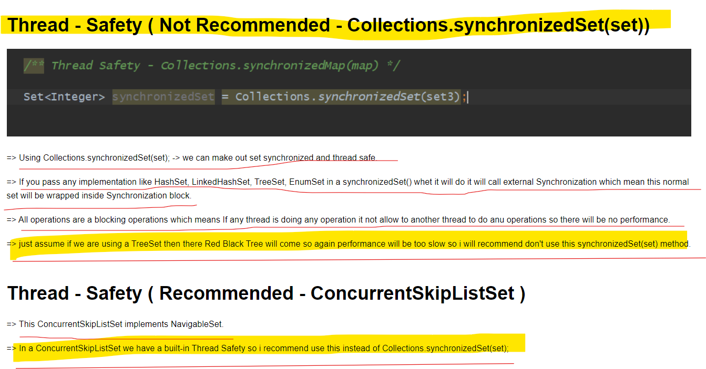
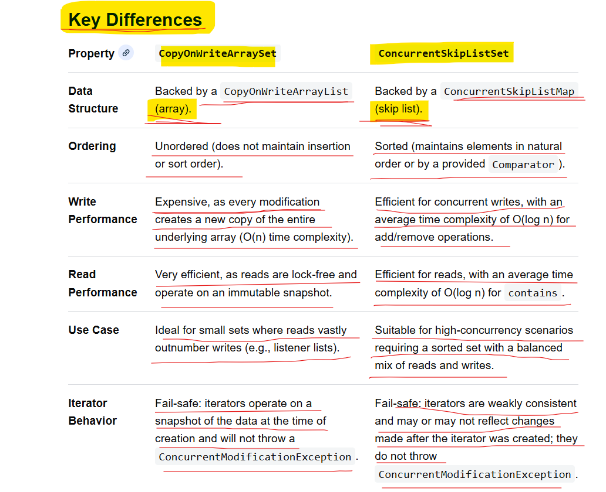

= Set is a collection that can not contain duplicate elements.
= Because Set is Based on HashMap Principles so
    = Time Complexity ->   find()  ->  O(1)
    = Time Complexity ->   insert() -> O(1)
    = Map :  Implementations (HashMap, LinkedHashMap, TreeMap, EnumMap)
    = Set :  Implementations (HashSet, LinkedHashSet, TreeSet, EnumSet)

Map<Integer, String> map = new HashMap<>(); 
Set integers = map.keySet();
= so, Actually the keys in a HashMap is a actually a Set. because keys in HashMap are unique. 
= Internal Implementation similar to HashMap where values will be a dummy values so these all are a keys only. 
= All Methods of Set is similar to a List Because Set also extends Collection Interface like List.

# Concurrency can be achieve in Set using **CopyOnWriteArraySet** and **ConcurrentSkipListSet**)

