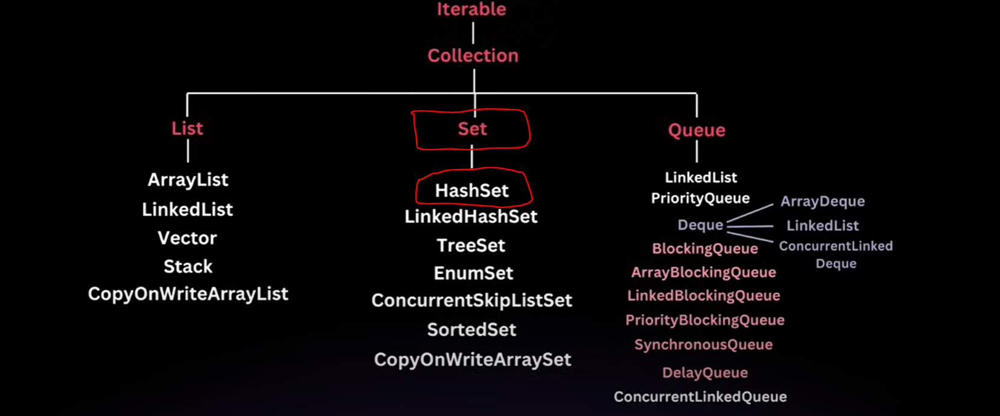
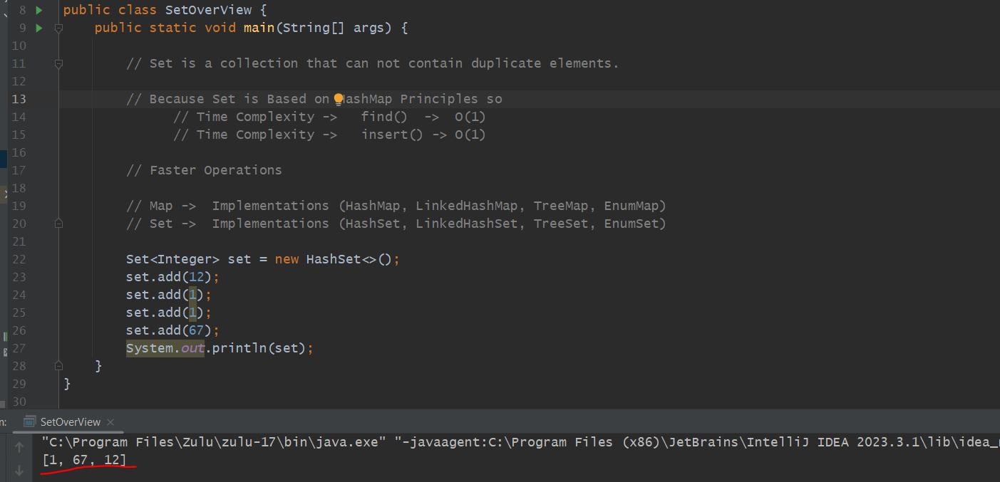
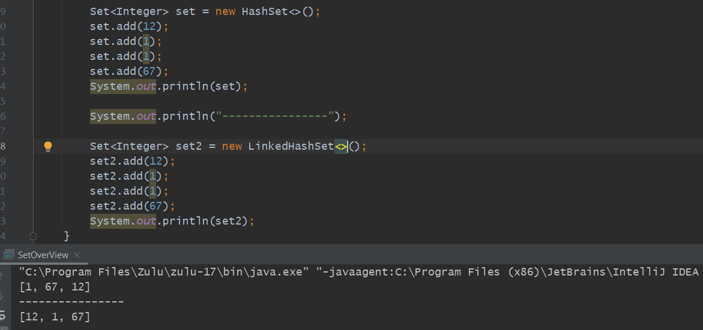
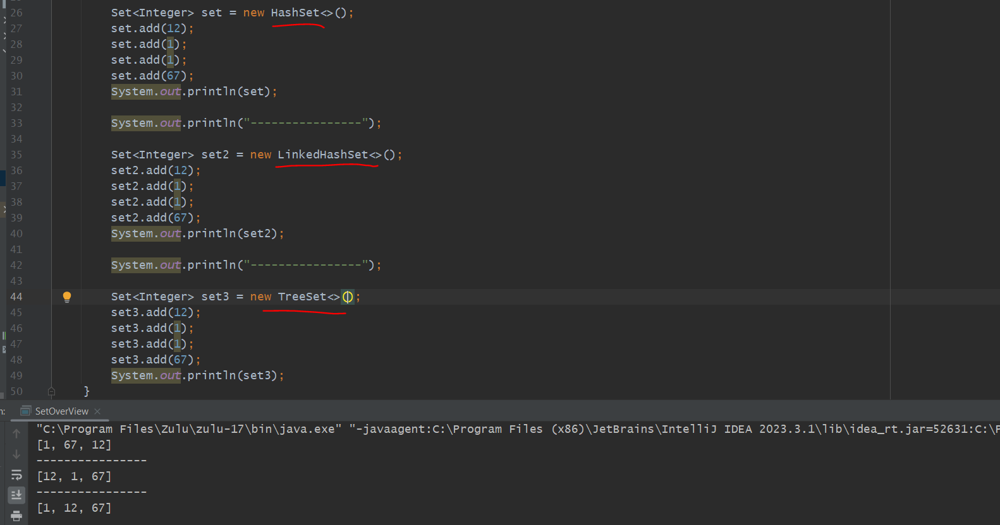
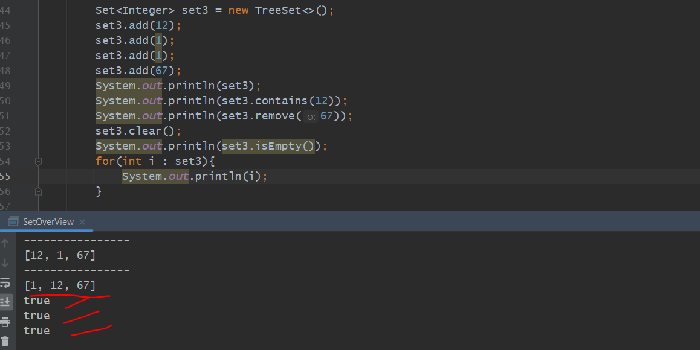
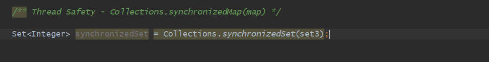
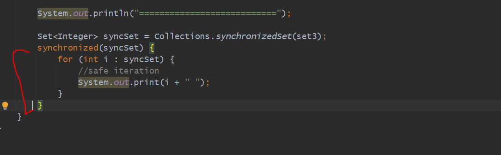
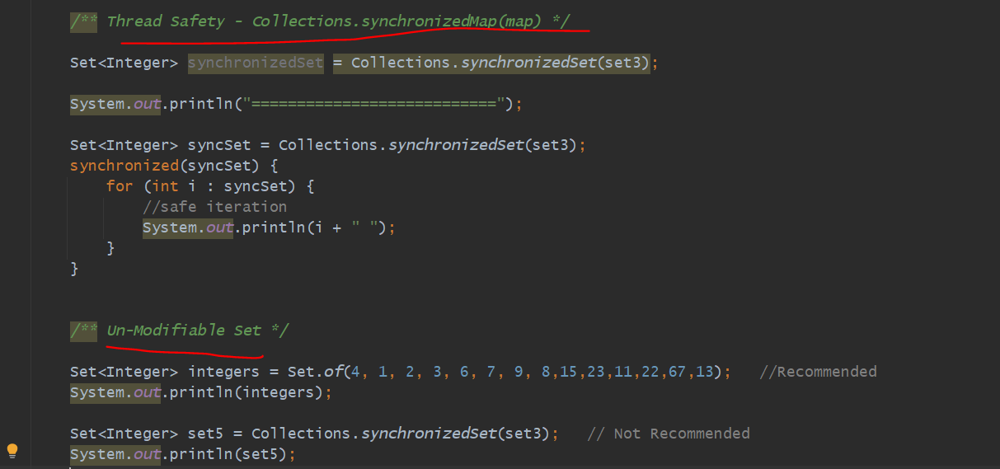

        // Set is a collection that can not contain duplicate elements.

        // Because Set is Based on HashMap Principles so
              // Time Complexity ->   find()  ->  O(1)
              // Time Complexity ->   insert() -> O(1)

        // Faster Operations

        // Map ->  Implementations (HashMap, LinkedHashMap, TreeMap, EnumMap)
        // Set ->  Implementations (HashSet, LinkedHashSet, TreeSet, EnumSet)

discussion
------------

while we do 

  Map<Integer, String> map = new HashMap<>();
  Set<Integer> integers = map.keySet();
  

so, Actually the keys in a HashMap is a actually a Set. because keys in HashMap are unique.

Internal Implementation similar to HashMap where values will be a dummy values so these all are a keys only.

=> All Methods of Set is similar to a List Because Set also extends Collection Interface like List.

=> 

    so un-ordered or not maintain Insertion-order.
    
    elements will be in sorted manner.

=> But If you want to maintain Order use [LinkedHashSet] internally it use a LinkedList to maintain an Order.   

  

=> If you want elements in a sorted manner use TreeSet

=> TreeSet implements NavigableSet so if we give reference of NavigableSet we can have some additional methods.

=> Set contains all methods like a List bcz list and set both extends Collection Interface. Map not comes under collection framework.

Thread - Safety ( Not Recommended - Collections.synchronizedSet(set))
=====================================================================

=> Using Collections.synchronizedSet(set);  -> we can make out set synchronized and thread safe.

=> If you pass any implementation like HashSet, LinkedHashSet, TreeSet, EnumSet in a synchronizedSet()
   whet it will do it will call external Synchronization which mean this normal set will be wrapped inside 
   Synchronization block.

=> All operations are a blocking operations which means If any thread is doing any operation it not allow to 
another thread to do anu operations so there will be no performance.

=> just assume if we are using a TreeSet then there Red Black Tree will come so again performance will be too
   slow so i will recommend don't use this synchronizedSet(set) method.

Thread - Safety ( Recommended - ConcurrentSkipListSet )
========================================================

=> This ConcurrentSkipListSet implements NavigableSet.

=> In a ConcurrentSkipListSet we have a built-in Thread Safety so i recommend use this instead of  Collections.synchronizedSet(set);

   another example
   ---------------

=> we are using synchronizedSet() here, only for a loop again we need to use synchronized() method. 
   All methods of our Tree Set wrapped with a Synchronized Block by using this synchronizedSet() method
   while we are doing loop for own again we need to use synchronized() block/method because one by one
   loop is iterating in that situation may be a chance another thread can access. so It's not recommended.
   so we should use ConcurrentSkipListSet().

=> ConcurrentSkipListSet() is our Thread Safe Set. 

Unmodifiable - Set
=================

=> How we were having unModifiableMap() here also we are having UnmodifiableSet. 

   

   
