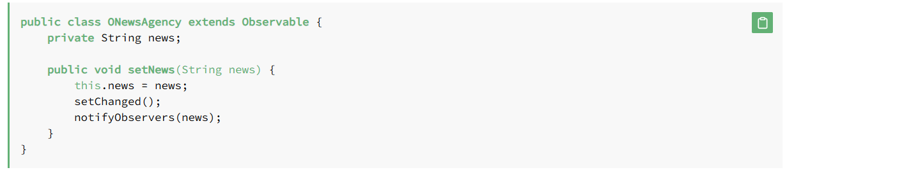

Observer is a behavioral design pattern. It specifies communication between objects: observable and observers. An observable is an object which notifies observers about the changes in its state.

For example, a news agency can notify channels when it receives news. Receiving news is what changes the state of the news agency, and it causes the channels to be notified.

NewsAgency is an observable, and when news gets updated, the state of NewsAgency changes. When the change happens, NewsAgency notifies the observers about it by calling their update() method.

To be able to do that, the observable object needs to keep references to the observers. In our case, it’s the channels variable.

Now let’s see what the observer, the Channel class, can look like. It should have the update() method, which is invoked when the state of NewsAgency changes:

Way 2 using Implementation With Observer The java.util.Observer interface defines the update() method, so there’s no need to define it ourselves, as we did in the previous section.
The Observer interface isn’t perfect, and has been deprecated since Java 9. One of the cons is that Observable isn’t an interface, it’s a class, and that’s why subclasses can’t be used as observables.

Also, a developer could override some of Observable‘s synchronized methods and disrupt their thread-safety.

# Recommended Approach :   ( ProperyChangeListener interface)

                Now let’s look at the ProperyChangeListener interface, which is recommended over Observer.

