# Single Responsibility Principle

The Single Responsibility Principle (SRP) states that a class, module, or function should have one, and only one, reason to change, 
meaning it should focus on a single, specific task or responsibility.

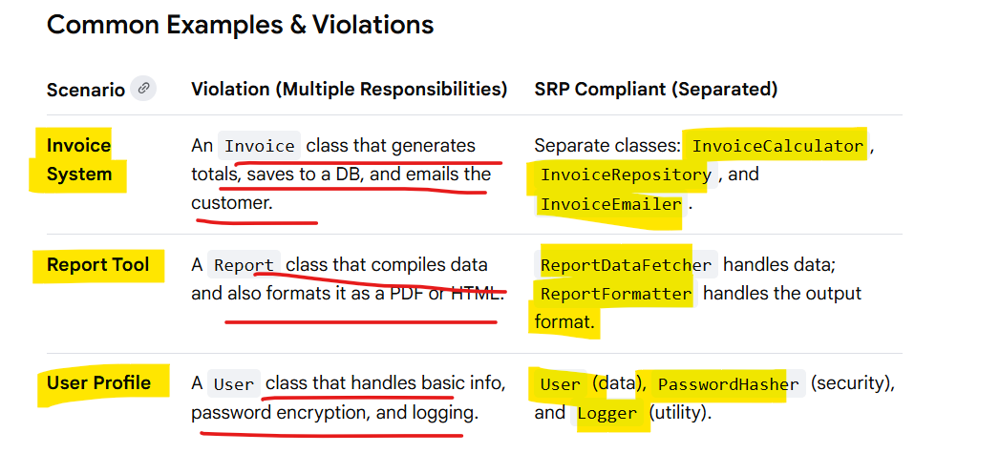

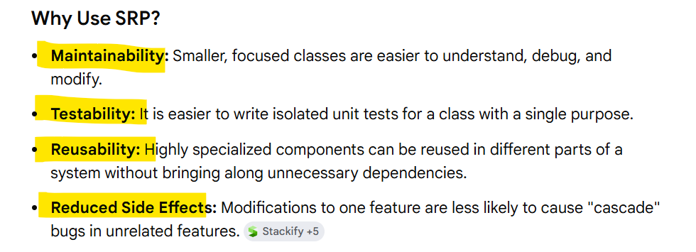

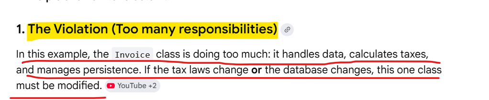

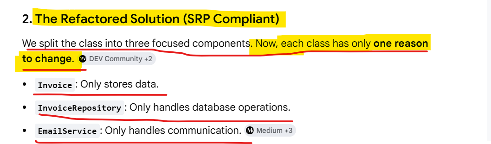

# Open Closed Principle

The Open-Closed Principle (OCP) states that software entities (classes, modules, functions) should be open for extension but closed for modification, 
meaning new functionality is added by adding new code, not changing old code.

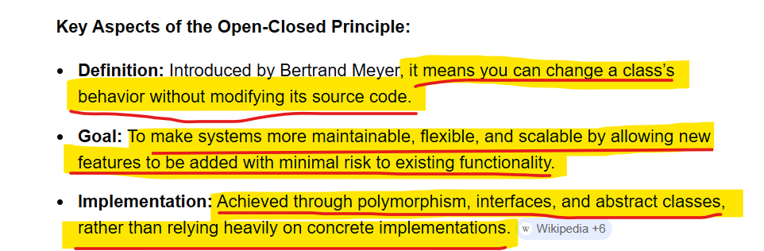

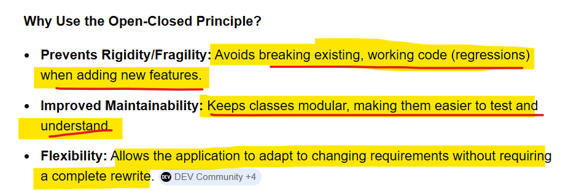

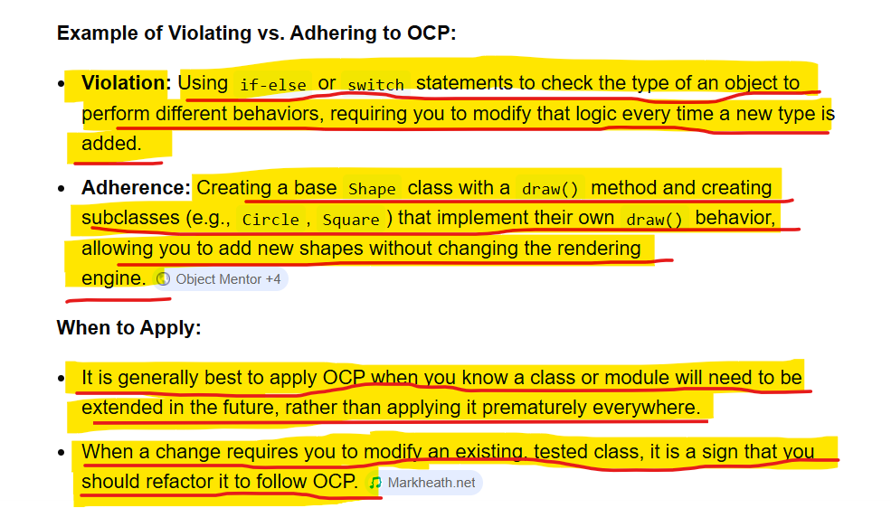

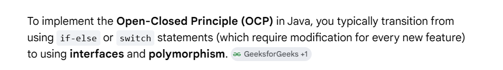

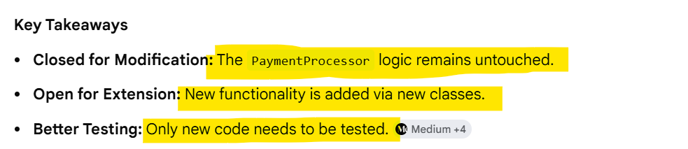

# Liskov Substitution Principle (LSP) 

The Liskov Substitution Principle (LSP) states that objects of a superclass should be replaceable with objects of its subclasses without breaking the 
application's correctness.

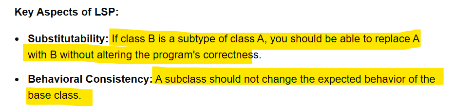

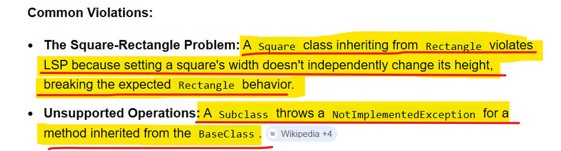

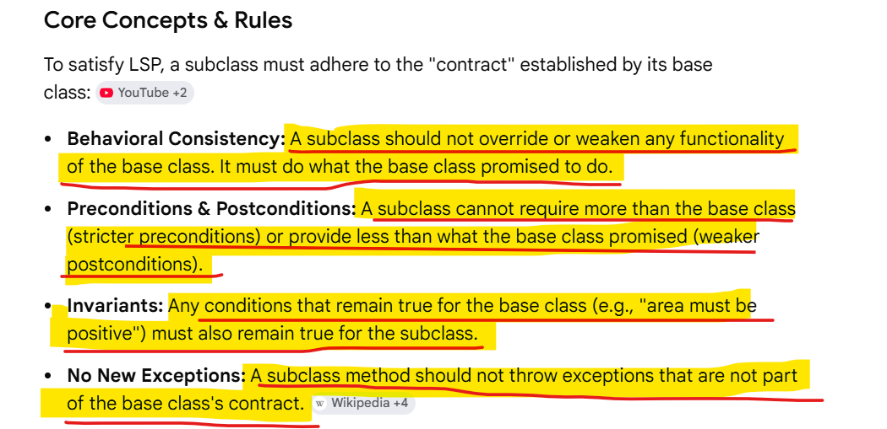

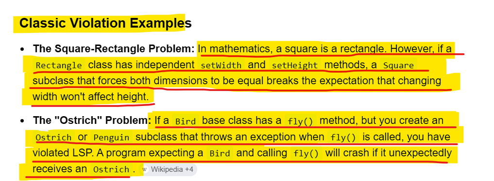

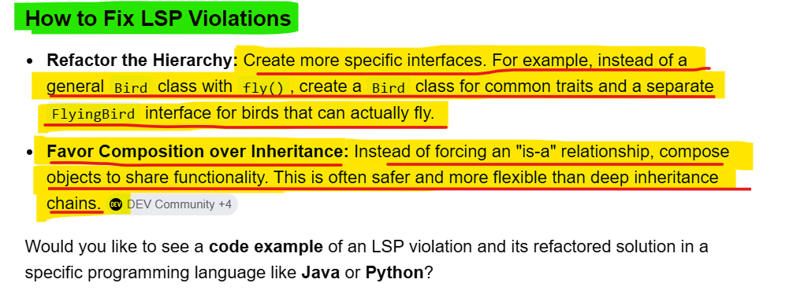

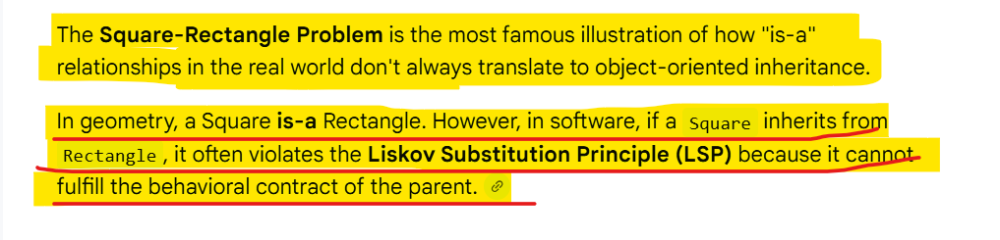

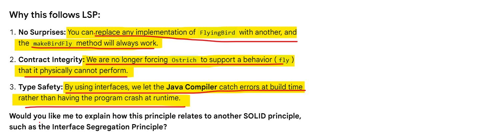

# Interface Segregation Principle

The Interface Segregation Principle (ISP)  states that no client should be forced to depend on methods it does not use.

Instead of creating one large, "fat" interface that contains every possible action, you should split it into smaller, more specific interfaces.

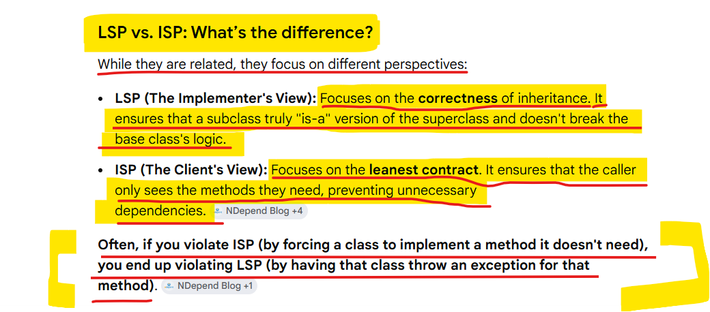

# Dependency Inversion

The Dependency Inversion Principle (DIP), It states that high-level modules should not depend on low-level modules; 
both should depend on abstractions.

. This approach decouples code, making systems more flexible, maintainable, and easier to test.

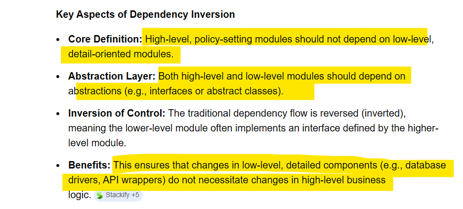

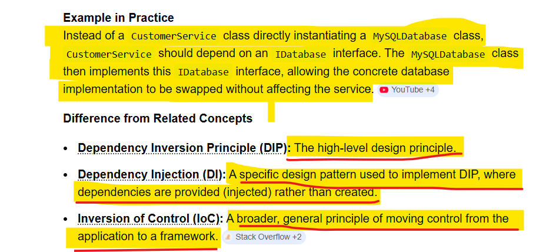

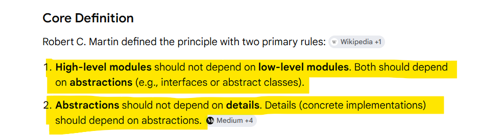

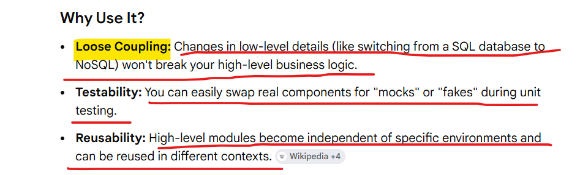

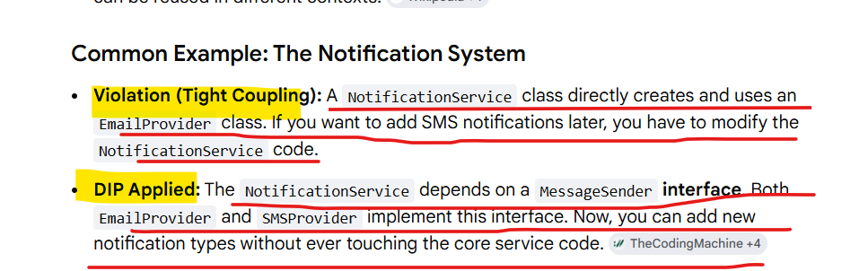

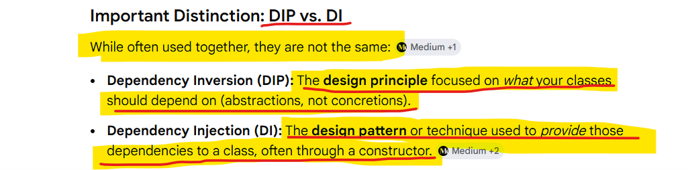

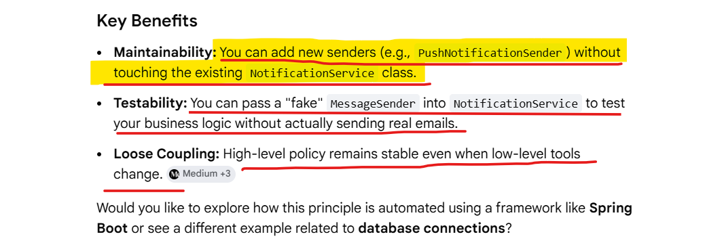

