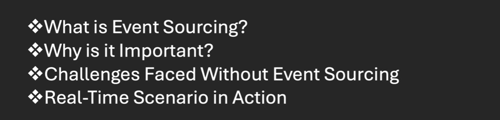

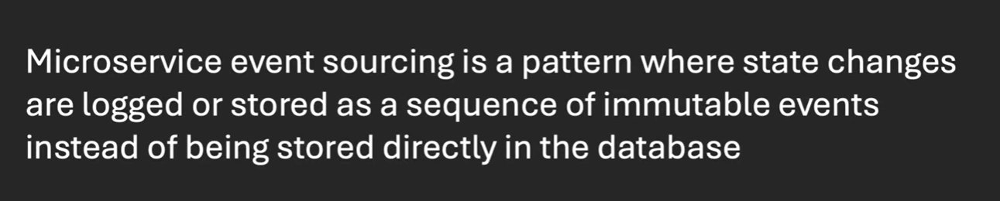

we are keep changing the state of an order so the order goes to 4 stages here and each time we override the 
order status to the database, this looks good but what would be the problem here.

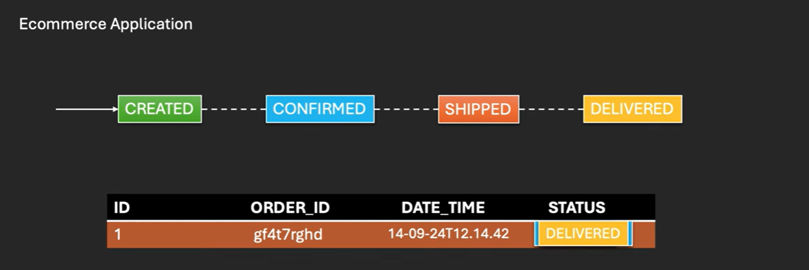

we are only storing or updating the latest state of an order which in this case is delivered. which mean  
our system have no record of the previous states of an order, such as when the order was created, shipped, confirmed
and delivered. 
    just think what will happen If a User raise a complaint of their order. you won't able to back tracked when
    the order created, confirmed and shipped because our system only stored the final state or our order that can 
    impact our business.
** How we can overcome this that's where Event Sourcing design pattern came into the picture.

# Resolution : Event Sourcing

   Instead of updating the order entity directly we create an event log that records every state change like
   created, confirmed, shipped and delivered.
    
   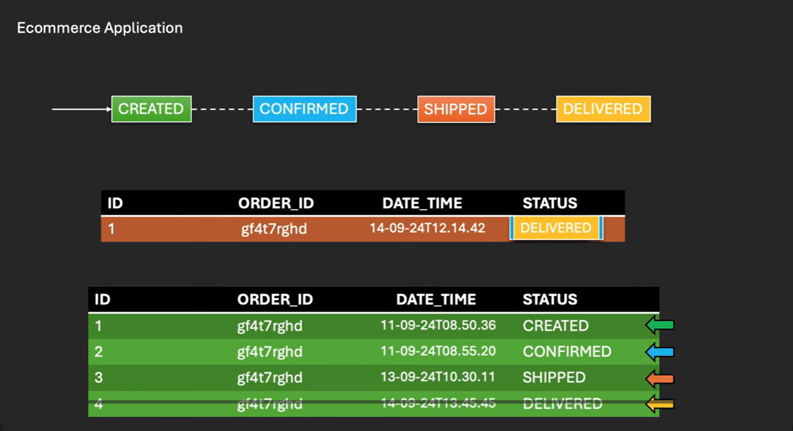

   In Below images user can track the current state of an order and the complete history of an order.
   This is only possibles using Event Sourcing Design Pattern.

   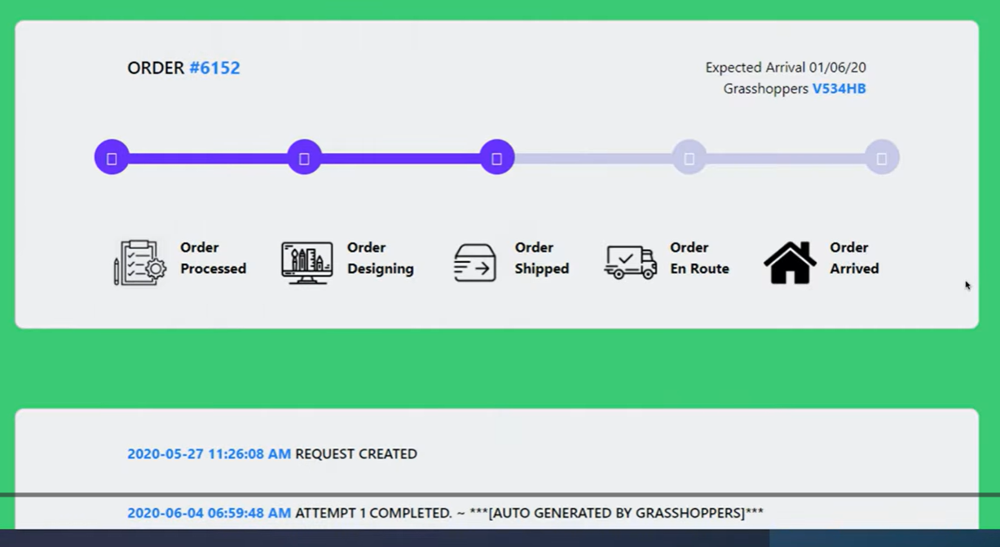

   Amazon/Flipkart uses this event sourcing approaches to maintain each and every step of a particular orders.

   
 # Design and Use Case

   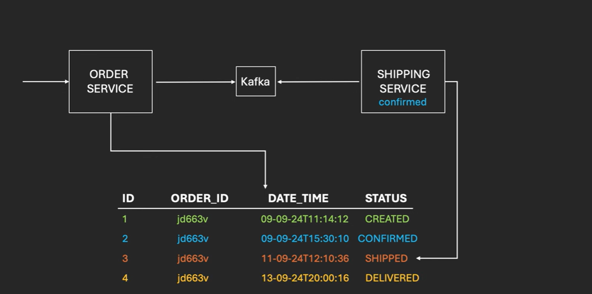
   
   We will create 2 microservice order-service and shipping-service.
   ->When order-service receive a request to place an order immediately he will add event to db with current time stamp with status CREATED
      and at the same time he will also publish the kafka event.
   ->shipping-service keep listening to the kafka topic to check the status if the order status is confirmed then he will initiate
      the shipment process.
   ->once you do the payment after that state will change to the confirmed.
   ->shipment-service always looking for a order confirmation once confirmed he will initiate shipment.
   ->once order get delivered state will be changed to DELIVERED.
   ->everything you can play with an event log.
   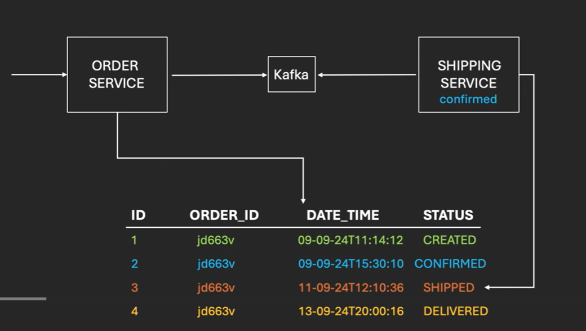
   
 
 
 ** All the state change log will capture in our either Event Log or Event Store. Currently, I am using
    MongoDB But in Real Time it would be better to use the Event Store DB or Google Big Query.

 ** For a Real Time Practise Better to use Event Store DB.
 

 # Testing

   - let's start the mongodb
   - and then let's start the kafka
   - we will hit all 4 stage of order like create, confirm, shipped and deliver.
   - we are not manually going to ship the order because its order event consumed by kafka in shipping-service and update status.
   - for 2 states confirm and deliver we are having rest endpoints.
   - let's start mongodb server 27017 and let's start kafka zookeeper and server.
   -   # Installing kafka and Zookeeper
   - download binary kafka.gz file extract and keep kafka folder in c drive
   - In kafka folder bin/windows/ ***.sh files we use to start producer/consumer/zookeeper/broker.
   - In kafka config folder server.properties file
     ----------------------
     INSTALLATION COMMANDS
     ----------------------
   - set kafka path like KAFKA_HOME & in path var %KAFKA_HOME%\bin
   - go C:\kafka\bin\windows and run cmd to start zookeeper >> zookeeper-server-start.bat ..\..\config\zookeeper.properties
   - start kafka server  kafka-server-start.bat ..\..\config\server.properties
   - now start order service and shipping service
   - http://localhost:9191/swagger-ui/index.html#/order-controller/placeOrder
   - /api/orders/place
   - 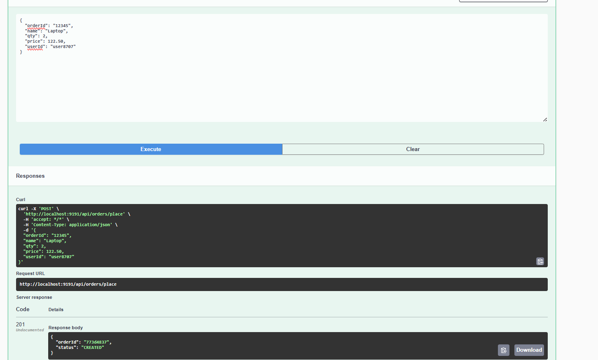
   - 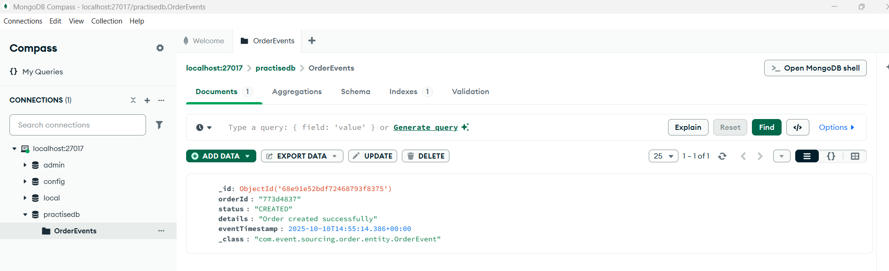
   - 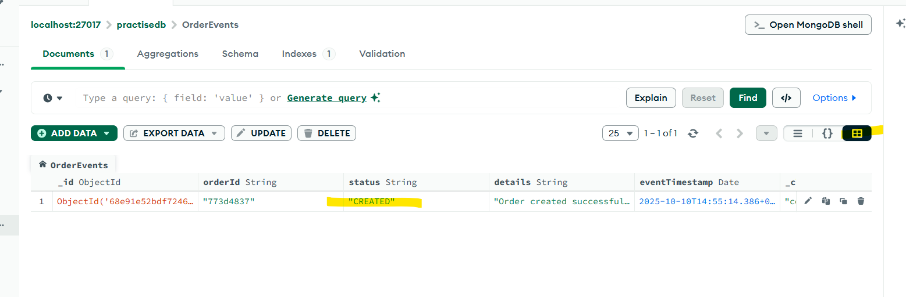
   - now hit the confirm order endpoint
   - pass the order id - 773d4837 and hit confirm endpoint
   - 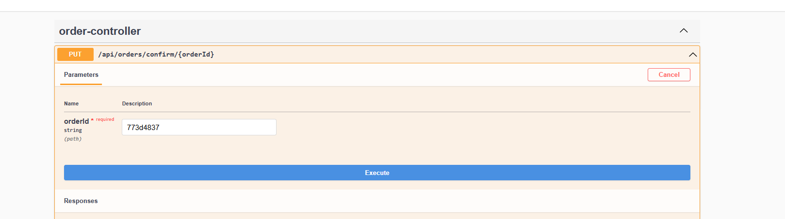
   - 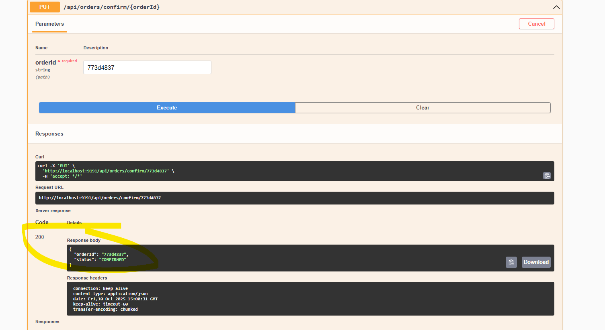
   - now status will change to confirm in db and publish kafka message shipping will consume and check if order confirmed 
     then update status to shipped
   - 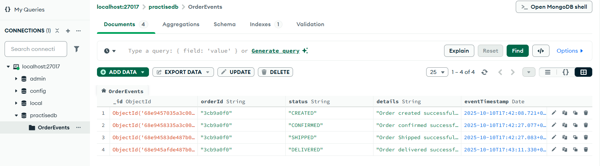
   - 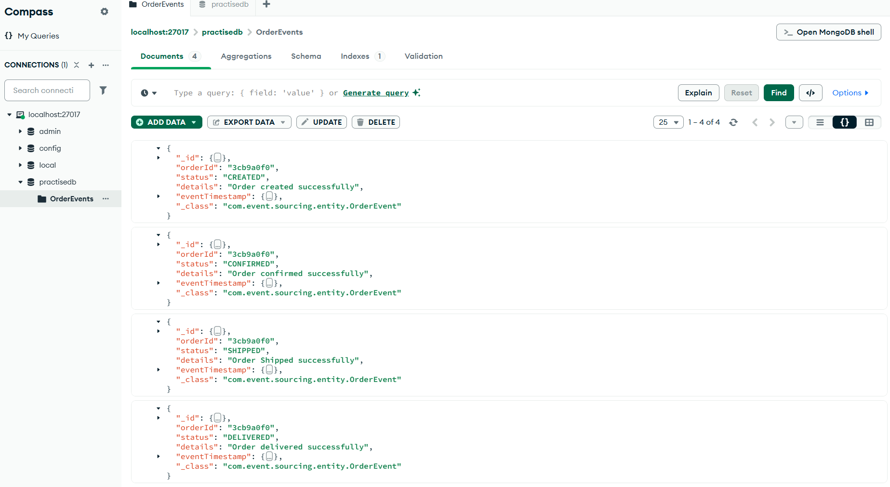
   - 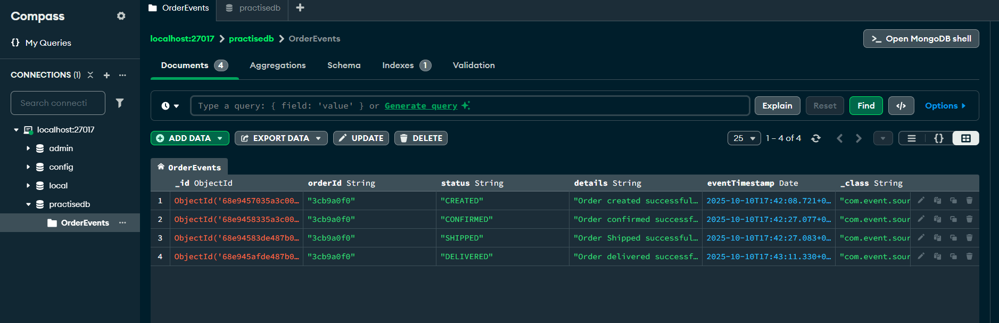
        
    

