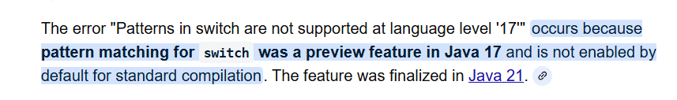
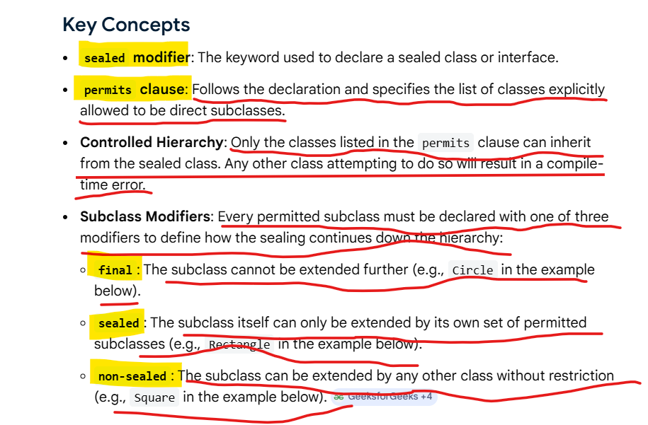
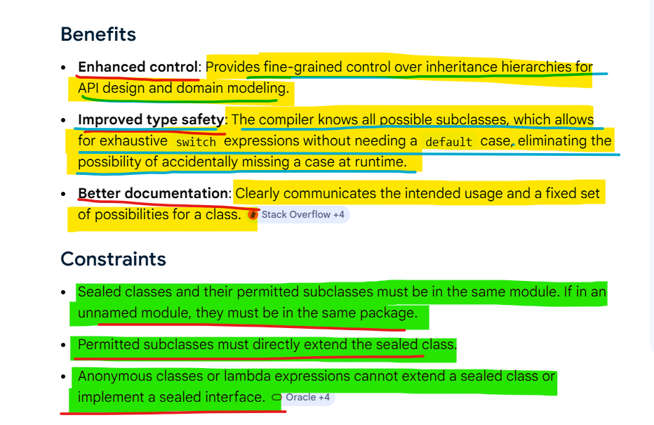
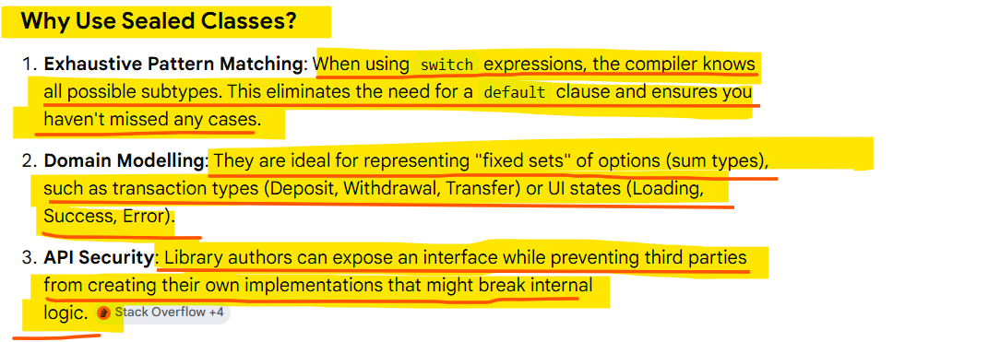
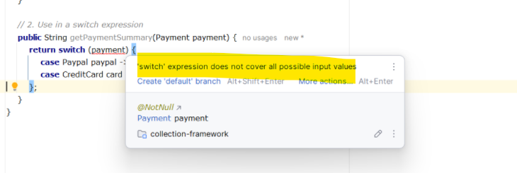
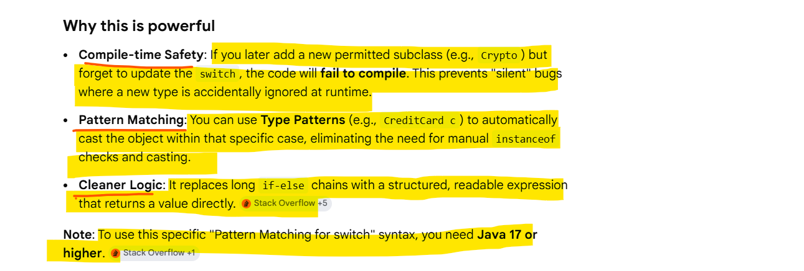

A sealed class in Java is a class or interface that restricts which other classes or interfaces may extend or implement it. 
This feature, finalized in Java 17, provides a middle ground between an "open" class (which anyone can extend) and 
a final class (which cannot be extended at all).

