# What is Records in Java ??

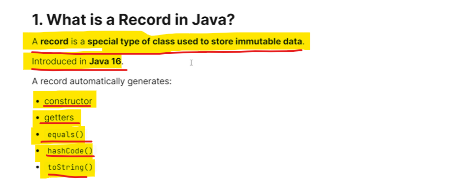

java internally convert into 

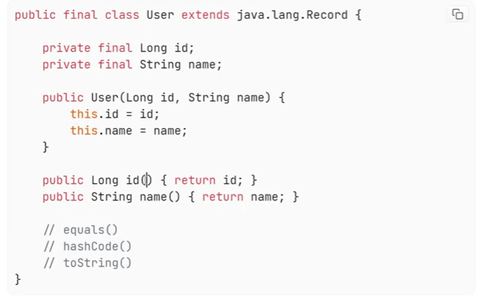

- There is no setter because it is immutable 
- Java will create a final class and extends that class with java.lang.Record
- Java will take input parameters and convert all into final variables
- Java will create all arguments constructor so that it can instantiate
- Java will create a getter with fields name, without get keyword with no setters

# Why Records is Introduced???

- because there is so many of a boiler code all that replace with a single line.
- This is how java removes all the boilerplate codes 
- Records solves Data Carrier Classes Problems

# Key Properties of Records

1. Immutable 
        classes and fields are final.
        you can not modify them because all are final in nature
    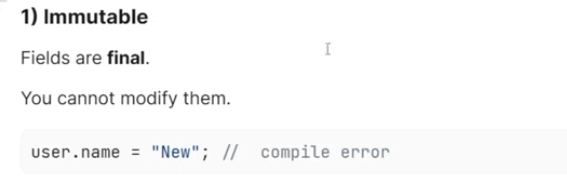

2. Records are Implicitly final so you can't extend a record.

    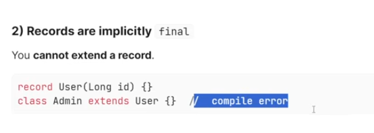

3. All records internally extend java.lang.Record and you can't change it
    and hence you can not extend any other class because by default it is already extends it,
    but you can implement n number of interfaces.

    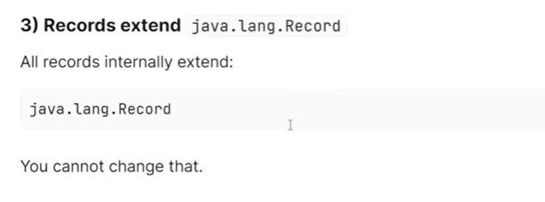

4. Difference between class and records

    records - Data Carrier, It carries the data usages around, nest usecase is request and response body never get change throughout an application.
                 those classes which is never going to change can use as a records.

# Interview Traps

# 1. Is Records is completely Immutable? If yes then it is shallow or deep Immutable??

   

   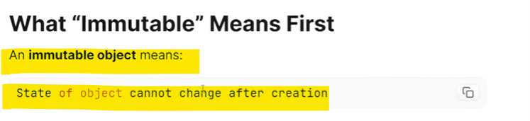

   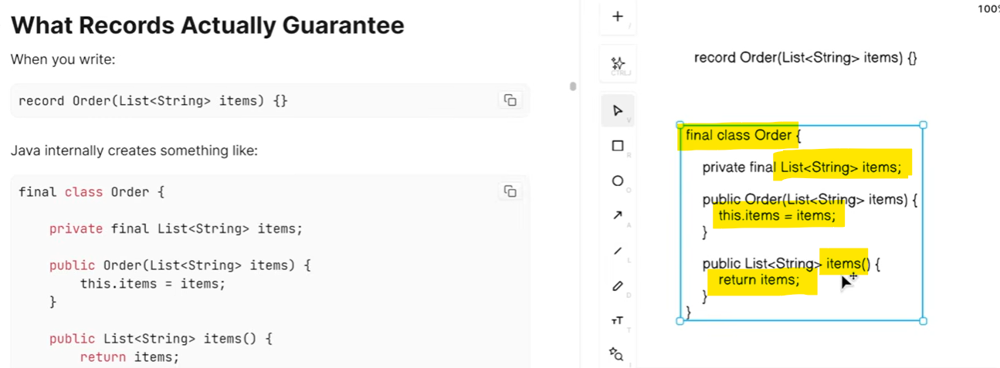

   Important part is How we are instantiating the variables.

   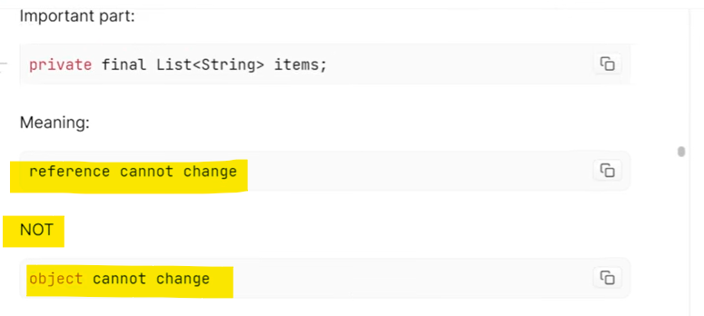

   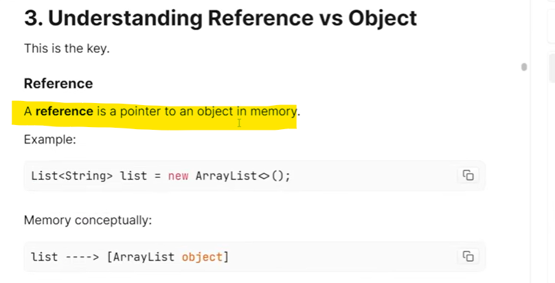

   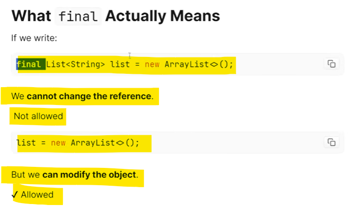

   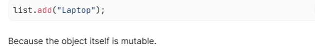

   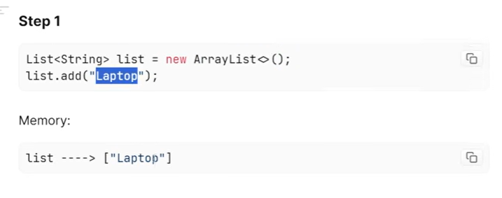

   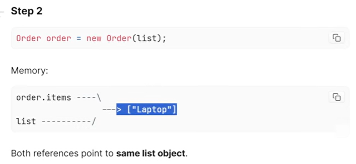

   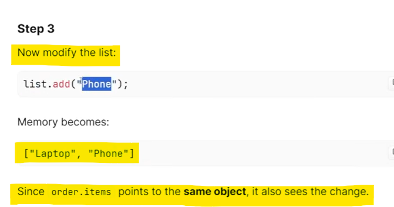

   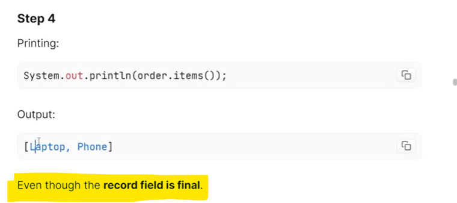

   This is just a Shallow Immutability.

   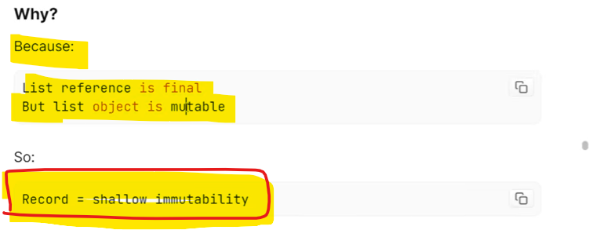

   
# 2. How we would make it deep Immutable ??

   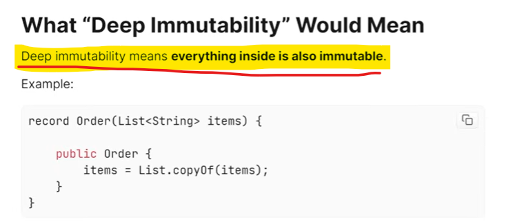

   you are creating a copy of the list and when you return this you return a copy of item
    that is different memory area and hence when try to modify it is unmodifiable and
    when try to modify will throw UnSupportedException

   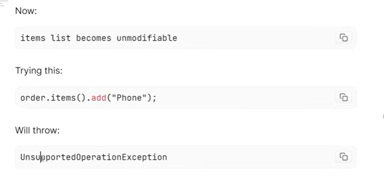
   
   so this Constructor we created is a Compact Constructor

   We can create Deep Immutable Records also But By Default Records are Shallow Immutable.
    It is your task to make the variables completely Immutables 

# 3. Can Records have Methods??

   

   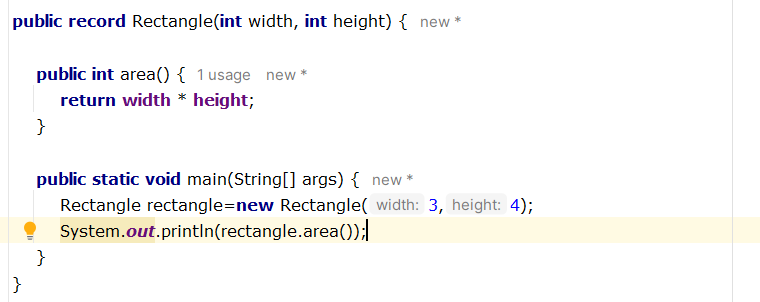

# 3. Can Records have Constructors?? What is canonical constructor and compact constructors??

   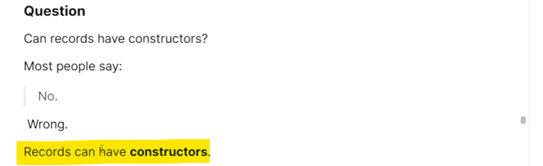

   most people thinks records implicitly defines constructors because record create an all args constructor internally.
   suppose If you have an user and you want basic check validations like if user's name is null throw an Exception.

   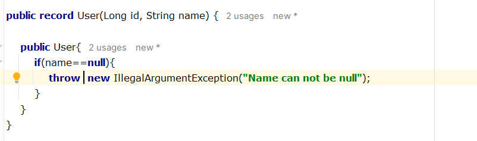

   this constructor is called compact constructor.

   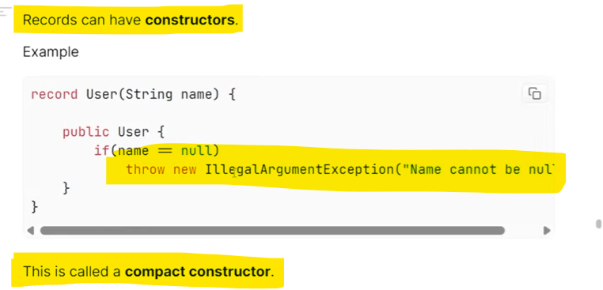

   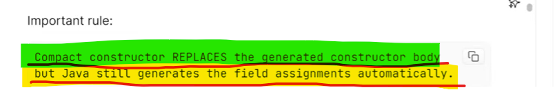

   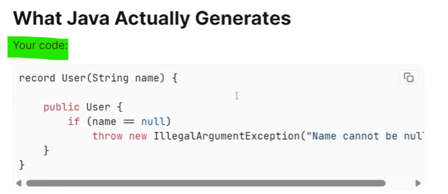

   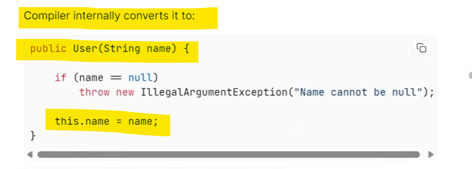

   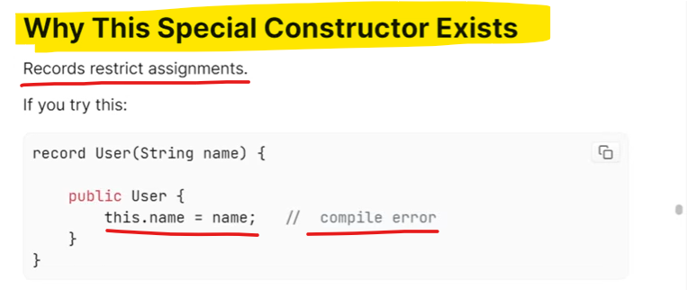

   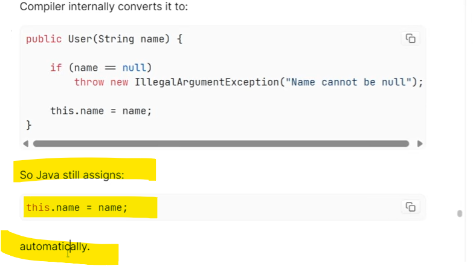

   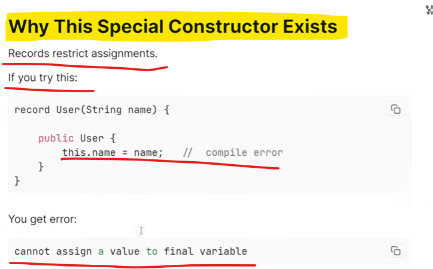

   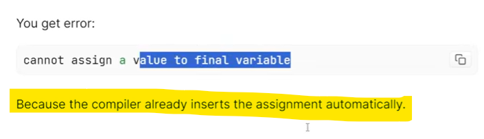

   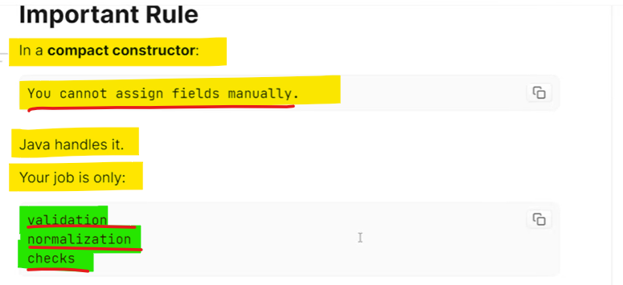

   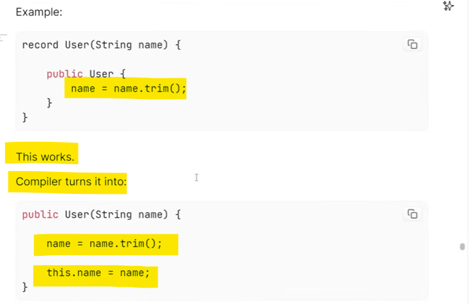

   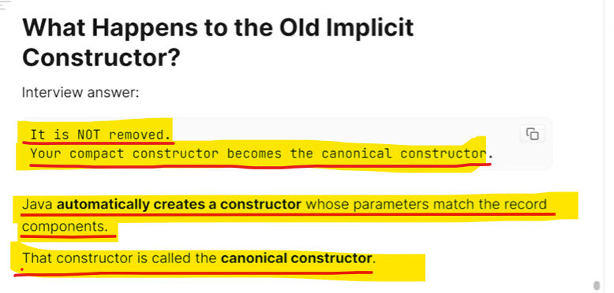

   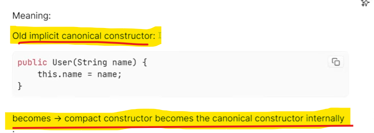

   # canonical constructor 

        which is an Implicit all argument constructor created by recod java for you internally.

  # compact constructor

       when you write your logic what you write and you want to embed into your all argument constructor
      that is compact constructor.

when ever you write a compact constructor, your compact constructor logic is copied and pasted into the
internal code of the canonical constructor(what the constructor created by java for you).

   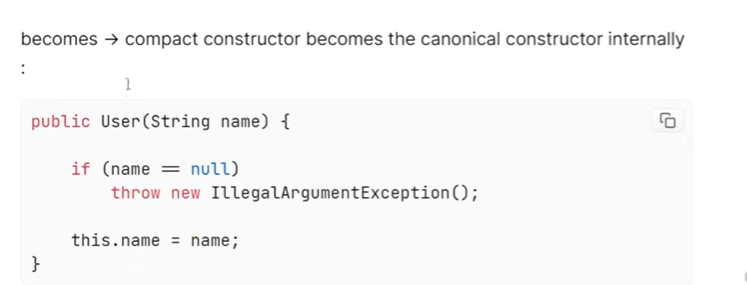

   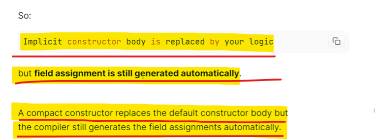

   
# 4. Can Records implements interfaces ?

   

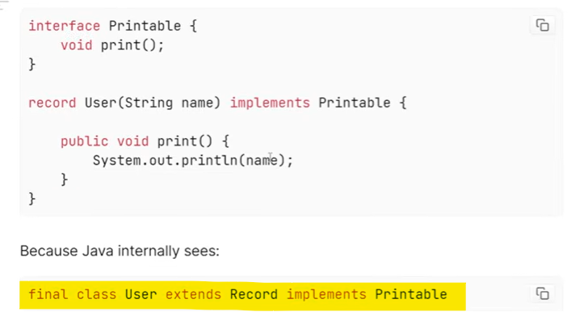

# 5. Can Records have instance variables??

   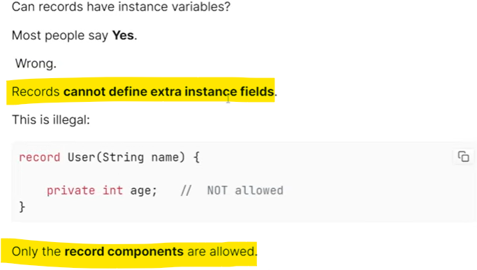

   

   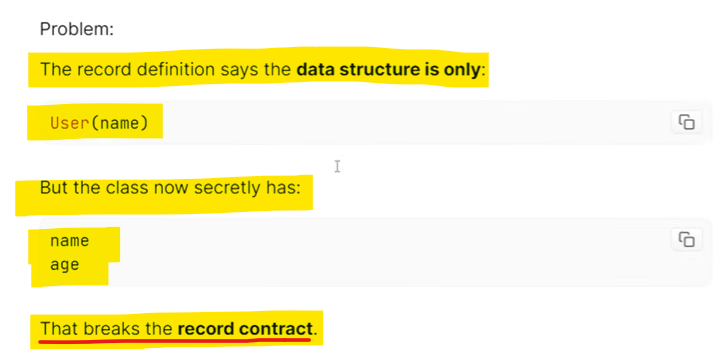

   
# 6. When should you use Records ??

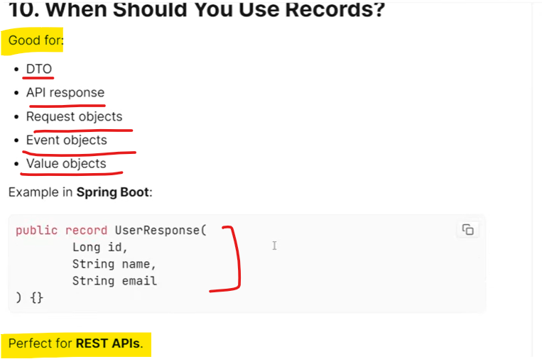

# 7. WHy should we not use records for a JPA entity ??

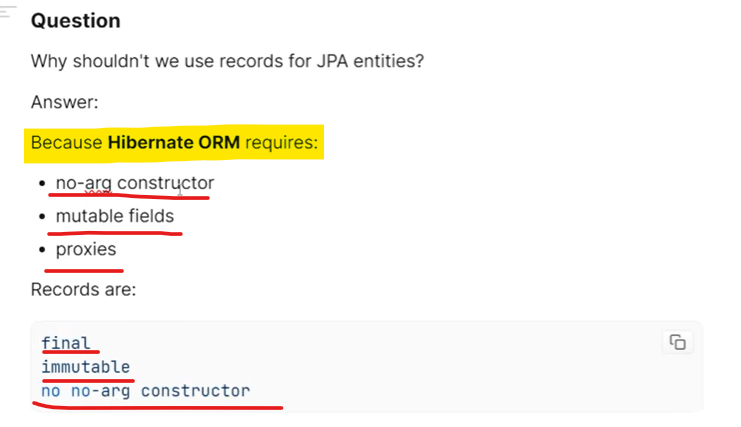

 # 8. WHen you should not use Records ??

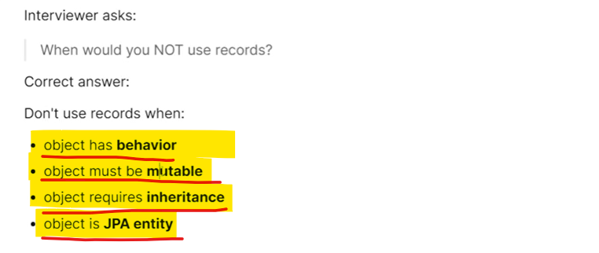

   