# Scenario 1 (synchronization)

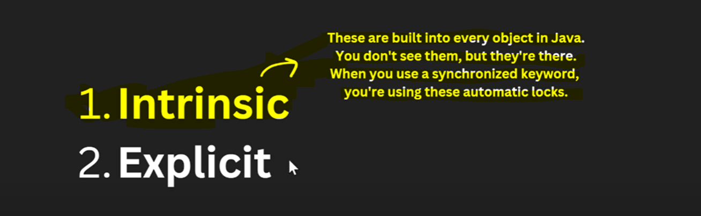

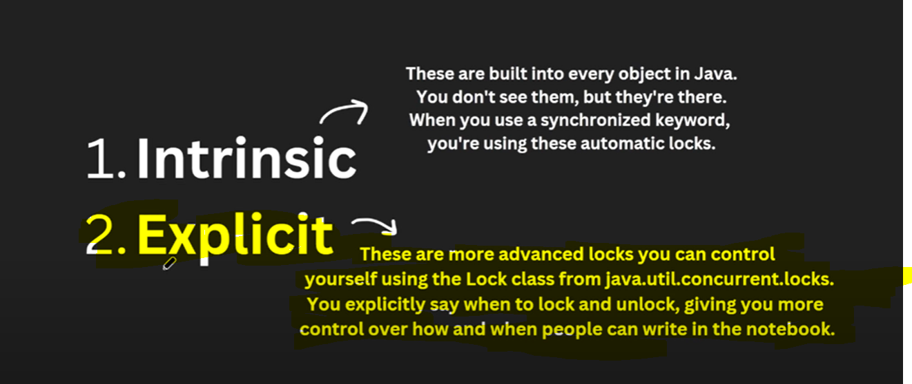

generally In every Object's there is an in build lock available which is synchronized.

# Synchronized Drawbacks

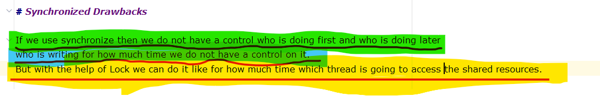

# Drawbacks with Synchronized(Implicit lock) and why Lock(Explicit lock or manual lock) came into picture

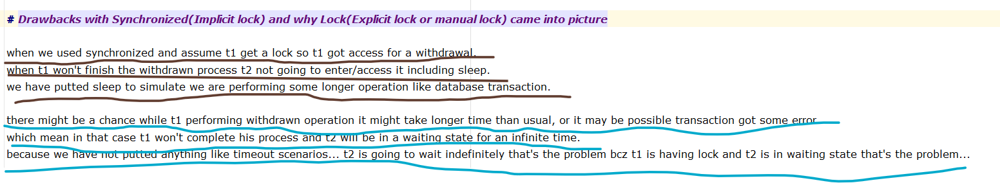

# which thread acquired this lock that only can access a critical section.

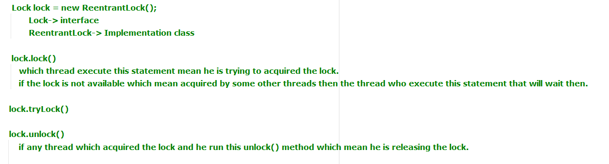

# Scenario 2 ( tryLock(), lock(), unlock() and interrupt())

dormant - not active for some time

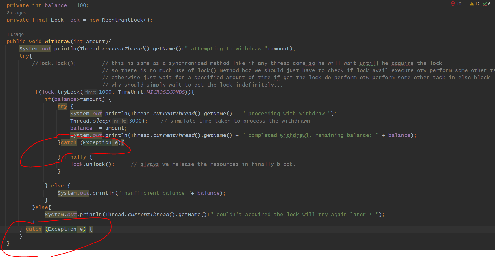

here you can see Thread-1 couldn't acquired the lock will try again later !!
because Thread 1 will wait for 1 second so he won't get the lock so he came in else block
because the reason is Thread 2 is taking 3 seconds to proceed the withdraw process.
here Thread 1 not get a chance to acquire a lock so he not perform withdrawn.

# step processing

1. Thread2 come he run tryLock() he got the lock
2. so, Thread2 started processing for 3 seconds...
3. within that time Thread1 also came and trying to get lock, he wait for 1 sec but he didn't get the lock so he not run
4. so for Thread 1 got printed "Thread-1 couldn't acquired the lock will try again later !!"
5. and when Thread2 has been proceed for 3 seconds then balance got deducted.
6. and then Thread2 got completed.

# why should not use lock() or why lock.lock() is not much useful

# Important Notes on Exception / InterruptedException

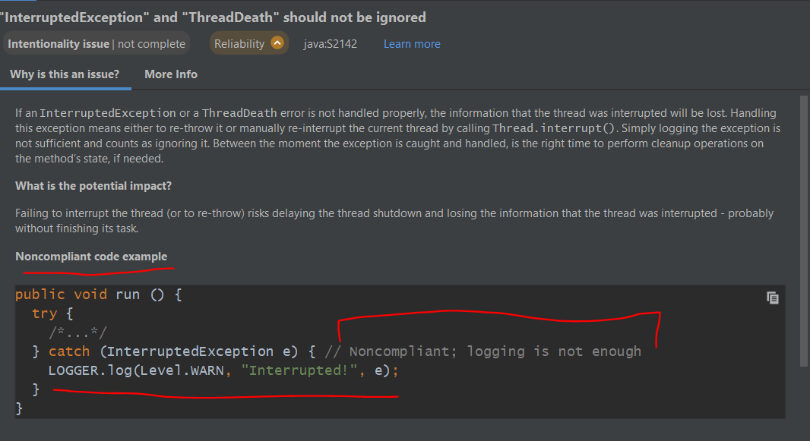

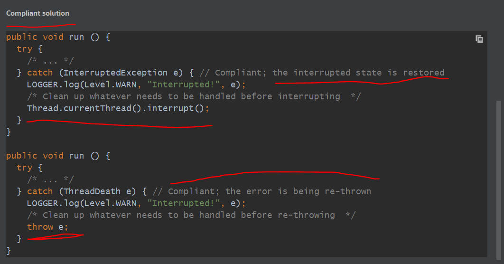

=> But In below again we again re-stored their states so that it easy to find out this thread was Interrupted.
earlier we just logging so Logging is not enough.

=> you have to store that state which will tell this Thread was interrupted again you have to re-store it
so that other threads will get to know or If any monitoring tool is running they can found out which thread got interrupted. so its a good practise.

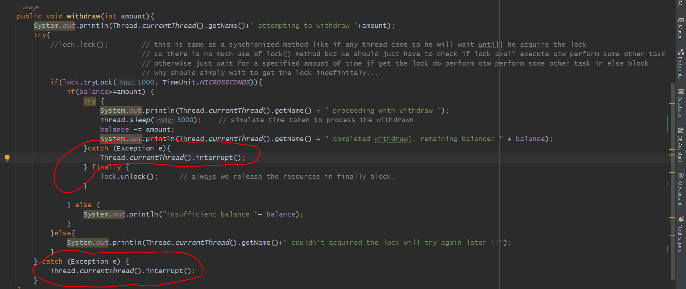

# Now after Interrupt if u want to do something

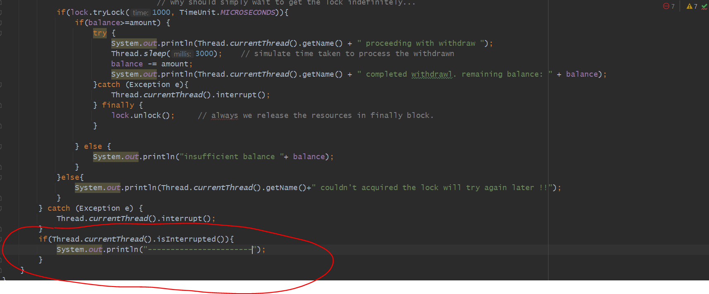

Now after Interrupt if u want to do something like logging and all you can do like this. But In that case you can't do because  you lost the state of that Thread.

Now In catch block you manually re-stored the state of that thread. that interrupt that thread so that if we want to do any clean up code  or any maintenance code will run.  

# Scenario 3 ( tryLock(), lock(), unlock() and interrupt())

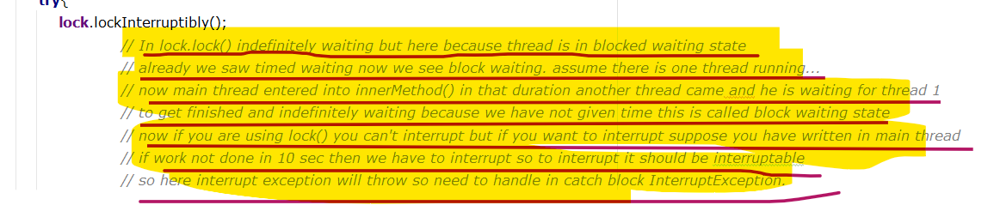

