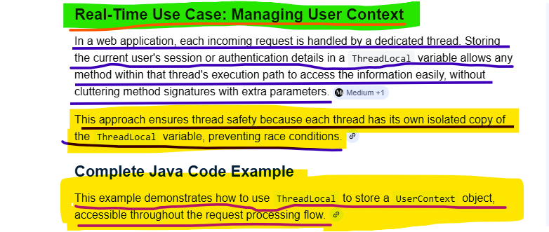
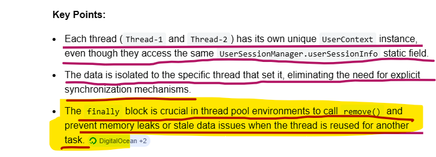
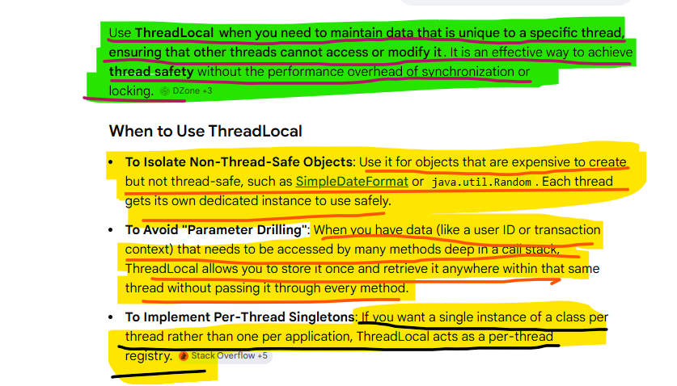
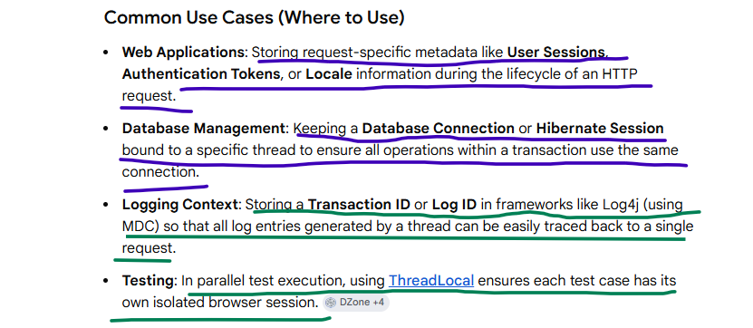
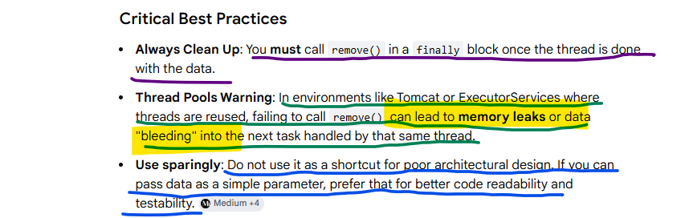

A primary real-time use case for ThreadLocal in Java is managing per-thread objects that are not thread-safe, 
such as SimpleDateFormat instances, or storing contextual information like user session IDs or transaction IDs 
in a multithreaded application without passing them as method parameters.

