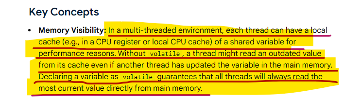

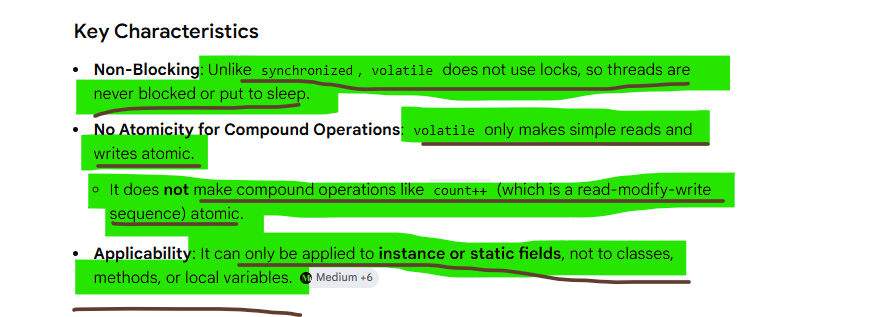

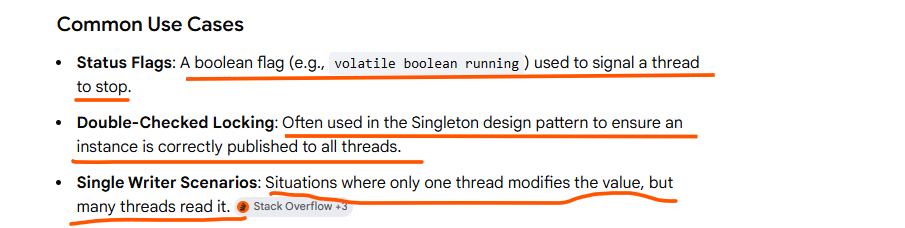

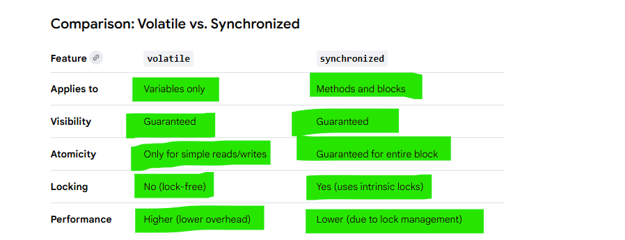

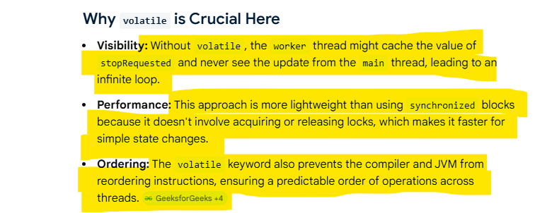

# The volatile keyword in Java guarantees visibility of changes to a variable across threads, but it does not guarantee atomicity for compound operations

Visibility okay, not atomic

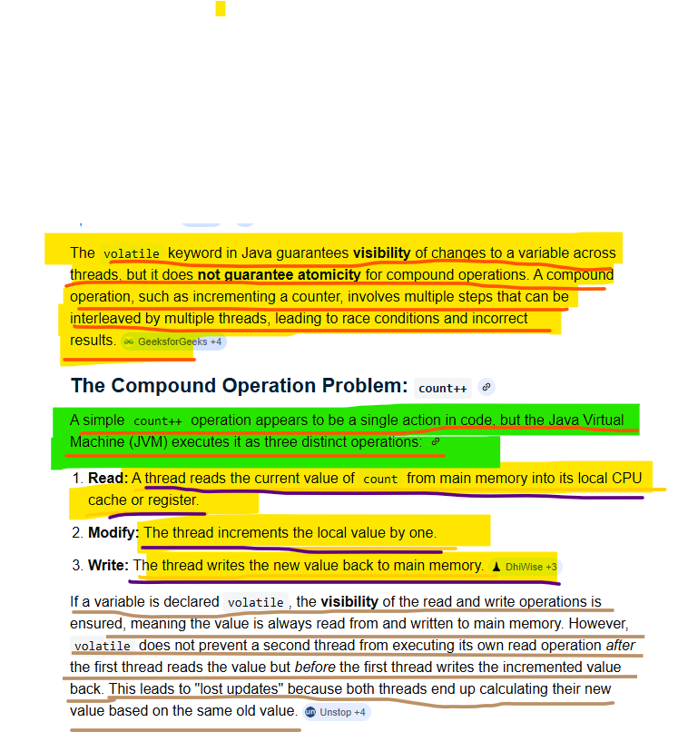

# Solution for Atomicity

To fix this, use synchronized blocks for mutual exclusion or AtomicInteger for lock-free, thread-safe operations. 

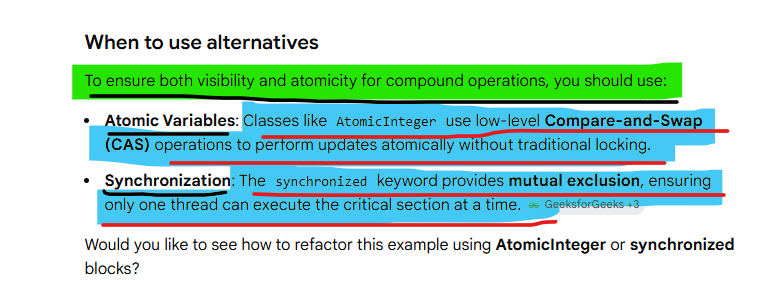

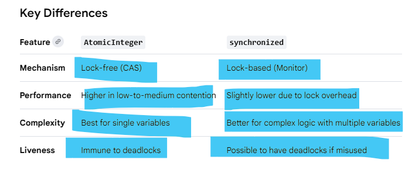

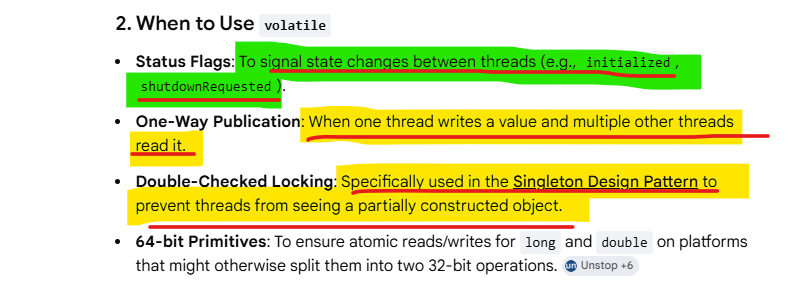

# how volatile used in the Singleton Design Pattern to prevent threads from seeing a partially constructed object.

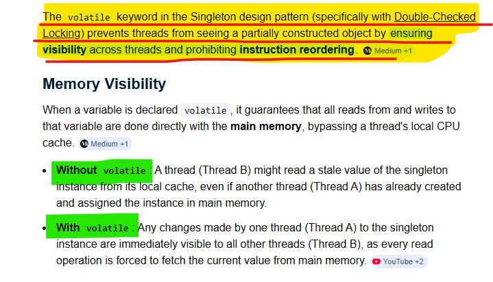

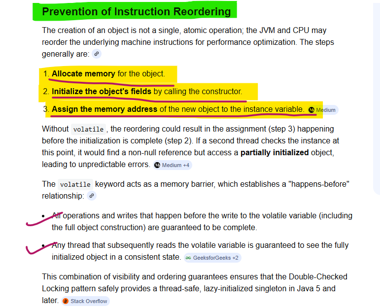

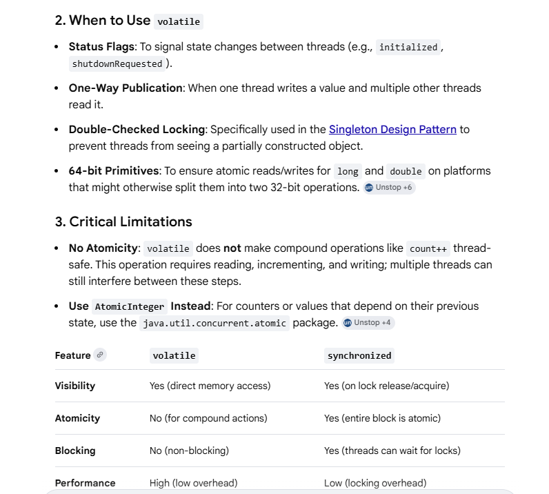