# Happy Scenario Path

   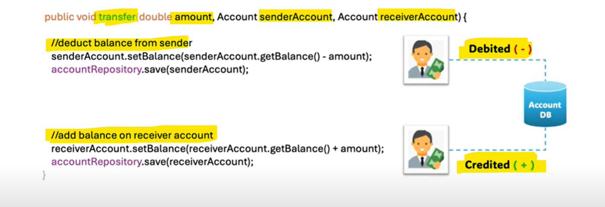
   
# Something Goes Wrong

    because of this failure data is not consistent into db.
    it debited from sender account but bcz of network failure not credited into receiver account.

   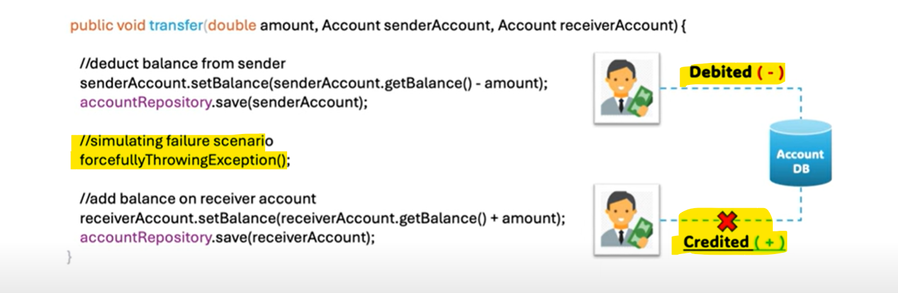
   
    Thats where Transaction comes into picture 
    If everything went well just commit all the changes

   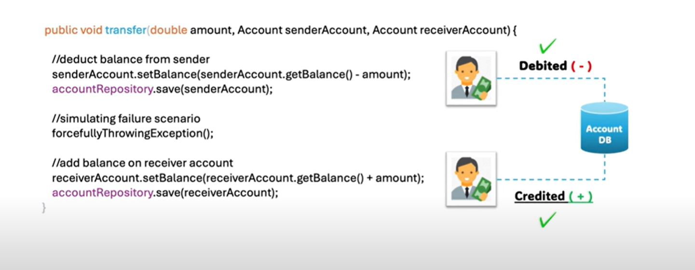    

    If anything went wrong just rolled back all the changes or revert back

   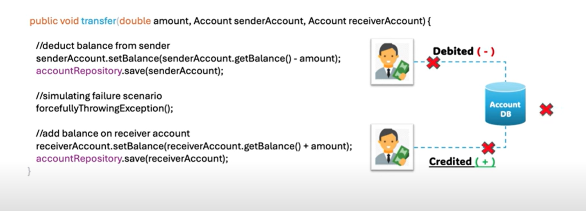
   

# How Spring Transaction works behind the scene

    How Spring Transaction identy What changes need to COMMITTED and What changes need to ROLL BACK.

# Use Case

    we have a transfer method 
    we are getting a sender account from the database
    we are getting a receiver account from the database
    then we deduct the amount from the sender account and update the db
    then we add the same amount to the receiver account and update the db
    forcefully to simulate the failure scenario we are throwing some exception
   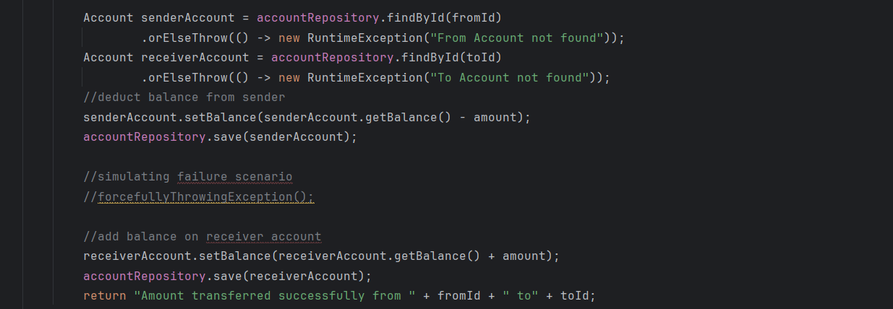
   

** The actual game starts when you annotate the @Transactional
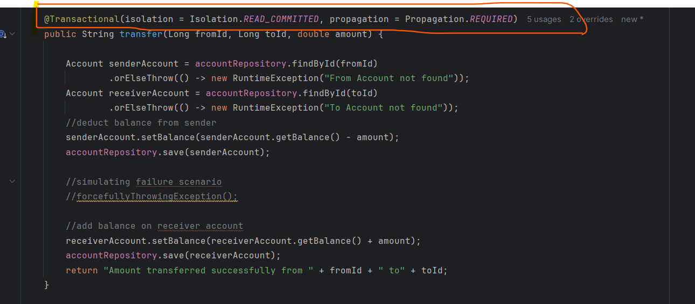

# Before Transaction Let's understand about AOP

    Spring AOP (Aspect-Oriented Programming) is a programming technique in the Spring Framework that helps separate cross-cutting concerns 
    (like logging, security, transactions) from the main business logic. Instead of adding this logic inside every class, 
    AOP allows you to write it once and apply it wherever needed.

    In Spring, AOP works using proxies and you can define behaviors using annotations like @Aspect, @Before, @After and @Around. 
    This keeps your code clean, modular and easier to maintain by focusing only on the core business functionality 
    while AOP handles the repetitive system-level tasks behind the scenes.

    Understanding AOP Concepts

        1. Aspect: An Aspect is a modular unit of cross-cutting concerns. For example, a logging aspect can be applied across 
                    various methods in different classes.

        2. Advice: This is the action taken by an aspect at a particular join point. There are five types of advice:

                Before: Executed before the method call.
                After: Executed after the method call, regardless of its outcome.
                AfterReturning: Executed after the method returns a result, but not if an exception occurs.
                Around: Surrounds the method execution, allowing you to control the method execution and its result.
                AfterThrowing: Executed if the method throws an exception.

   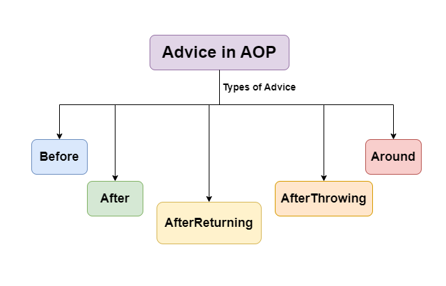
   
        3. Join Point: A specific point in the execution of a program, such as method execution or exception handling, 
                where an aspect can be applied.
   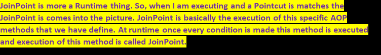

        4. Pointcut: A Pointcut is a predicate that defines where advice should be applied. It matches join points using expressions.

        5. Weaving: This is the process of linking aspects with the target object. Spring AOP only supports runtime weaving 
                using proxy-based mechanisms (JDK dynamic proxies for interfaces and CGLIB for concrete classes). It does not 
                modify bytecode like AspectJ. 
   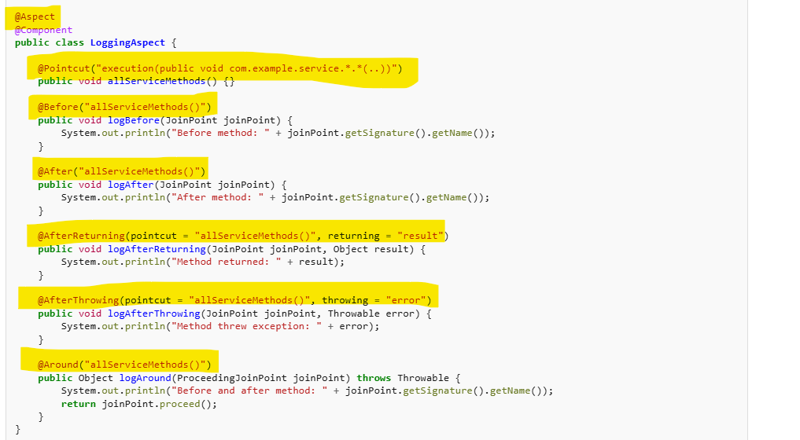

# Transaction Internal Flow : Demonstration

   

    Spring Transaction uses AOP Internally.

    AOP
        If you have and Secondary logic which you want to execute Before your method execution or
        After your Method execution 
        or If any Failure happening and you want to execute your Secondary Logic In that case
        you can go for Aspect Oriented Programming
        It Offers couples of Advices you can use them

   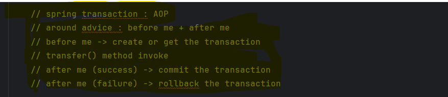

 # Spring Transaction Algorithm :: To maintain consistency
        
   

    when you annotate @Transactional 
 
    step 1 - Spring Transaction Internally use the AOP(Aspect Oriented Program)

    step 2 - Spring Transaction internally use Around Advice : If Any Pre-Processing Logic you want to execute before this transfer method
             or If you want to execute any Post-Processing after this transfer method you can go for @Around Advice.

    step 3 - What Logic Spring Transaction will execute before this transfer() method - So It will create or get the Transaction

    step 4 - Once It get the Transaction within the Transaction Context It will execute your transfer() method then If everything
             ok or looks good, there is no failure then it will COMMIT the Transaction.

    step 5 - If there is any failure after your method execution then It will RollBack the Transaction.

    This is what Spring Transaction does Internally !!!

    so Spring will apply the around advice on top of your transfer method. it will execute before logic nothing just create
    or get the Transaction then it will call your transfer() method once transfer() method execute successfully, on success
    it will commit the transaction and on failure it will rollback the transaction.

 # Overview of Before start Debugging Internally

    lets understand different types of libraries or classes or mechanism involved to initiate this @Around advice and 
    do the Commit or a RollBack when there is a Failure. 

   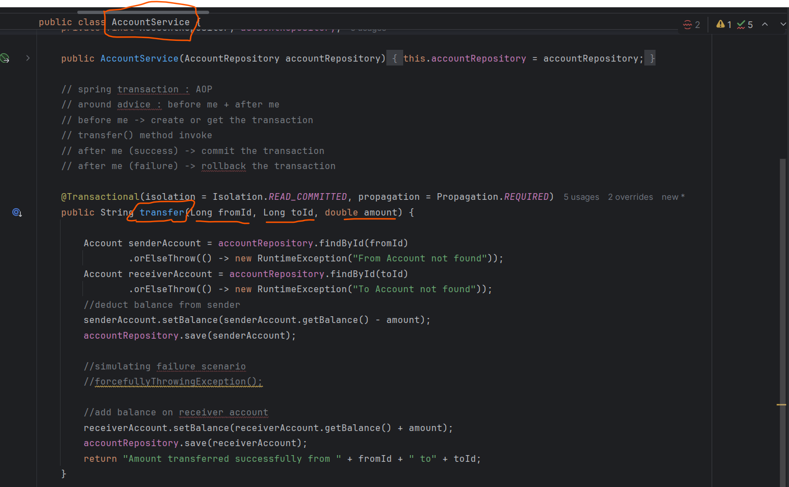

    If you observe this is our AccountService transfer() method when you access that then what it does It simply creates a 
    Proxy class, when you say Proxy class it create with a syntax AccountService then some number then CGLIB and once it will
    create a Proxy class it will extends from your Account Service and it will override the transfer() method.

   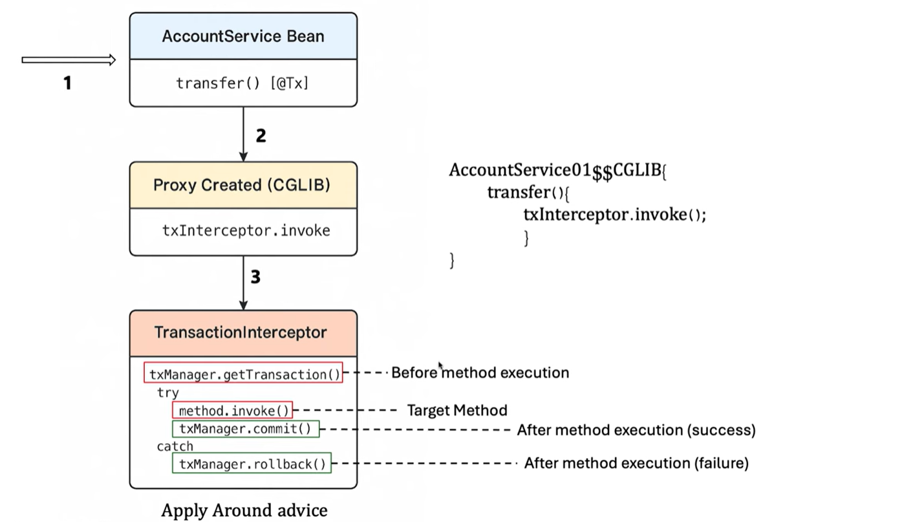

    But It depends which Proxy class it is creating. If your AccountService class will Implement from any Interface then it
    will create JDKDynamicProxy class otherwise if it is a concrete class there is no implementation or no parent class for that
    class then it will create a CGLIB based Proxy class.
   
    once it create the Proxy class, it will override your transfer() method and from the transfer() method it will give
    complete control to TransactionInterceptor class. TransactionInterceptor is the class who applies the Around advice 
    on your transfer() method. 
   
   

    you can see the syntax, you have the transfer() method Spring has overridden in the CGLIB Proxy class then he will give
    complete target method metadata (in our case tarhet method is transfer() and metadata is to, from and amount) to
    txInterceptor.invoke() method and If you see the High Level Syntax of TransactionInterceptor. If you see the method.invoke()
    nothing but target method which is nothing transfer() method before it execute the transfer() method It does create the
    transaction object or get the Transaction that is something Before Method Execution then it will execute your target method 
    after that if everything is Success then it will commit the transaction and if any failure occurred it will do the rollback. 
    If you see the Signature it is like an @Around Advice. 
        so before the target method - method.invoke(), it execute getTransaction() and after that it execute either commit
        or rollback based on success or failure.

    This is what something Spring Does Internally How this Proxy Class is created, How the method metadata of transfer() is
    getting delegate to the transaction interceptor let's create a Pseudocode for it and then we will do Debugging.

    AccountServiceProxy class will extends AccountService class and override transfer() method also it will inject 
    transactionInterceptor and their metadata will pass to the transactionInterceptor. 
    let's see the detailed description below.

 # Pseudocode Creation

    this is what something Around Advice.

  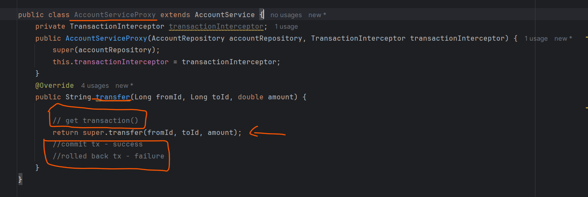        

    Now What is the role of this TransactionInterceptor???

    This below line is not the code which will directly execute in your proxy, rather it will give method Metadata to
    transactionInterceptor.invoke(metadata).
    
        // get transaction()
        return super.transfer(fromId, toId, amount);
        //commit tx - success
        //rolled back tx - failure
    
    If you call directly trasnfer() method from Proxy using super this will behave like a non-transactional method.
    so will not directly call super.transfer() rather get the metadata or methodInvocation then give that metadata
    methodInvocation to the transactionInterceptor so he will do the get transaction and he will do the commit and 
    rollback transaction based on the scenarios. 

   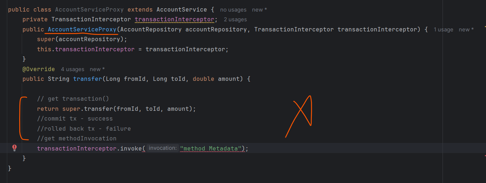
   
    so we no need to do that above steps. rather than proxy handle get transaction and commit and roll back based
    on the situations let transactionInterceptor do that for us that is the reason Spring Developers provided
    TransactionInterceptor class. so to call the target method we also need to inject the target class which is nothing
    AccountService then write the logic for method invocation.
    we are using reflection to get the metadata of the method.

   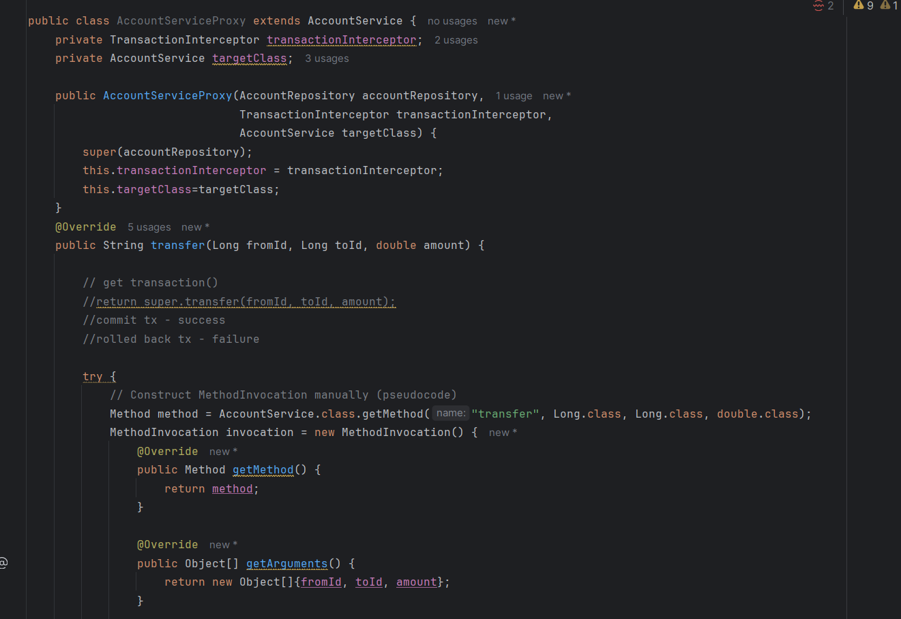
   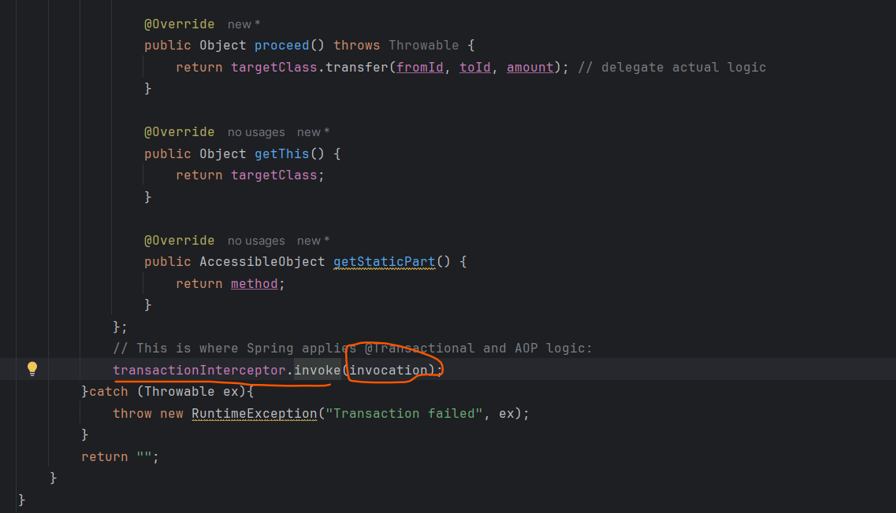
    
    below line is the main line who is doing everything behind the scene

            // This is where Spring applies @Transactional and AOP logic:
            transactionInterceptor.invoke(invocation);
    
    
# Transaction Interceptor Class Evaluation

   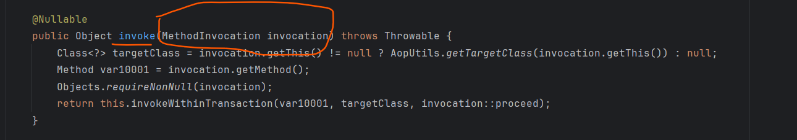

    Transaction Interceptor calling the invoke() method with methodInvocation as parameter, method Invocation is nothing all about
    proxy detail and method details. then it will check where is the targetClass where we need to apply the transaction. once u get method
    invocation details metadata ready.

   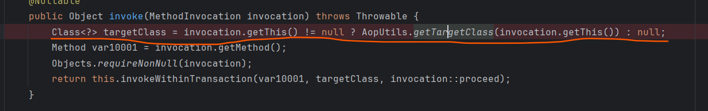

    then we are passing method name, target class and asking to proceed with the execution

   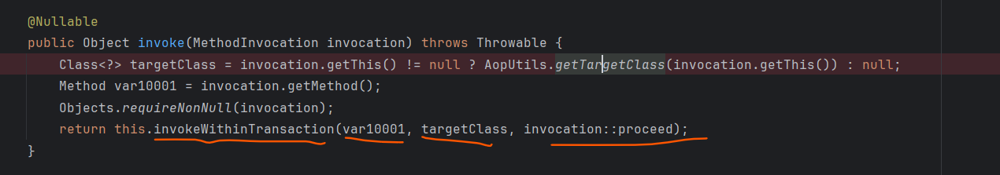

    If you see the below line what it does is it get the TransactionAttributeSource either it will get an existing transaction or it will
    create a new transaction it depends on what type of Propagation you have defined. so this will get the Transaction which is nothing
    your Before method Execution.

   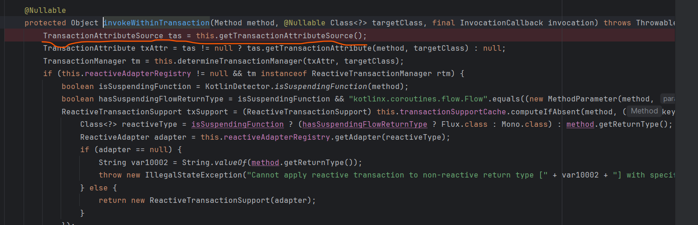

    then It will determine the TransactionManager which type of TransactionManager is this. either it is a JpaTransactionManager,
    jdbcTransactionManager, HibernateTransactionManager or DataSourceTransactionmanager.

   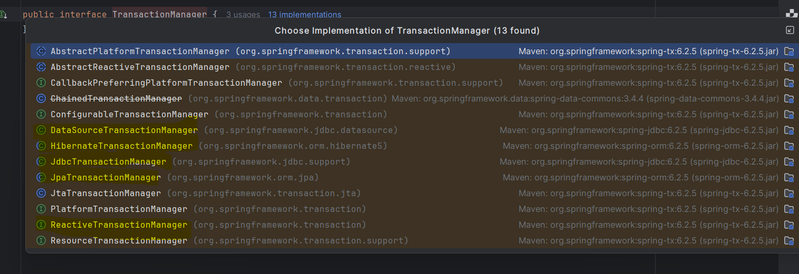
   
    once it find the transactionmanager then it will evaluate the JoinPointIdentification which mean who is your target and what
    is the method you want to apply the Around advice so the method name will identified. 

   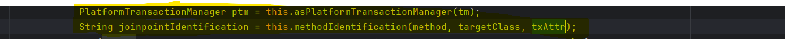
   
    Below is the place from where actual game will start, If any failure occurred then rolledback if not then commit.

   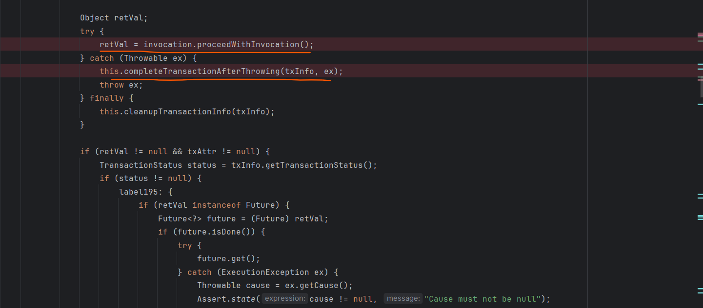
   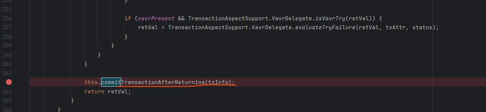
   
    

####     DEBUGGING   #####

# 1. Happy Scenario - No Exception Occurred

   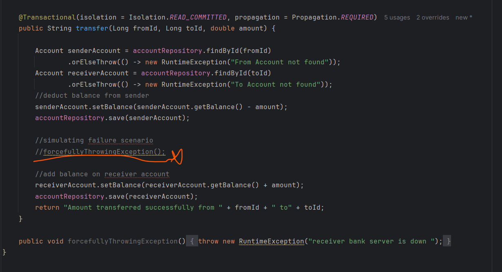
   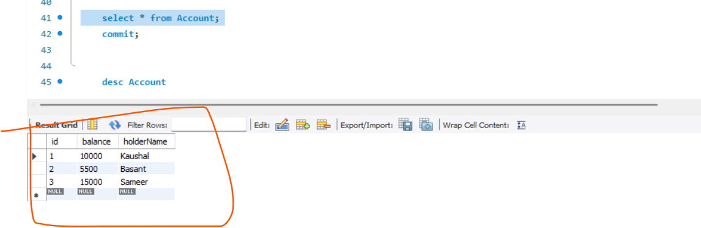
   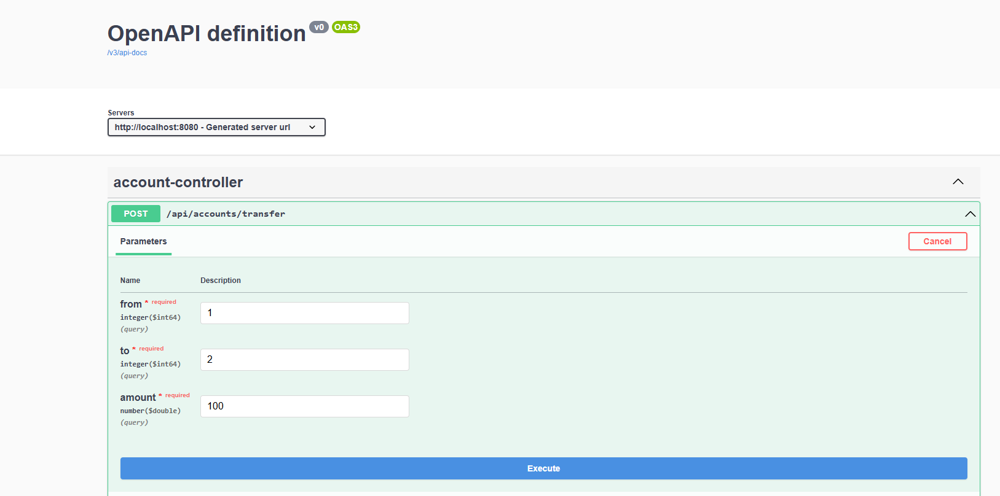

 imp -  If you can see the Method Invocation is having all the details. 

   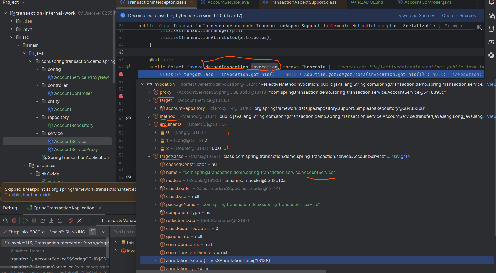
   
 imp-   First Request will come to the Interceptor, It will create the Proxy Class its a Dynamic Proxy created by CGLIB. 
 
 imp - ALl the information we are giving to TransactionAspectSupport.java class. this is where the actual Around
       Advice logic will be execute.

   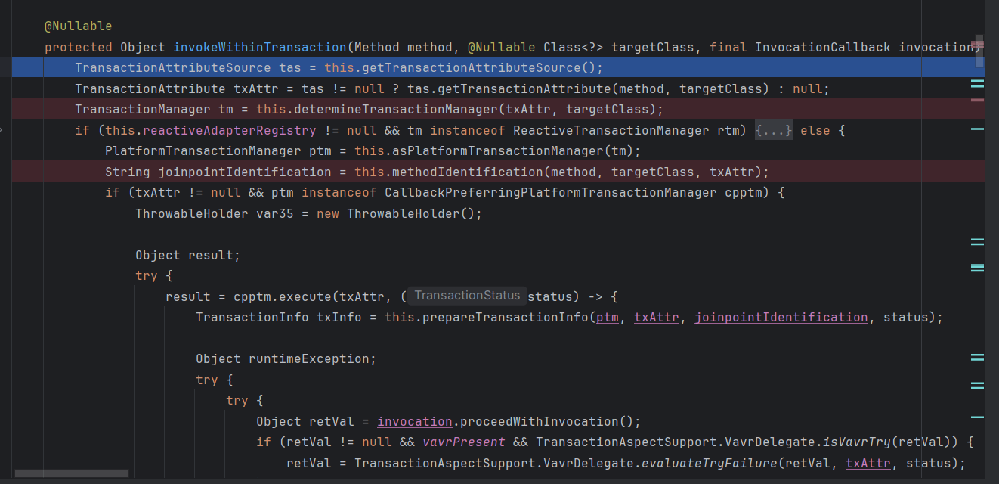

 imp - In below line it will fetch all the details about the Transaction like what is Isolation level and
         whet Propagation level setted.

      {MethodClassKey@13218}public java.lang.String com.spring.transaction.demo.spring_transaction.service.AccountService.transfer(java.lang.Long,java.lang.Long,double) on class com.spring.transaction.demo.spring_transaction.service.AccountService -> {RuleBasedTransactionAttribute@13206}PROPAGATION_REQUIRED,ISOLATION_READ_COMMITTED

imp - if u can see what is the joinPoint Information showing

   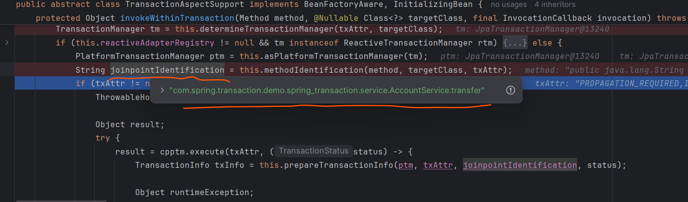
actual method call for transaction is happening

   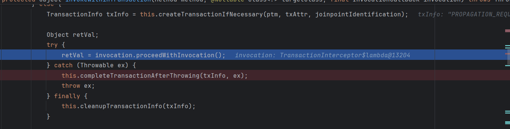

imp - If you see everything is happening within a same transaction

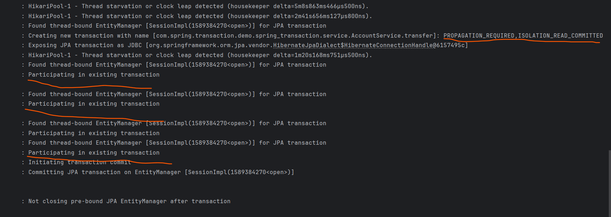

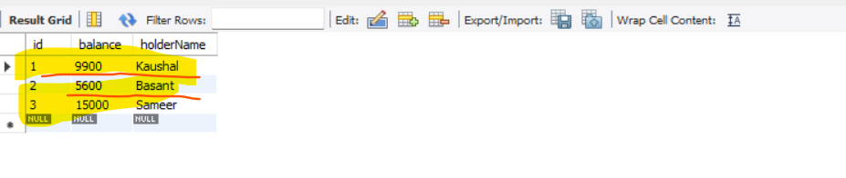

 
   