# Isolation

In Transaction ISOLATION controls the visibility of changes made by one transaction to another transaction.

For Example, there are 2 Transactions T1 and T2. What T1 is doing It should be update to T2 that is what
the role of ISOLATION is to make the data consistency between multiple Transactions.

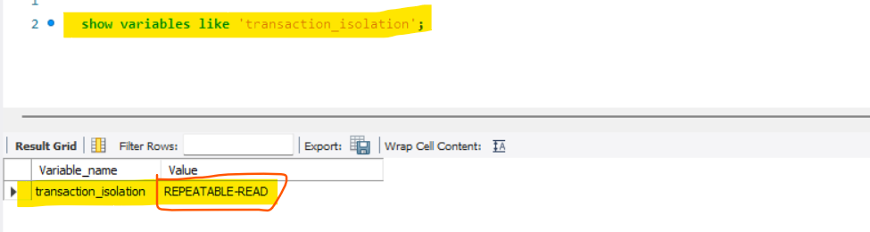

# We are using DB - MYSQL

# Total 5 Isolation Level
    - DEFAULT
    - READ_UNCOMMITTED
    - READ_COMMITTED
    - REPEATABLE_READ
    - SERIALIZABLE

- Let's do the Postmortem of each-and-every isolation level here.

# 1. ISOLATION.DEFAULT

    This DEFAULT isolation level is specific to your database. so, what database you are using and what is the default isolation level
    set to the database will be use if you define Isolation Level as a DEFAULT. so in mysql REPEATABLE_READ is by default configured but
    you can change and override it with any other isolation_level.

    >>> show variables like 'transaction_isolation';
   
   

    so as of now we can ignore DEFAULT because any of the rest 4 we can set as a default isolation level and we can use it. so let's discuss
    rest 4 isolation levels. 

 so let's understand each and every Problem statement and how we can solve it and in which situation we should use which ISOLATION level.

# 2. ISOLATION: READ_UNCOMMITTED  (DIRTY READ)

   It allows Dirty Read or allow to read Uncommitted data Which create the data Inconsistency throughout my application during the transaction
   To Avoid Dirty Read we can use READ_COMMITTED.

   # PROBLEM STATEMENT

    you have an Inventory db with product id, name, price and stock_availability.
    
    If there is a transaction Tx1 and Tx2. 
    If anything is going to change by transaction Tx1 is it going to reflect to the transaction tx2 or not or what value is it 
    reflecting to the transaction tx2. that's how you can validate the different isolation level. 

   # Use Case -1 

    There is a transaction t1 and at same time there is a transaction t2. 
    transaction t1 trying to update the stock value
    currently laptop product stock value is 20 and transaction t1 want to update it to 10 
    now at same time transaction t2 want to read the stock value of same product(laptop) so what value it will display to transaction t2 ???
    it will display 10.
    Think in Real Time perspective is this Behaviour is Correct??  No, Right?
    
    What transaction 1 is doing here he is trying to update the value but does he committed the changes?? No he didn't which mean
    transaction t2 trying to read Uncommitted Data, What If in future or after some time transaction t1 Rolledback the data. If he
    rollback the change the stock value will be updated to 20 but what transaction t2 has read is 10 which mean the data is not
    consistent between two transactions. 
    
   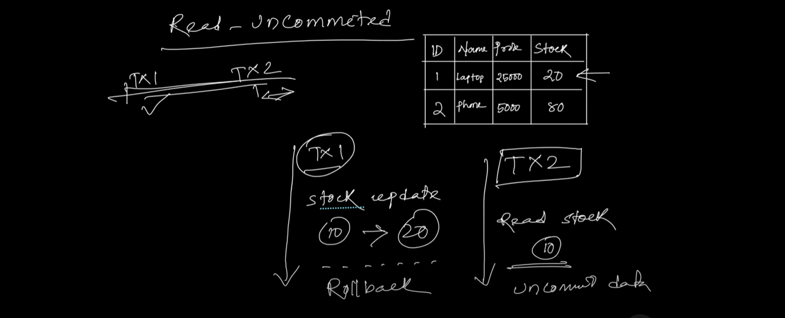

    
   # Use case -2

    you want to watch some movie and suppose there are only 2 tickets availables in Theater. suppose you and one guy Rahul trying to book the
    same ticket. 
    Rahul is trying to book the 2 ticket but he didn't paid or didn't committed or he has not confirmed ticket booking and
    at the same time you are trying to book the ticket but you are seeing ticket availabity is 0 because he already booked the ticket so it showing 
    us to 0 but this guy Rahul after some time get diff plan and he rolled back. 
    so, it is showing un committed data to transaction t2 which is inconsistent. 

   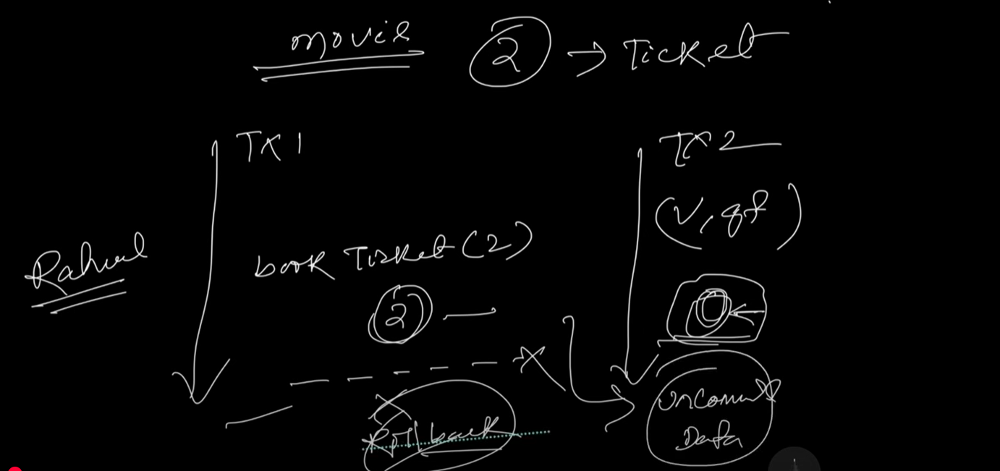

   Let's try to ReProduce the use case scenario of update Inventory stock availability. 

   # Coding-

    let's create 2 methods or transaction A and B, one will update the stock and another will read the stock value.
    so you can see after Transaction A we sleep for 5 seconds to simulate transaction B to get a chance to execute
   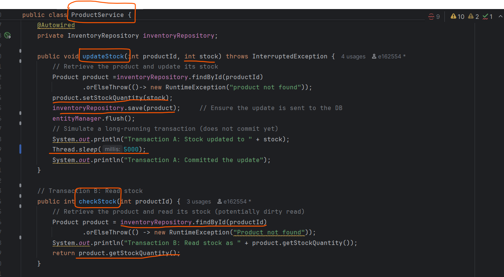

    let's create 2 different Threads as a 2 different Transactions. 
    one Thread will call updateStock() and another one will call checkStock() then we will see how Read_Uncommitted will behave.
   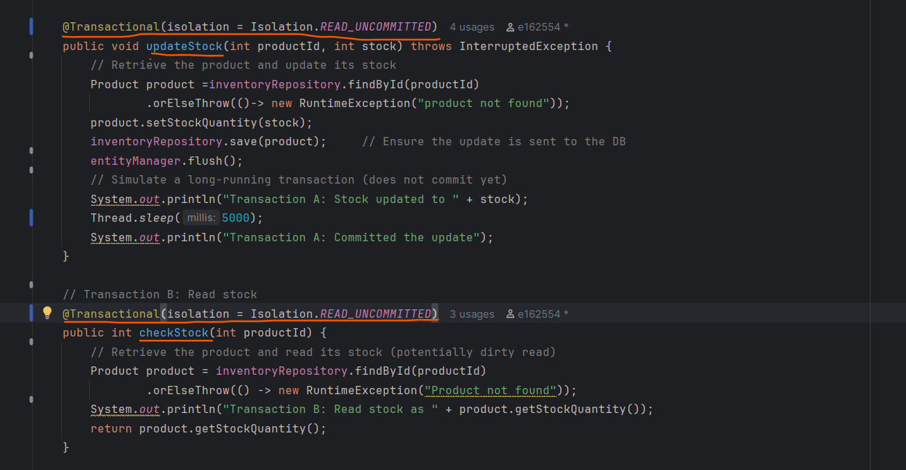

    we are going to check whether checkStock() data by transaction B is reading the committed data or uncommitted data.
    crete a class - ReadUncommittedDemo for creating 2 threads and calling updateStock and checkStock methos.
    we have created 2 different transactions by creating 2 different threads. 

    let's validate what is the value in our db now
    
    insert into Product (name, price, stock_quantity)
    values('Laptop', 25000.0, 10);                  
    
    insert into Product (name, price, stock_quantity)
    values('Smartphone', 5000.0, 5);               
    
    insert into Product (name, price, stock_quantity)
    values('Watch', 1500.0, 34);                    
    
    insert into Product (name, price, stock_quantity)
    values('TV', 75000.0, 4);                       

    we can see in DB we have a stock quantity is 50 for a product - Laptop, and from our code Transaction A
    trying to update it to 5.
   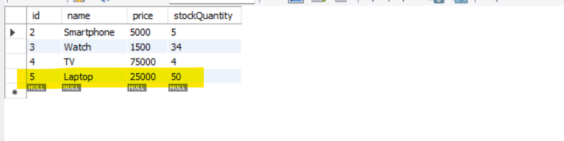
   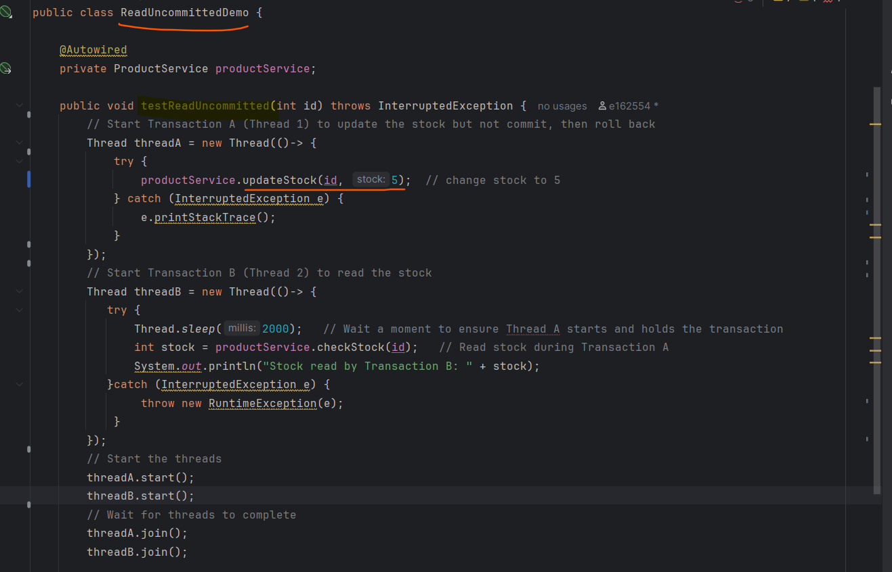

    we have a controller class which endpoint is going to start transaction A and transaction B and we are trying to update
    for a product id - 5 which is laptop.
   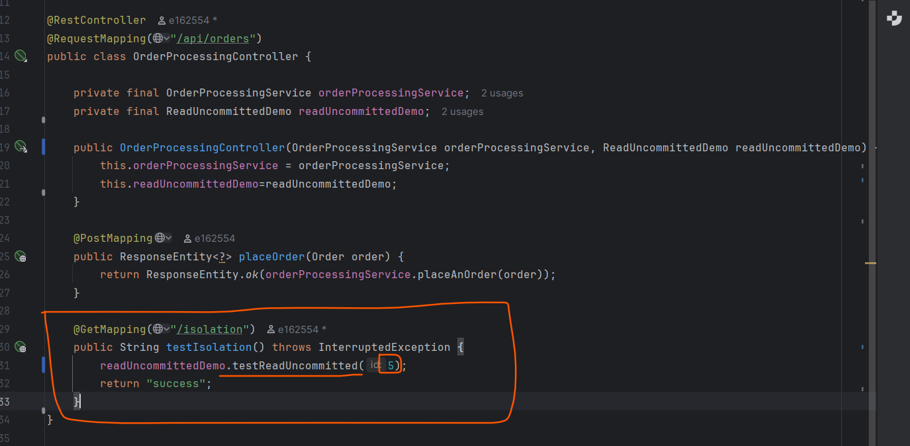
   
    let's set the transaction isolation level in our database as a READ_UNCOMMITTED and verify
    
   >>> SET SESSION TRANSACTION ISOLATION LEVEL READ UNCOMMITTED;
       show variables like 'transaction_isolation';
   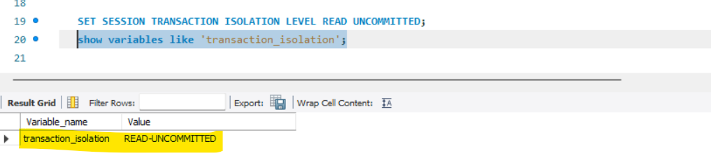
   
   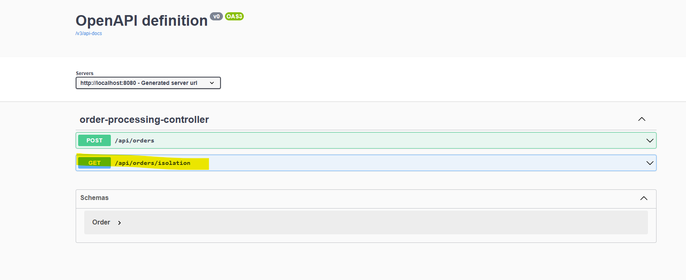
    
    Read the output carefully
  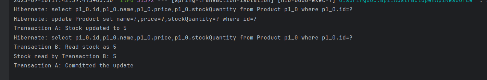 
  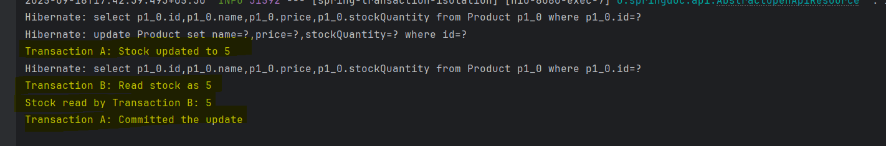
  
   Earlier stock was 50 and transaction A updated it to 5 at same time transaction B read stock as a 5 so now the question is
   while transaction B read the value is transaction A committed the value so, here transaction B is reading the uncommitted data 
   this is called uncommitted read or dirty read. so after transaction B read the data then Transaction A committed there changes.

  # second scenario after transaction B read the data let's ask transaction A to roll back the changes 
        System.out.println("Transaction A: Rolling back the update" );
        TransactionAspectSupport.currentTransactionStatus().setRollbackOnly();
   
  so first make our db update as it was earlier
      
      update Product set stockQuantity = 50 where id = 5;
   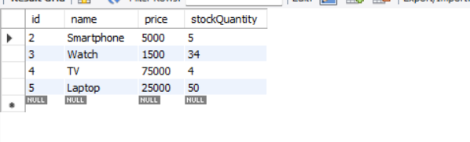
   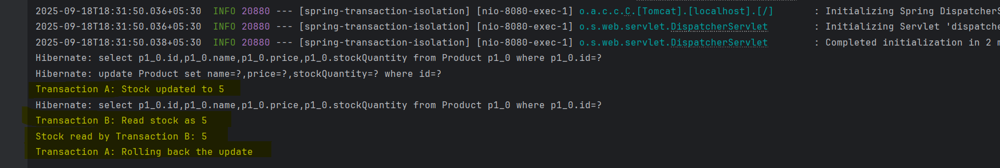
   
   if we see the log transaction A update the changes and he has not yet committed in mean time transaction B read the
   data and after some time transaction A rolled back the data so if we see in db the product stcok availability for laptop 
   is not 5 it should be 50 because transaction A rolled back the changes but transaction B read 5 which is Dirty Read.

   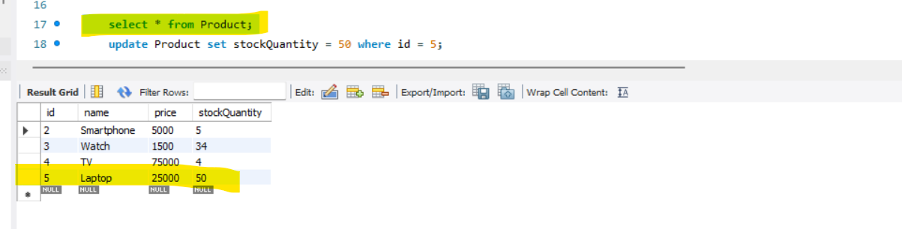
   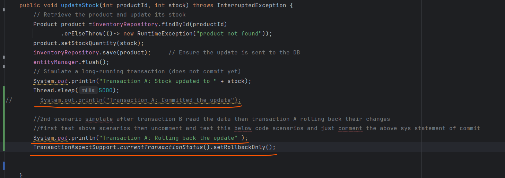

# 2. ISOLATION: READ_COMMITTED  (Also Called NON_REPEATABLE_READ        —   TO AVOID DIRTY READ)

   READ_COMMITTED will not allow any Dirty Read or any UnCommitted Data. 

      Now I don't want to read the uncommitted data I only want to Read the Committed data. 

   # Use case

      we have 2 transactions, transaction A and transaction B. 
      let's say the value was 20 and transaction A is trying to update it to 10, transaction B at the same time trying to read it
      so rather than showing the uncommitted data to transaction B he should read the committed data that is 20 because transaction A trying to
      update it to 10 but he did not commited it until and unless he committed the data transaction B should get the committed data only
      which is nothing 20 only. so, how we can achieve this is our next isolation level to avoid the dirty read and only read the committed data.
      
   # Coding

      let's comment the rollback sys changes
   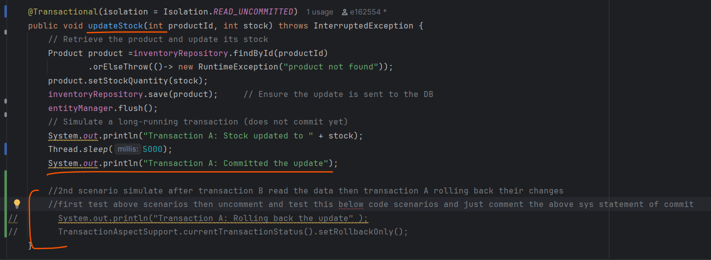

      Now we want only to read the committed value so let's change the code
   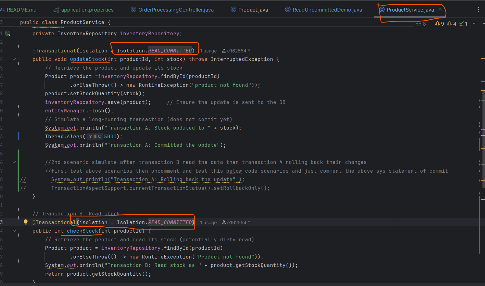
      
      again we are creating 2 threads or transactions 1 will update and another will read the products.
   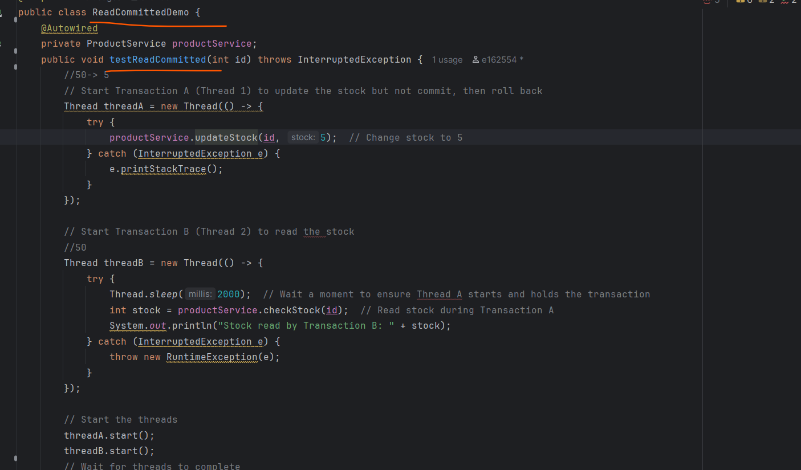
   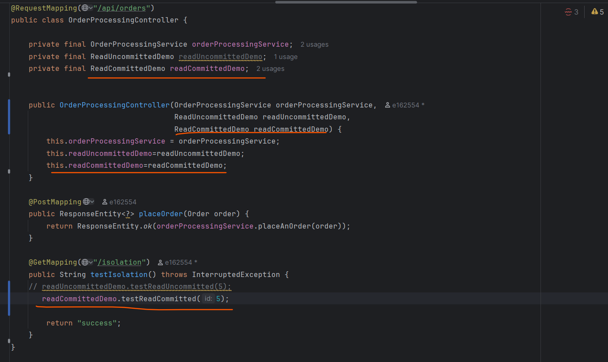

      now lets see our db stock records is 50 for product id 5.
   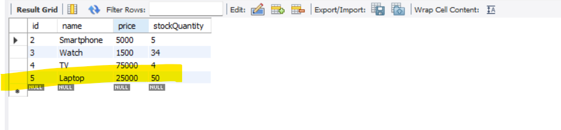
   
   # Assumptions

      Read Committed will not allows any Dirty Read or uncommitted read. 
      now Transaction A will try to update the stock value from 50 to 5.
      Now at same time when transaction B trying to read the value what should the value displayed to transaction B
      since we are asking both the transaction to read only the Read_Committed data so here transaction B should 
      read the value as a 50 because there is no guarantee the transaction A updating the data he will be committing
      what if he will be doing the rollback. 
         so give me the clean value which was last committed Earlier. 

   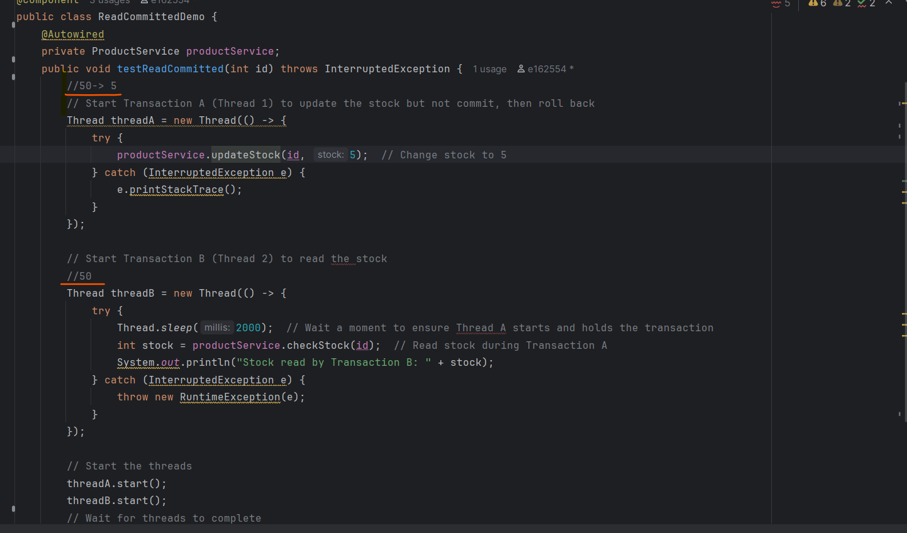

      transaction A is updating to 5 but not yet committed and transaction B is reading initial value which was 50.

      *** go and update the Isolation Level in mysql db to READ_COMMITTED
   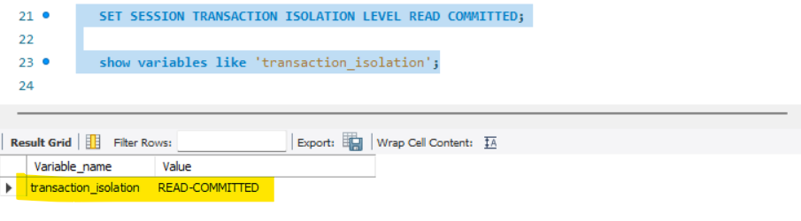

   # Testing

      restart the server
   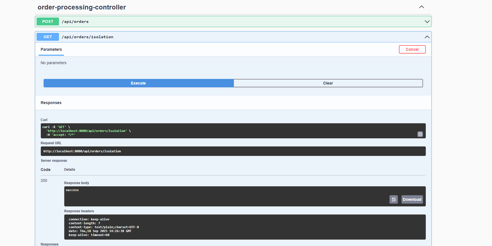

      go and check console
   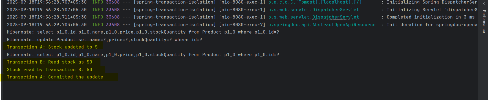

      earlier for product id 5 stock quantity was 50, 
      transaction A trying to update the stock value to 5 but he didn't committed yet
      at same time transaction B trying to read the value and he is getting 50 that is correct right, 
      because this is not uncommitted data this is last committed value because there is no guarantees 
      either transaction A really commit the changes or he will do rolledback. 

      so now transaction B read the value as 50 because of the last committed value and later after reading transaction B
      later transaction A committing the value. 
   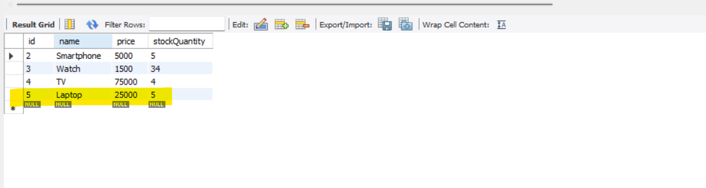

   This Way you can Avoid Dirty Read. 
      
   # Drawback with READ_UNCOMMITTED & READ_COMMITTED

      READ_UNCOMMITTED allows us to read Dirty content or uncommitted data 
      However you can avoid or eleminate using READ_COMMITTED

      There is a Problem in READ_COMMITTED as well............
      Now Imagine for product id 1 stock quantity initial value is 50.
      Transaction 1 updated the stock value to 10.
      But Transaction 2 while we are using READ_COMMITTED it read the value as a 50 which was last committed value
      because we are not sure either transaction 1 going to committing the value or going to do rolledback in sometime
      so we are not sure about this behaviour. 

      now imaging this value 10 is update in db but again this is not committed yet and again transaction 2
      trying to read the value he will not get 50 rather he will get the value 10 so what i want here i want to maintain
      here the consistency before transaction update and after transaction update How many time i will fetch the value
      i need the consistent result. i do not want any inconsistency while reading the data.

      so in this case to avoid this kind of issue REPEATABLE_READ Issolation Level. 
   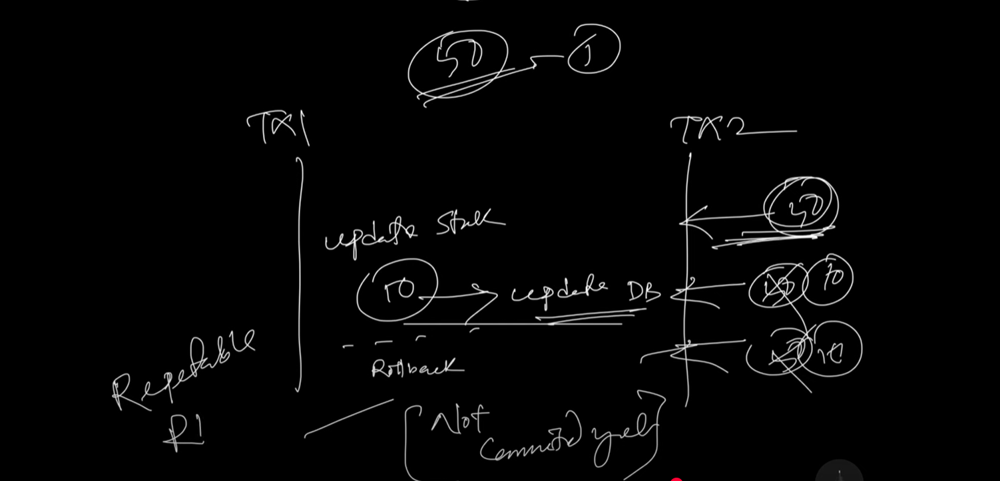

      
   # What Repeatable_Read does
      
         It Ensures that If a Transaction Reads the data multiple times it will see the same data through out the
         Transaction, Even If other transaction modify the data this way it will prevent the Dirty Read and NonRepeatable Read.

         But it will not prevent the Phantom Read.

# 3. ISOLATION: REPEATABLE_READ     (  Avoid Non-Repeatable_Read & Dirty Read )

   Imp - Here updateStock will update the value from 50 to 5, however the initial stock is 50 so, In the fetchStock()
      at the first Read i want the value to display 50 and in second read also i want to see the value as 50. 
      I donot care any transaction is doing any modification in between since my transaction is active so how many times
      I fetch the result i will get the constant output thats all about Repeatable_READ.

   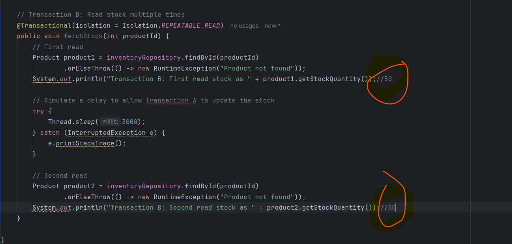

      I want to maintain a consistency between before transaction update and after transaction update.
      How many times I fetch the value i need the consistent results I do not want any inconsistent result while reading
      any active transaction. In this situation to avoid these kind of issues you can use Repeatable_Read isolation level.

      What this Repeatable_Read Isolation level does It ensures that If a transaction reads the data multiple times it will
      see the same data through out the transactions, even if other transaction modified the data so, this way we can prevent dirty 
      read and non_repeatable_read but again it does not prevent the phantom read. Because I want Consistent Result Through out
      the Transaction.
      
   # Code Change

      Transaction 1 update the Stock that is correct. 
      However transaction 2 read the values multiple times. 
      fetchStock() will read the value multiple times.
      while it will read multiple time you should get the consistent results.
   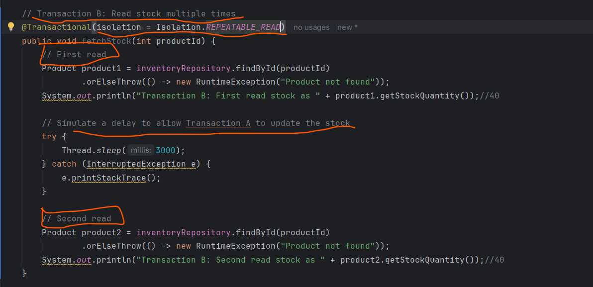

      Transaction B will read the stock available for that id and then wait for 3 seconds Simulate a delay 
      to allow Transaction A to update the stock so before and after update the value should be same. I want
      50 before and after update also. 
   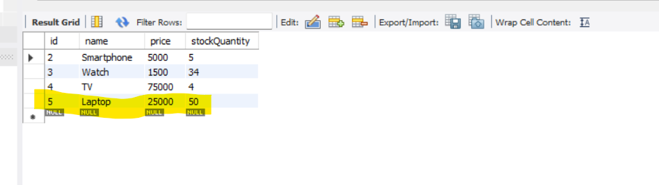

  Important -> Here updateStock will update the value from 50 to 5, however the initial stock is 50 so, In the fetchStock()
      at the first Read i want the value to display 50 and in second read also i want to see the value as 50. 
      I do not care any transaction is doing any modification in between since my transaction is active so how many times
      I fetch the result i will get the constant output thats all about Repeatable_READ.
      
   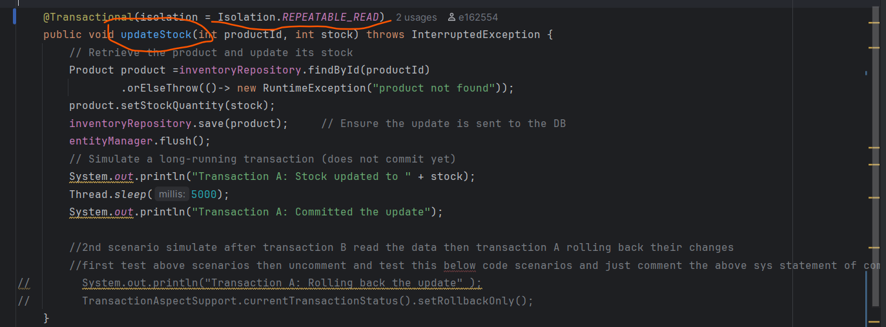

   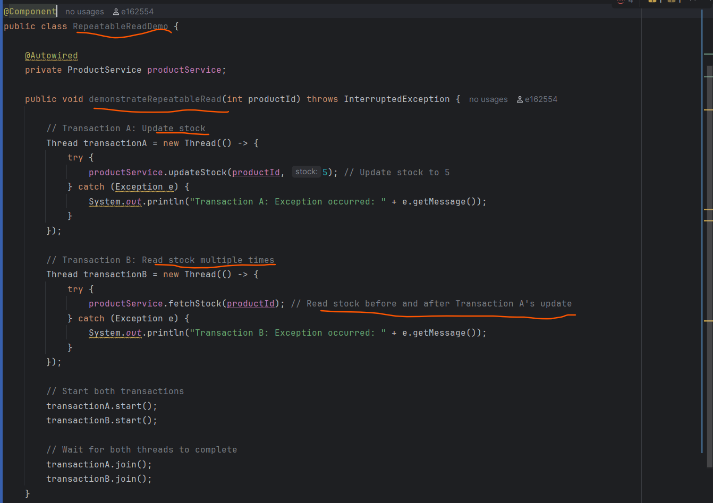

   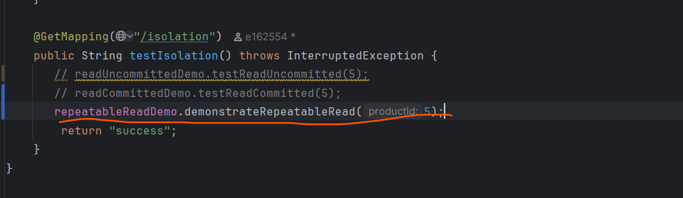

    Before starting the server and start Testing let's first change the Isolation_Level in our database.

   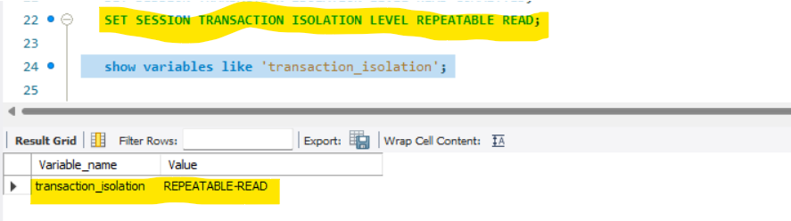

   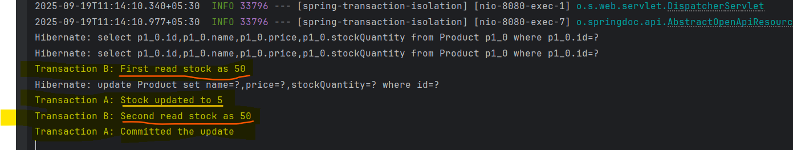

   Transaction B getting the same data 50 before and after the update of transaction A. In this way we can avoid the
   Non_Repeatable_Read. 

# 4. ISOLATION: SERIALIZABLE_READ

      If you are using Serializable Isolation level then It Ensures that Transactions are Executing in a Manner equivalent
      to Running them Sequential just one after another Even If they are executed concurrently.

      you have transaction 1 and Transaction 2. Transaction 1 is trying to do update and transaction 2 is Reading.
      Now what it does once transaction 1 started at the same time if you start transaction 2 even though both are executing concurrently
      it will apply the Lock, Serializable Isolation will apply the LOCK. 

      So First Transaction 1 will complete the Task then only he will give a chance to Trasnacton 2 to get execute. 
      there will be no concurrent execution it would be kind of synchronous execution just one after another. one transation t1
      will complete the task then only serializable will release the lock to transaction 2 to execute there task. both can run parallely.

      In this way movie ticket or seat booking will get resolved. 
    -> In Real Time while doing flight booking or Movie Ticket Booking Which ISOLATION level is appropriate for it.

   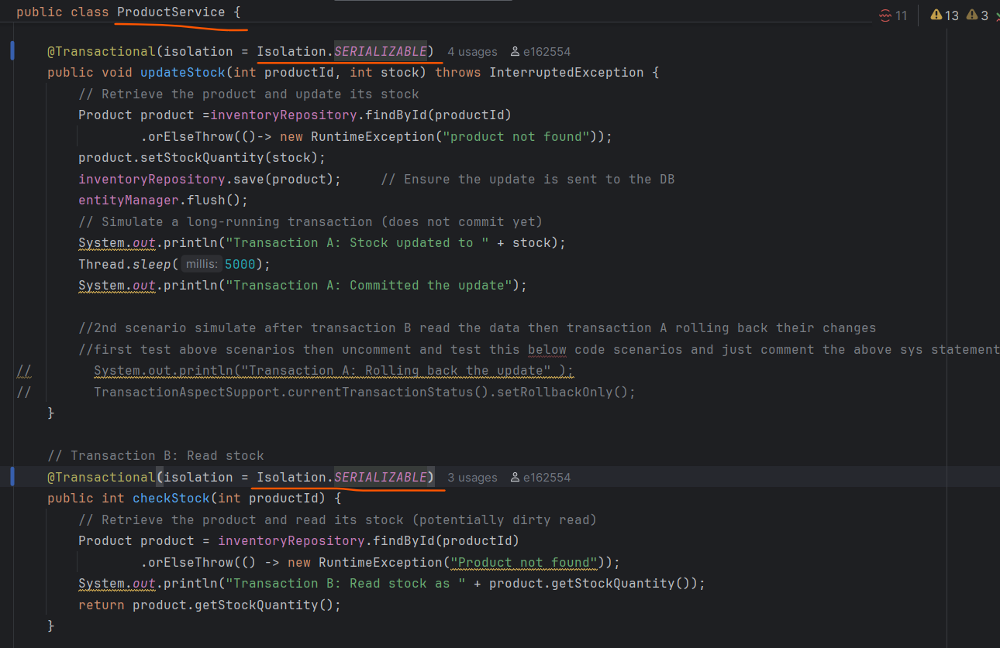
      
   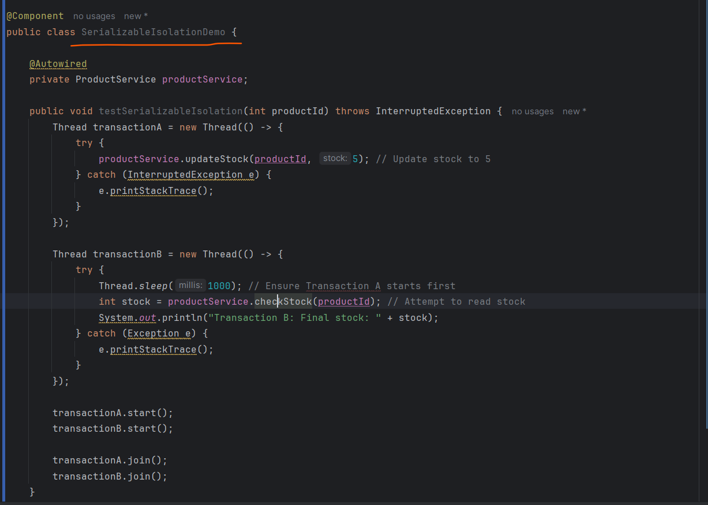

   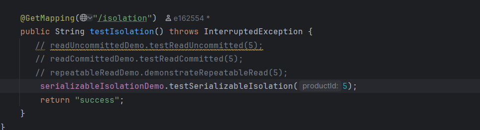

   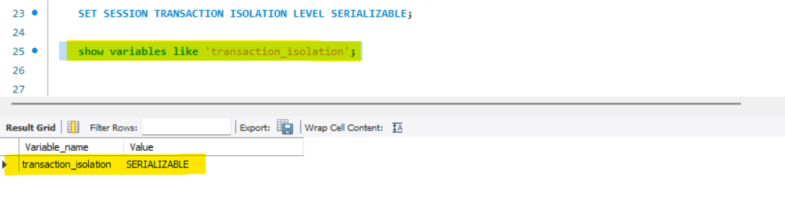

   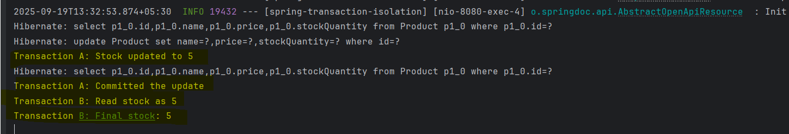

      we can see Transaction A started and he has done the update from 50 to 5 and then he has committed their changes
      after the transaction A completed Transaction B starts executing. 

      Now there is no data Inconsistency Issue Transaction A execute first he update the stock and then he
      commit his changes and then at same time Transaction B trying to fetch the record stock availaibity
      reflecting correctly. 

      So, This way If you are using SERIALIZABLE then there is always a Guarantee there will be
            - No Dirty READ
            - No Phantom Read
            - No Non_Repeatable READ

   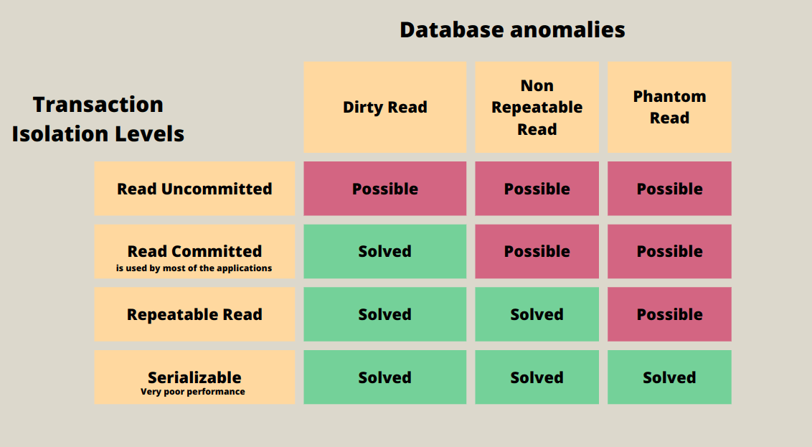

 # But Since The Flow is Going to Be Synchronous in a Serializable Isolation It will Leads the Performance Issues.
 # In case if you are playing with a Huge Data It is not Recommended to go with a Serializable, bcz it will apply lock.
 # It is Highly Recommended in Real Time Projects.

  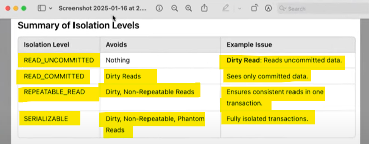

Hibernate flush() method
========================
    The flush() method in Hibernate is used to synchronize the in-memory state of the persistence context with the underlying
    database. It forces Hibernate to execute SQL statements for pending changes, such as inserts, updates, and deletes, 
    without committing the transaction. Here are some reasons to use flush()

    To make changes visible to other operations within the same transaction:
   
    **If a subsequent operation, like a query, depends on changes made earlier in the transaction, flush() ensures that those
    changes are reflected in the database before the query is executed.

    To manage optimistic locking:

    ** flush() can be used to update the version field of an entity, which is used for optimistic locking. 
    This ensures that concurrent updates are handled correctly.